#  书生·浦语大模型实战营

## 作业&笔记

汇总链接：https://github.com/sunxiaobei/InternLM_tutorial/tree/main/notes
第1课笔记：https://github.com/sunxiaobei/InternLM_tutorial/blob/main/notes/Day01.md
第2课笔记：https://github.com/sunxiaobei/InternLM_tutorial/blob/main/notes/Day02.md
第2课作业：https://github.com/sunxiaobei/InternLM_tutorial/blob/main/notes/HWDay02.md
第3课笔记：https://github.com/sunxiaobei/InternLM_tutorial/blob/main/notes/Day03.md
第3课作业：https://github.com/sunxiaobei/InternLM_tutorial/blob/main/notes/HWDay03.md
第4课笔记：https://github.com/sunxiaobei/InternLM_tutorial/blob/main/notes/Day04.md
第4课作业：https://github.com/sunxiaobei/InternLM_tutorial/blob/main/notes/HWDay04.md
第5课笔记：https://github.com/sunxiaobei/InternLM_tutorial/blob/main/notes/Day05.md
第5课作业：https://github.com/sunxiaobei/InternLM_tutorial/blob/main/notes/HWDay05.md
第6课笔记：https://github.com/sunxiaobei/InternLM_tutorial/blob/main/notes/Day06.md
第6课作业：https://github.com/sunxiaobei/InternLM_tutorial/blob/main/notes/HWDay06.md


资料：

- 课程资料：https://github.com/InternLM/tutorial
- 课程视频：https://www.bilibili.com/video/BV1Rc411b7ns
- OpenXLab：https://studio.intern-ai.org.cn
- 学习手册：https://kvudif1helh.feishu.cn/docx/Xx8hdqGwmopi5NxWxNWc76AOnPf
- Q&A文档：https://cguue83gpz.feishu.cn/docx/Noi7d5lllo6DMGxkuXwclxXMn5f
- 基于大模型搭建金融场景智能问答系统：https://github.com/Tongyi-EconML/FinQwen
- 天池LLM大模型：https://tianchi.aliyun.com/competition/entrance/532172
- https://huggingface.co/datasets/arxiv_dataset
- MirrorZ Help 开源镜像: https://help.mirrors.cernet.edu.cn/


## 本地实践Demo

### 环境配置

- Ubuntu 20  内存64+  GPU 16+
- Cuda 11.7 
- Python 3.10
- Pytorch 2.0.1

```
bash /root/share/install_conda_env_internlm_base.sh internlm-demo  # 执行该脚本文件来安装项目实验环境

# 升级pip  demo1、2
python -m pip install --upgrade pip
pip install modelscope==1.9.5
pip install transformers==4.35.2
pip install streamlit==1.24.0
pip install sentencepiece==0.1.99
pip install accelerate==0.24.1
conda activate internlm-demo

#  demo3
/root/share/install_conda_env_internlm_base.sh xcomposer-demo
conda activate xcomposer-demo
pip install transformers==4.33.1 timm==0.4.12 sentencepiece==0.1.99 gradio==3.44.4 markdown2==2.4.10 xlsxwriter==3.1.2 einops accelerate

# Demo4
# InternStudio 平台，则从本地 clone 一个已有 pytorch 2.0.1 的环境：
/root/share/install_conda_env_internlm_base.sh xtuner0.1.9
conda activate xtuner0.1.9
# 拉取 0.1.9 的版本源码
mkdir xtuner019 && cd xtuner019
git clone -b v0.1.9 https://gitee.com/Internlm/xtuner
# 从源码安装 XTuner
pip install -e '.[all]'

```

- 创建环境

```
conda create -n internlmm python=3.10.13

conda activate internlmm
```

- 配置pip

```
# 设置pip默认镜像源
# python -m pip install --upgrade pip
python -m pip install -i https://mirrors.cernet.edu.cn/pypi/web/simple --upgrade pip
# 设置
pip config set global.index-url https://mirrors.cernet.edu.cn/pypi/web/simple
```

- 配置cuda

```
cat <<'EOF' > ~/.condarc
channels:
  - defaults
show_channel_urls: true
default_channels:
  - https://mirrors.tuna.tsinghua.edu.cn/anaconda/pkgs/main
  - https://mirrors.tuna.tsinghua.edu.cn/anaconda/pkgs/r
  - https://mirrors.tuna.tsinghua.edu.cn/anaconda/pkgs/msys2
custom_channels:
  conda-forge: https://mirrors.tuna.tsinghua.edu.cn/anaconda/cloud
  pytorch: https://mirrors.tuna.tsinghua.edu.cn/anaconda/cloud
EOF

source  ~/.condarc
```

- 依赖包安装

```
conda activate internlmm
# 升级pip
python -m pip install --upgrade pip

# nvcc -V # 查看版本
pip install torch==2.0.1 --index-url https://download.pytorch.org/whl/cu117
pip install torchvision==0.15.2 --index-url https://download.pytorch.org/whl/cu117
pip install torchaudio==2.0.2 --index-url https://download.pytorch.org/whl/cu117

pip install torch==2.0.1 torchvision==0.15.2 torchaudio==2.0.2

# 其他依赖包
# conda config --show > internlm-demo.yaml
pip install transformers==4.35.2
pip install modelscope==1.9.5

pip install streamlit==1.24.0
pip install sentencepiece==0.1.99
pip install accelerate==0.24.1
pip install huggingface_hub==0.20.3


# lagent 
# conda config --show > internlm-demo.yaml
pip install tritonclient
pip install grpcio==1.59.2
# pip install lagent
cd /root/models/code/lagent
pip install -e . # 源码安装

# 浦语灵笔  自己创建存在问题 python: can't open file 'examples/web_demo.py': [Errno 2] No such file or directory
# conda config --show > xcomposer-demo.yaml
pip install transformers==4.33.1
pip install timm==0.4.12 
pip install sentencepiece==0.1.99 
pip install gradio==3.44.4
pip install gradio_client==0.5.1
pip install markdown2==2.4.10 
pip install xlsxwriter==3.1.2 
pip install einops==0.7.0
pip install accelerate==0.26.1

#其他
pip install boltons==23.0.0
pip install brotlipy==0.7.0
pip install libmambapy==1.5.1
pip install pillow==10.2.0
pip install pluggy==1.0.0
pip install pycosat==0.6.6
pip install pyOpenSSL==23.2.0
pip install PySocks==1.7.1
pip install ruamel.yaml==0.17.21
pip install truststore==0.8.0
pip install zstandard==0.19.0
```

### 模型下载

- 方式一、ModelScope下载模型, 在 `/root` 路径下新建目录 `model`，在目录下新建 `download.py` 

```
import torch
from modelscope import snapshot_download, AutoModel, AutoTokenizer
import os
model_dir = snapshot_download('Shanghai_AI_Laboratory/internlm-chat-7b', cache_dir='/root/models', revision='v1.0.3')
```

执行下载: 14GB, 下载挺慢

```
python /root/model/download.py
```

- ModelScope 通过Git下载

```
# 装一下拉取模型文件要用的库
pip install modelscope

# 从 modelscope 下载下载模型文件
apt install git git-lfs -y
git lfs install
git lfs clone https://modelscope.cn/Shanghai_AI_Laboratory/internlm-chat-7b.git -b v1.0.3
```

- 方式二、HuggingFace下载: Hugging Face 官方提供的 `huggingface-cli` 命令行工具

```
# pip install -U huggingface_hub
# - resume-download：断点续下
# - local-dir：本地存储路径。（linux 环境下需要填写绝对路径）
import os

# 下载模型
os.system('huggingface-cli download --resume-download internlm/internlm-chat-7b --local-dir your_path')

```

下载部分文件

```
import os 
from huggingface_hub import hf_hub_download  # Load model directly 

hf_hub_download(repo_id="internlm/internlm-7b", filename="config.json")
```

设置国内镜像

```
import os 
os.environ['HF_ENDPOINT'] = 'https://hf-mirror.com'

from huggingface_hub import hf_hub_download  # Load model directly 

hf_hub_download(repo_id="internlm/internlm-7b", filename="config.json")
```

- 方式三、OpenXLab下载

```
# pip install openxlab

from openxlab.model import download
download(model_repo='OpenLMLab/InternLM-7b', model_name='InternLM-7b', output='your local path')
```

- 方式三、直接复制share下的

```
mkdir -p /root/models/Shanghai_AI_Laboratory
cp -r /root/share/temp/model_repos/internlm-chat-7b /root/models/Shanghai_AI_Laboratory
```

### 代码准备

- 下载代码

```
mkdir -p /root/models/code
cd /root/models/code
git clone https://gitee.com/internlm/InternLM.git

# 切换固定版本
cd InternLM
git checkout 3028f07cb79e5b1d7342f4ad8d11efad3fd13d17

```


### 终端运行

- 在 `/root/models/code/InternLM` 目录下新建一个 `cli_demo.py` 文件

```
import torch
from transformers import AutoTokenizer, AutoModelForCausalLM


model_name_or_path = "/root/models/Shanghai_AI_Laboratory/internlm-chat-7b"

tokenizer = AutoTokenizer.from_pretrained(model_name_or_path, trust_remote_code=True)
model = AutoModelForCausalLM.from_pretrained(model_name_or_path, trust_remote_code=True, torch_dtype=torch.bfloat16, device_map='auto')
model = model.eval()

system_prompt = """You are an AI assistant whose name is InternLM (书生·浦语).
- InternLM (书生·浦语) is a conversational language model that is developed by Shanghai AI Laboratory (上海人工智能实验室). It is designed to be helpful, honest, and harmless.
- InternLM (书生·浦语) can understand and communicate fluently in the language chosen by the user such as English and 中文.
"""

messages = [(system_prompt, '')]

print("=============Welcome to InternLM chatbot, type 'exit' to exit.=============")

while True:
    input_text = input("User  >>> ")
    input_text = input_text.replace(' ', '')
    if input_text == "exit":
        break
    response, history = model.chat(tokenizer, input_text, history=messages)
    messages.append((input_text, response))
    print(f"robot >>> {response}")
```

- 在终端运行Demo

```
bash
conda activate internlmm
python /root/models/code/InternLM/cli_demo.py
```

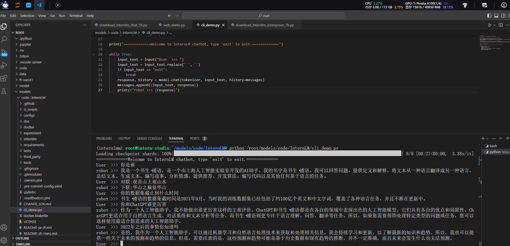

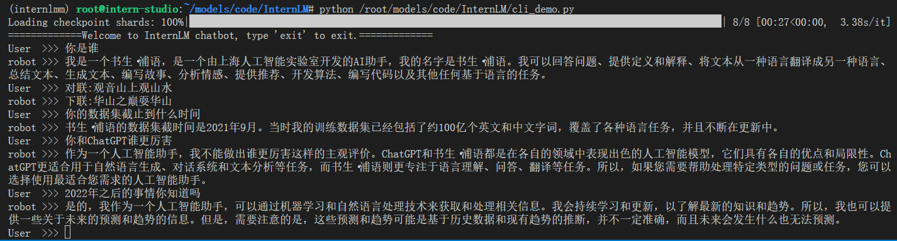

### web运行Demo

- 代码修改
  将 `/root/models/code/InternLM/web_demo.py` 中 29 行和 33 行的模型更换为本地的 `/root/models/Shanghai_AI_Laboratory/internlm-chat-7b`

- 配置本地端口映射服务器，本地电脑PowerShell

```
# 创建SSH密钥，一路回车或自定义
ssh-keygen -t rsa
# 查看公钥
cat ~\.ssh\id_rsa.pub

```

- 复制公钥到InternStudio配置SSH
- 本地终端配置端口，服务器端口在开发机SSH链接中查找（改为自己的36183）

```
ssh -CNg -L 6066:127.0.0.1:6066 root@ssh.intern-ai.org.cn -p 36183

```

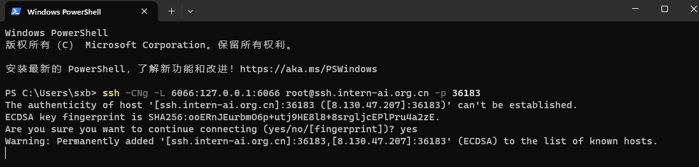

- VsCode 运行 `/root/code/InternLM` 目录下的 `web_demo.py` 文件，输入以下命令后， 将端口映射到本地。在本地浏览器输入 `http://127.0.0.1:6066` 即可。

```
bash
conda activate internlmm  # 首次进入 vscode 会默认是 base 环境，所以首先切换环境
cd /root/models/code/InternLM
streamlit run web_demo.py --server.address 127.0.0.1 --server.port 6066

```

- 谷歌浏览器测试: http://127.0.0.1:6066

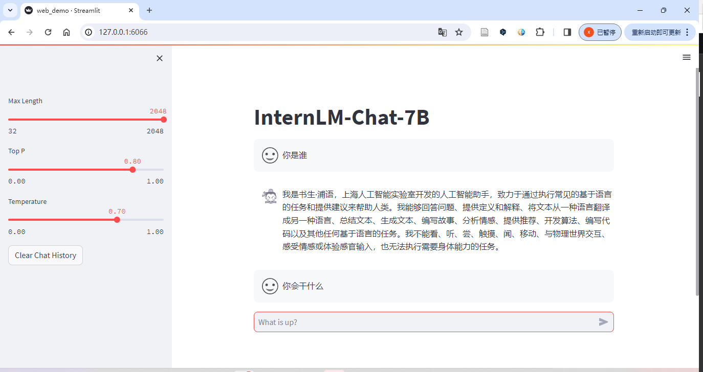

### Lagent智能体Demo

- 下载代码

```
cd /root/models/code
git clone https://gitee.com/internlm/lagent.git

cd /root/models/code/lagent
git checkout 511b03889010c4811b1701abb153e02b8e94fb5e # 尽量保证和教程commit版本一致

conda activate internlmm
pip install tritonclient
pip install grpcio==1.59.2
cd /root/models/code/lagent
pip install -e . # 源码安装
```

- 修改代码: `/root/code/lagent/examples/react_web_demo.py`

```
import copy
import os

import streamlit as st
from streamlit.logger import get_logger

from lagent.actions import ActionExecutor, GoogleSearch, PythonInterpreter
from lagent.agents.react import ReAct
from lagent.llms import GPTAPI
from lagent.llms.huggingface import HFTransformerCasualLM


class SessionState:

    def init_state(self):
        """Initialize session state variables."""
        st.session_state['assistant'] = []
        st.session_state['user'] = []

        #action_list = [PythonInterpreter(), GoogleSearch()]
        action_list = [PythonInterpreter()]
        st.session_state['plugin_map'] = {
            action.name: action
            for action in action_list
        }
        st.session_state['model_map'] = {}
        st.session_state['model_selected'] = None
        st.session_state['plugin_actions'] = set()

    def clear_state(self):
        """Clear the existing session state."""
        st.session_state['assistant'] = []
        st.session_state['user'] = []
        st.session_state['model_selected'] = None
        if 'chatbot' in st.session_state:
            st.session_state['chatbot']._session_history = []


class StreamlitUI:

    def __init__(self, session_state: SessionState):
        self.init_streamlit()
        self.session_state = session_state

    def init_streamlit(self):
        """Initialize Streamlit's UI settings."""
        st.set_page_config(
            layout='wide',
            page_title='lagent-web',
            page_icon='./docs/imgs/lagent_icon.png')
        # st.header(':robot_face: :blue[Lagent] Web Demo ', divider='rainbow')
        st.sidebar.title('模型控制')

    def setup_sidebar(self):
        """Setup the sidebar for model and plugin selection."""
        model_name = st.sidebar.selectbox(
            '模型选择：', options=['gpt-3.5-turbo','internlm'])
        if model_name != st.session_state['model_selected']:
            model = self.init_model(model_name)
            self.session_state.clear_state()
            st.session_state['model_selected'] = model_name
            if 'chatbot' in st.session_state:
                del st.session_state['chatbot']
        else:
            model = st.session_state['model_map'][model_name]

        plugin_name = st.sidebar.multiselect(
            '插件选择',
            options=list(st.session_state['plugin_map'].keys()),
            default=[list(st.session_state['plugin_map'].keys())[0]],
        )

        plugin_action = [
            st.session_state['plugin_map'][name] for name in plugin_name
        ]
        if 'chatbot' in st.session_state:
            st.session_state['chatbot']._action_executor = ActionExecutor(
                actions=plugin_action)
        if st.sidebar.button('清空对话', key='clear'):
            self.session_state.clear_state()
        uploaded_file = st.sidebar.file_uploader(
            '上传文件', type=['png', 'jpg', 'jpeg', 'mp4', 'mp3', 'wav'])
        return model_name, model, plugin_action, uploaded_file

    def init_model(self, option):
        """Initialize the model based on the selected option."""
        if option not in st.session_state['model_map']:
            if option.startswith('gpt'):
                st.session_state['model_map'][option] = GPTAPI(
                    model_type=option)
            else:
                st.session_state['model_map'][option] = HFTransformerCasualLM(
                    '/root/model/Shanghai_AI_Laboratory/internlm-chat-7b')
        return st.session_state['model_map'][option]

    def initialize_chatbot(self, model, plugin_action):
        """Initialize the chatbot with the given model and plugin actions."""
        return ReAct(
            llm=model, action_executor=ActionExecutor(actions=plugin_action))

    def render_user(self, prompt: str):
        with st.chat_message('user'):
            st.markdown(prompt)

    def render_assistant(self, agent_return):
        with st.chat_message('assistant'):
            for action in agent_return.actions:
                if (action):
                    self.render_action(action)
            st.markdown(agent_return.response)

    def render_action(self, action):
        with st.expander(action.type, expanded=True):
            st.markdown(
                "<p style='text-align: left;display:flex;'> <span style='font-size:14px;font-weight:600;width:70px;text-align-last: justify;'>插    件</span><span style='width:14px;text-align:left;display:block;'>:</span><span style='flex:1;'>"  # noqa E501
                + action.type + '</span></p>',
                unsafe_allow_html=True)
            st.markdown(
                "<p style='text-align: left;display:flex;'> <span style='font-size:14px;font-weight:600;width:70px;text-align-last: justify;'>思考步骤</span><span style='width:14px;text-align:left;display:block;'>:</span><span style='flex:1;'>"  # noqa E501
                + action.thought + '</span></p>',
                unsafe_allow_html=True)
            if (isinstance(action.args, dict) and 'text' in action.args):
                st.markdown(
                    "<p style='text-align: left;display:flex;'><span style='font-size:14px;font-weight:600;width:70px;text-align-last: justify;'> 执行内容</span><span style='width:14px;text-align:left;display:block;'>:</span></p>",  # noqa E501
                    unsafe_allow_html=True)
                st.markdown(action.args['text'])
            self.render_action_results(action)

    def render_action_results(self, action):
        """Render the results of action, including text, images, videos, and
        audios."""
        if (isinstance(action.result, dict)):
            st.markdown(
                "<p style='text-align: left;display:flex;'><span style='font-size:14px;font-weight:600;width:70px;text-align-last: justify;'> 执行结果</span><span style='width:14px;text-align:left;display:block;'>:</span></p>",  # noqa E501
                unsafe_allow_html=True)
            if 'text' in action.result:
                st.markdown(
                    "<p style='text-align: left;'>" + action.result['text'] +
                    '</p>',
                    unsafe_allow_html=True)
            if 'image' in action.result:
                image_path = action.result['image']
                image_data = open(image_path, 'rb').read()
                st.image(image_data, caption='Generated Image')
            if 'video' in action.result:
                video_data = action.result['video']
                video_data = open(video_data, 'rb').read()
                st.video(video_data)
            if 'audio' in action.result:
                audio_data = action.result['audio']
                audio_data = open(audio_data, 'rb').read()
                st.audio(audio_data)


def main():
    logger = get_logger(__name__)
    # Initialize Streamlit UI and setup sidebar
    if 'ui' not in st.session_state:
        session_state = SessionState()
        session_state.init_state()
        st.session_state['ui'] = StreamlitUI(session_state)

    else:
        st.set_page_config(
            layout='wide',
            page_title='lagent-web',
            page_icon='./docs/imgs/lagent_icon.png')
        # st.header(':robot_face: :blue[Lagent] Web Demo ', divider='rainbow')
    model_name, model, plugin_action, uploaded_file = st.session_state[
        'ui'].setup_sidebar()

    # Initialize chatbot if it is not already initialized
    # or if the model has changed
    if 'chatbot' not in st.session_state or model != st.session_state[
            'chatbot']._llm:
        st.session_state['chatbot'] = st.session_state[
            'ui'].initialize_chatbot(model, plugin_action)

    for prompt, agent_return in zip(st.session_state['user'],
                                    st.session_state['assistant']):
        st.session_state['ui'].render_user(prompt)
        st.session_state['ui'].render_assistant(agent_return)
    # User input form at the bottom (this part will be at the bottom)
    # with st.form(key='my_form', clear_on_submit=True):

    if user_input := st.chat_input(''):
        st.session_state['ui'].render_user(user_input)
        st.session_state['user'].append(user_input)
        # Add file uploader to sidebar
        if uploaded_file:
            file_bytes = uploaded_file.read()
            file_type = uploaded_file.type
            if 'image' in file_type:
                st.image(file_bytes, caption='Uploaded Image')
            elif 'video' in file_type:
                st.video(file_bytes, caption='Uploaded Video')
            elif 'audio' in file_type:
                st.audio(file_bytes, caption='Uploaded Audio')
            # Save the file to a temporary location and get the path
            file_path = os.path.join(root_dir, uploaded_file.name)
            with open(file_path, 'wb') as tmpfile:
                tmpfile.write(file_bytes)
            st.write(f'File saved at: {file_path}')
            user_input = '我上传了一个图像，路径为: {file_path}. {user_input}'.format(
                file_path=file_path, user_input=user_input)
        agent_return = st.session_state['chatbot'].chat(user_input)
        st.session_state['assistant'].append(copy.deepcopy(agent_return))
        logger.info(agent_return.inner_steps)
        st.session_state['ui'].render_assistant(agent_return)


if __name__ == '__main__':
    root_dir = os.path.dirname(os.path.dirname(os.path.abspath(__file__)))
    root_dir = os.path.join(root_dir, 'tmp_dir')
    os.makedirs(root_dir, exist_ok=True)
    main()
```

- 93行：`'/root/models/Shanghai_AI_Laboratory/internlm-chat-7b'`

- 运行

```
streamlit run /root/models/code/lagent/examples/react_web_demo.py --server.address 127.0.0.1 --server.port 6066

```

- 输入数学问题 已知 `2x+3=10`，求`x` ,此时 `InternLM-Chat-7B` 模型理解题意生成解此题的 `Python` 代码，`Lagent` 调度送入 `Python` 代码解释器求出该问题的解。

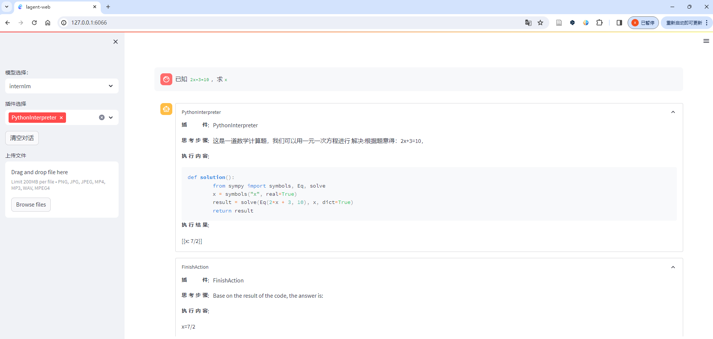


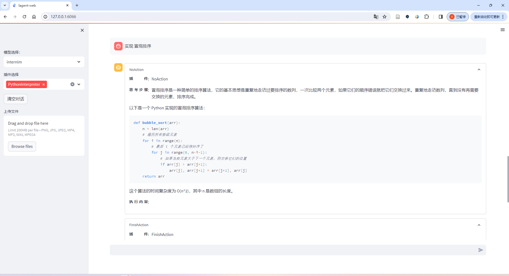

### 浦语 灵笔Demo  

- Ubuntu 20  内存100+  GPU 32+
- A100(1/4) * 2

- 环境配置

```
bash
conda activate internlmm

pip install transformers==4.33.1 timm==0.4.12 sentencepiece==0.1.99 gradio==3.44.4 markdown2==2.4.10 xlsxwriter==3.1.2 einops accelerate

```

- 下载模型  : download_internlm_xcomposer_7b.py

```
# pip install modelscope==1.9.5

import torch
from modelscope import snapshot_download, AutoModel, AutoTokenizer
import os
model_dir = snapshot_download('Shanghai_AI_Laboratory/internlm-xcomposer-7b', cache_dir='/root/models', revision='master')
```

- 代码准备

```
cd /root/models/code
git clone https://gitee.com/internlm/InternLM-XComposer.git
cd /root/models/code/InternLM-XComposer
git checkout 3e8c79051a1356b9c388a6447867355c0634932d  # 最好保证和教程的 commit 版本一致
```

- Demo运行

```
cd /root/models/code/InternLM-XComposer

# 
python examples/web_demo.py  \
    --folder /root/models/Shanghai_AI_Laboratory/internlm-xcomposer-7b \
    --num_gpus 1 \
    --port 6066
```

-  `num_gpus 1` 是因为InternStudio平台对于 `A100(1/4)*2` 识别仍为一张显卡。但如果有小伙伴课后使用两张 3090 来运行此 demo，仍需将 `num_gpus` 设置为 `2` 。

### 作业1

**基础作业：**

- 使用 InternLM-Chat-7B 模型生成 300 字的小故事（需截图）。

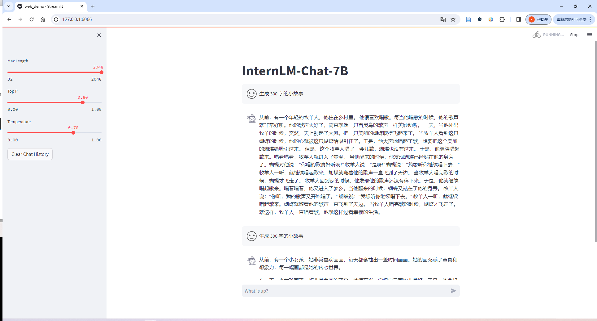

- 熟悉 hugging face 下载功能，使用 `huggingface_hub` python 包，下载 `InternLM-20B` 的 config.json 文件到本地（需截图下载过程）。

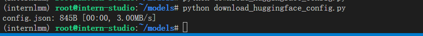

**进阶作业（可选做）**

- 完成浦语·灵笔的图文理解及创作部署（需截图） 

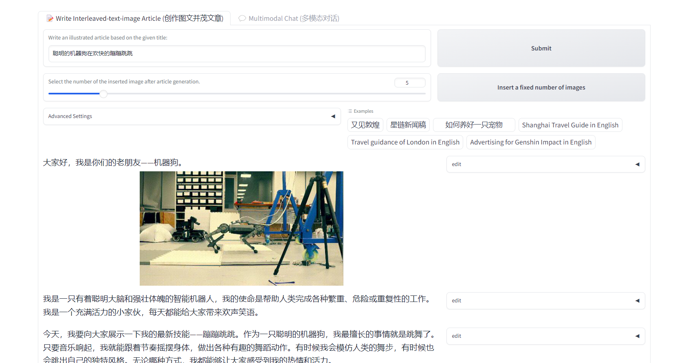

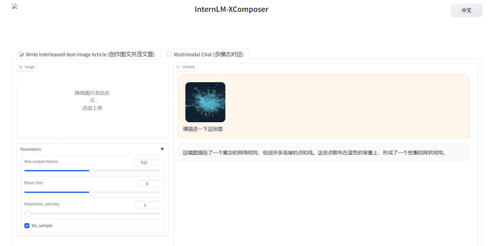

- 完成 Lagent 工具调用 Demo 创作部署（需截图）


## Langchain知识库

### 环境配置

```
# 复制
/root/share/install_conda_env_internlm_base.sh InternLM
conda activate InternLM

# 已有
conda activate internlmm

# 升级pip  同Demo1、2
python -m pip install --upgrade pip

pip install modelscope==1.9.5
pip install transformers==4.35.2
pip install streamlit==1.24.0
pip install sentencepiece==0.1.99
pip install accelerate==0.24.1

# Langchain依赖包 
pip install langchain==0.0.292
pip install gradio==4.4.0
pip install chromadb==0.4.15
pip install sentence-transformers==2.2.2
pip install unstructured==0.10.30
pip install markdown==3.3.7
# 数据集
pip install huggingface_hub==0.20.2
```

- gradio版本报错  gradio==3.44.4

```
pip install torch==2.0.1 -f https://download.pytorch.org/whl/cu116/torch_stable.html
pip install gradio==3.44.4
pip install huggingface-hub==0.20.2
```

### 模型下载

- 同本地Demo1下载

### 数据集下载

- 开源词向量模型 [Sentence Transformer](https://huggingface.co/sentence-transformers/paraphrase-multilingual-MiniLM-L12-v2):（我们也可以选用别的开源词向量模型来进行 Embedding，目前选用这个模型是相对轻量、支持中文且效果较好的，同学们可以自由尝试别的开源词向量模型）
- `download_hf_st.py`

```
# pip install -U huggingface_hub

import os

# 设置环境变量
os.environ['HF_ENDPOINT'] = 'https://hf-mirror.com'

# 下载模型
os.system('huggingface-cli download --resume-download sentence-transformers/paraphrase-multilingual-MiniLM-L12-v2 --local-dir /root/models/sentence-transformer')
```

- 更多关于镜像使用可以移步至 [HF Mirror](https://hf-mirror.com/) 查看。

- 下载NLTK:开源词向量模型构建开源词向量的时候，需要用到第三方库 `nltk` 的一些资源。正常情况下，其会自动从互联网上下载，但可能由于网络原因会导致下载中断，此处我们可以从国内仓库镜像地址下载相关资源。

```
cd /root/models
git clone https://gitee.com/yzy0612/nltk_data.git  --branch gh-pages
cd nltk_data
mv packages/*  ./
cd tokenizers
unzip punkt.zip
cd ../taggers
unzip averaged_perceptron_tagger.zip
```

### 知识库搭建

- 数据收集

选择由上海人工智能实验室开源的一系列大模型工具开源仓库作为语料库来源，包括：

- [OpenCompass](https://gitee.com/open-compass/opencompass)：面向大模型评测的一站式平台
- [IMDeploy](https://gitee.com/InternLM/lmdeploy)：涵盖了 LLM 任务的全套轻量化、部署和服务解决方案的高效推理工具箱
- [XTuner](https://gitee.com/InternLM/xtuner)：轻量级微调大语言模型的工具库
- [InternLM-XComposer](https://gitee.com/InternLM/InternLM-XComposer)：浦语·灵笔，基于书生·浦语大语言模型研发的视觉-语言大模型
- [Lagent](https://gitee.com/InternLM/lagent)：一个轻量级、开源的基于大语言模型的智能体（agent）框架
- [InternLM](https://gitee.com/InternLM/InternLM)：一个开源的轻量级训练框架，旨在支持大模型训练而无需大量的依赖

首先我们需要将上述远程开源仓库 Clone 到本地，可以使用以下命令：

```
# 进入到数据库盘
cd /root/models/code
# clone 上述开源仓库
git clone https://gitee.com/open-compass/opencompass.git
git clone https://gitee.com/InternLM/lmdeploy.git
git clone https://gitee.com/InternLM/xtuner.git
git clone https://gitee.com/InternLM/InternLM-XComposer.git
git clone https://gitee.com/InternLM/lagent.git
git clone https://gitee.com/InternLM/InternLM.git
```

接着，为语料处理方便，我们将选用上述仓库中所有的 markdown、txt 文件作为示例语料库。注意，也可以选用其中的代码文件加入到知识库中，但需要针对代码文件格式进行额外处理（因为代码文件对逻辑联系要求较高，且规范性较强，在分割时最好基于代码模块进行分割再加入向量数据库）。

我们首先将上述仓库中所有满足条件的文件路径找出来，我们定义一个函数，该函数将递归指定文件夹路径，返回其中所有满足条件（即后缀名为 .md 或者 .txt 的文件）的文件路径：

```
import os 
def get_files(dir_path):
    # args：dir_path，目标文件夹路径
    file_list = []
    for filepath, dirnames, filenames in os.walk(dir_path):
        # os.walk 函数将递归遍历指定文件夹
        for filename in filenames:
            # 通过后缀名判断文件类型是否满足要求
            if filename.endswith(".md"):
                # 如果满足要求，将其绝对路径加入到结果列表
                file_list.append(os.path.join(filepath, filename))
            elif filename.endswith(".txt"):
                file_list.append(os.path.join(filepath, filename))
    return file_list
```

- 数据加载
- 得到所有目标文件路径之后，我们可以使用 LangChain 提供的 FileLoader 对象来加载目标文件，得到由目标文件解析出的纯文本内容。由于不同类型的文件需要对应不同的 FileLoader，我们判断目标文件类型，并针对性调用对应类型的 FileLoader，同时，调用 FileLoader 对象的 load 方法来得到加载之后的纯文本对象：

```
from tqdm import tqdm
from langchain.document_loaders import UnstructuredFileLoader
from langchain.document_loaders import UnstructuredMarkdownLoader

def get_text(dir_path):
    # args：dir_path，目标文件夹路径
    # 首先调用上文定义的函数得到目标文件路径列表
    file_lst = get_files(dir_path)
    # docs 存放加载之后的纯文本对象
    docs = []
    # 遍历所有目标文件
    for one_file in tqdm(file_lst):
        file_type = one_file.split('.')[-1]
        if file_type == 'md':
            loader = UnstructuredMarkdownLoader(one_file)
        elif file_type == 'txt':
            loader = UnstructuredFileLoader(one_file)
        else:
            # 如果是不符合条件的文件，直接跳过
            continue
        docs.extend(loader.load())
    return docs
```

使用上文函数，我们得到的 `docs` 为一个纯文本对象对应的列表。

- 构建向量数据库

LangChain 提供了多种文本分块工具，此处我们使用字符串递归分割器，并选择分块大小为 500，块重叠长度为 150（由于篇幅限制，此处没有展示切割效果，学习者可以自行尝试一下，想要深入学习 LangChain 文本分块可以参考教程 [《LangChain - Chat With Your Data》](https://github.com/datawhalechina/prompt-engineering-for-developers/blob/9dbcb48416eb8af9ff9447388838521dc0f9acb0/content/LangChain%20Chat%20with%20Your%20Data/1.%E7%AE%80%E4%BB%8B%20Introduction.md)：

```python
from langchain.text_splitter import RecursiveCharacterTextSplitter

text_splitter = RecursiveCharacterTextSplitter(
    chunk_size=500, chunk_overlap=150)
split_docs = text_splitter.split_documents(docs)
```

接着我们选用开源词向量模型 [Sentence Transformer](https://huggingface.co/sentence-transformers/paraphrase-multilingual-MiniLM-L12-v2) 来进行文本向量化。LangChain 提供了直接引入 HuggingFace 开源社区中的模型进行向量化的接口：

```python
from langchain.embeddings.huggingface import HuggingFaceEmbeddings

embeddings = HuggingFaceEmbeddings(model_name="/root/data/model/sentence-transformer")
```

同时，考虑到 Chroma 是目前最常用的入门数据库，我们选择 Chroma 作为向量数据库，基于上文分块后的文档以及加载的开源向量化模型，将语料加载到指定路径下的向量数据库：

```python
from langchain.vectorstores import Chroma

# 定义持久化路径
persist_directory = 'data_base/vector_db/chroma'
# 加载数据库
vectordb = Chroma.from_documents(
    documents=split_docs,
    embedding=embeddings,
    persist_directory=persist_directory  # 允许我们将persist_directory目录保存到磁盘上
)
# 将加载的向量数据库持久化到磁盘上
vectordb.persist()
```

- 整体脚本

```
# 首先导入所需第三方库
from langchain.document_loaders import UnstructuredFileLoader
from langchain.document_loaders import UnstructuredMarkdownLoader
from langchain.text_splitter import RecursiveCharacterTextSplitter
from langchain.vectorstores import Chroma
from langchain.embeddings.huggingface import HuggingFaceEmbeddings
from tqdm import tqdm
import os

# 获取文件路径函数
def get_files(dir_path):
    # args：dir_path，目标文件夹路径
    file_list = []
    for filepath, dirnames, filenames in os.walk(dir_path):
        # os.walk 函数将递归遍历指定文件夹
        for filename in filenames:
            # 通过后缀名判断文件类型是否满足要求
            if filename.endswith(".md"):
                # 如果满足要求，将其绝对路径加入到结果列表
                file_list.append(os.path.join(filepath, filename))
            elif filename.endswith(".txt"):
                file_list.append(os.path.join(filepath, filename))
    return file_list

# 加载文件函数
def get_text(dir_path):
    # args：dir_path，目标文件夹路径
    # 首先调用上文定义的函数得到目标文件路径列表
    file_lst = get_files(dir_path)
    # docs 存放加载之后的纯文本对象
    docs = []
    # 遍历所有目标文件
    for one_file in tqdm(file_lst):
        file_type = one_file.split('.')[-1]
        if file_type == 'md':
            loader = UnstructuredMarkdownLoader(one_file)
        elif file_type == 'txt':
            loader = UnstructuredFileLoader(one_file)
        else:
            # 如果是不符合条件的文件，直接跳过
            continue
        docs.extend(loader.load())
    return docs

# 目标文件夹
tar_dir = [
    "/root/data/InternLM",
    "/root/data/InternLM-XComposer",
    "/root/data/lagent",
    "/root/data/lmdeploy",
    "/root/data/opencompass",
    "/root/data/xtuner"
]

# 加载目标文件
docs = []
for dir_path in tar_dir:
    docs.extend(get_text(dir_path))

# 对文本进行分块
text_splitter = RecursiveCharacterTextSplitter(
    chunk_size=500, chunk_overlap=150)
split_docs = text_splitter.split_documents(docs)

# 加载开源词向量模型
embeddings = HuggingFaceEmbeddings(model_name="/root/data/model/sentence-transformer")

# 构建向量数据库
# 定义持久化路径
persist_directory = 'data_base/vector_db/chroma'
# 加载数据库
vectordb = Chroma.from_documents(
    documents=split_docs,
    embedding=embeddings,
    persist_directory=persist_directory  # 允许我们将persist_directory目录保存到磁盘上
)
# 将加载的向量数据库持久化到磁盘上
vectordb.persist()
```

- langchain_demo

将该脚本和后续脚本均放在该目录下运行。运行上述脚本，即可在本地构建已持久化的向量数据库，后续直接导入该数据库即可，无需重复构建。

### InernLM 接入 LangChain

为便捷构建 LLM 应用，我们需要基于本地部署的 InternLM，继承 LangChain 的 LLM 类自定义一个 InternLM LLM 子类，从而实现将 InternLM 接入到 LangChain 框架中。完成 LangChain 的自定义 LLM 子类之后，可以以完全一致的方式调用 LangChain 的接口，而无需考虑底层模型调用的不一致。

基于本地部署的 InternLM 自定义 LLM 类并不复杂，我们只需从 LangChain.llms.base.LLM 类继承一个子类，并重写构造函数与 `_call` 函数即可：

```
from langchain.llms.base import LLM
from typing import Any, List, Optional
from langchain.callbacks.manager import CallbackManagerForLLMRun
from transformers import AutoTokenizer, AutoModelForCausalLM
import torch

class InternLM_LLM(LLM):
    # 基于本地 InternLM 自定义 LLM 类
    tokenizer : AutoTokenizer = None
    model: AutoModelForCausalLM = None

    def __init__(self, model_path :str):
        # model_path: InternLM 模型路径
        # 从本地初始化模型
        super().__init__()
        print("正在从本地加载模型...")
        self.tokenizer = AutoTokenizer.from_pretrained(model_path, trust_remote_code=True)
        self.model = AutoModelForCausalLM.from_pretrained(model_path, trust_remote_code=True).to(torch.bfloat16).cuda()
        self.model = self.model.eval()
        print("完成本地模型的加载")

    def _call(self, prompt : str, stop: Optional[List[str]] = None,
                run_manager: Optional[CallbackManagerForLLMRun] = None,
                **kwargs: Any):
        # 重写调用函数
        system_prompt = """You are an AI assistant whose name is InternLM (书生·浦语).
        - InternLM (书生·浦语) is a conversational language model that is developed by Shanghai AI Laboratory (上海人工智能实验室). It is designed to be helpful, honest, and harmless.
        - InternLM (书生·浦语) can understand and communicate fluently in the language chosen by the user such as English and 中文.
        """
        
        messages = [(system_prompt, '')]
        response, history = self.model.chat(self.tokenizer, prompt , history=messages)
        return response
        
    @property
    def _llm_type(self) -> str:
        return "InternLM"

```

在上述类定义中，我们分别重写了构造函数和 `_call` 函数：对于构造函数，我们在对象实例化的一开始加载本地部署的 InternLM 模型，从而避免每一次调用都需要重新加载模型带来的时间过长；`_call` 函数是 LLM 类的核心函数，LangChain 会调用该函数来调用 LLM，在该函数中，我们调用已实例化模型的 chat 方法，从而实现对模型的调用并返回调用结果。

在整体项目中，我们将上述代码封装为 LLM.py，后续将直接从该文件中引入自定义的 LLM 类。

### 构建检索问答链

LangChain 通过提供检索问答链对象来实现对于 RAG 全流程的封装。所谓检索问答链，即通过一个对象完成检索增强问答（即RAG）的全流程，针对 RAG 的更多概念，我们会在视频内容中讲解，也欢迎读者查阅该教程来进一步了解：[《LLM Universe》](https://github.com/datawhalechina/llm-universe/tree/main)。我们可以调用一个 LangChain 提供的 `RetrievalQA` 对象，通过初始化时填入已构建的数据库和自定义 LLM 作为参数，来简便地完成检索增强问答的全流程，LangChain 会自动完成基于用户提问进行检索、获取相关文档、拼接为合适的 Prompt 并交给 LLM 问答的全部流程。

#### 加载向量数据库

首先我们需要将上文构建的向量数据库导入进来，我们可以直接通过 Chroma 以及上文定义的词向量模型来加载已构建的数据库：

```
from langchain.vectorstores import Chroma
from langchain.embeddings.huggingface import HuggingFaceEmbeddings
import os

# 定义 Embeddings
embeddings = HuggingFaceEmbeddings(model_name="/root/data/model/sentence-transformer")

# 向量数据库持久化路径
persist_directory = 'data_base/vector_db/chroma'

# 加载数据库
vectordb = Chroma(
    persist_directory=persist_directory, 
    embedding_function=embeddings
)
```

上述代码得到的 `vectordb` 对象即为我们已构建的向量数据库对象，该对象可以针对用户的 `query` 进行语义向量检索，得到与用户提问相关的知识片段。

#### 实例化自定义 LLM 与 Prompt Template

接着，我们实例化一个基于 InternLM 自定义的 LLM 对象：

```python
from LLM import InternLM_LLM
llm = InternLM_LLM(model_path = "/root/data/model/Shanghai_AI_Laboratory/internlm-chat-7b")
llm.predict("你是谁")
```

构建检索问答链，还需要构建一个 Prompt Template，该 Template 其实基于一个带变量的字符串，在检索之后，LangChain 会将检索到的相关文档片段填入到 Template 的变量中，从而实现带知识的 Prompt 构建。我们可以基于 LangChain 的 Template 基类来实例化这样一个 Template 对象：

```python
from langchain.prompts import PromptTemplate

# 我们所构造的 Prompt 模板
template = """使用以下上下文来回答用户的问题。如果你不知道答案，就说你不知道。总是使用中文回答。
问题: {question}
可参考的上下文：
···
{context}
···
如果给定的上下文无法让你做出回答，请回答你不知道。
有用的回答:"""

# 调用 LangChain 的方法来实例化一个 Template 对象，该对象包含了 context 和 question 两个变量，在实际调用时，这两个变量会被检索到的文档片段和用户提问填充
QA_CHAIN_PROMPT = PromptTemplate(input_variables=["context","question"],template=template)
```

#### 构建检索问答链

最后，可以调用 LangChain 提供的检索问答链构造函数，基于我们的自定义 LLM、Prompt Template 和向量知识库来构建一个基于 InternLM 的检索问答链：

```python
from langchain.chains import RetrievalQA

qa_chain = RetrievalQA.from_chain_type(llm,retriever=vectordb.as_retriever(),return_source_documents=True,chain_type_kwargs={"prompt":QA_CHAIN_PROMPT})
```

得到的 `qa_chain` 对象即可以实现我们的核心功能，即基于 InternLM 模型的专业知识库助手。我们可以对比该检索问答链和纯 LLM 的问答效果：

```python
# 检索问答链回答效果
question = "什么是InternLM"
result = qa_chain({"query": question})
print("检索问答链回答 question 的结果：")
print(result["result"])

# 仅 LLM 回答效果
result_2 = llm(question)
print("大模型回答 question 的结果：")
print(result_2)
```

#### 本地测试

- run_llm_demo.py

```
cd /root/models/langchain_demo

# 运行命令行demo，生成本地数据库
python run_llm_demo.py


```

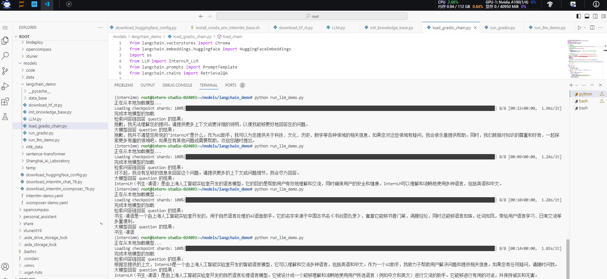

### Web端Demo

在完成上述核心功能后，我们可以基于 Gradio 框架将其部署到 Web 网页，从而搭建一个小型 Demo，便于测试与使用。

我们首先将上文的代码内容封装为一个返回构建的检索问答链对象的函数，并在启动 Gradio 的第一时间调用该函数得到检索问答链对象，后续直接使用该对象进行问答对话，从而避免重复加载模型：

```python
from langchain.vectorstores import Chroma
from langchain.embeddings.huggingface import HuggingFaceEmbeddings
import os
from LLM import InternLM_LLM
from langchain.prompts import PromptTemplate
from langchain.chains import RetrievalQA

def load_chain():
    # 加载问答链
    # 定义 Embeddings
    embeddings = HuggingFaceEmbeddings(model_name="/root/data/model/sentence-transformer")

    # 向量数据库持久化路径
    persist_directory = 'data_base/vector_db/chroma'

    # 加载数据库
    vectordb = Chroma(
        persist_directory=persist_directory,  # 允许我们将persist_directory目录保存到磁盘上
        embedding_function=embeddings
    )

    # 加载自定义 LLM
    llm = InternLM_LLM(model_path = "/root/data/model/Shanghai_AI_Laboratory/internlm-chat-7b")

    # 定义一个 Prompt Template
    template = """使用以下上下文来回答最后的问题。如果你不知道答案，就说你不知道，不要试图编造答
    案。尽量使答案简明扼要。总是在回答的最后说“谢谢你的提问！”。
    {context}
    问题: {question}
    有用的回答:"""

    QA_CHAIN_PROMPT = PromptTemplate(input_variables=["context","question"],template=template)

    # 运行 chain
    qa_chain = RetrievalQA.from_chain_type(llm,retriever=vectordb.as_retriever(),return_source_documents=True,chain_type_kwargs={"prompt":QA_CHAIN_PROMPT})
    
    return qa_chain
```

接着我们定义一个类，该类负责加载并存储检索问答链，并响应 Web 界面里调用检索问答链进行回答的动作：

```python
class Model_center():
    """
    存储检索问答链的对象 
    """
    def __init__(self):
        # 构造函数，加载检索问答链
        self.chain = load_chain()

    def qa_chain_self_answer(self, question: str, chat_history: list = []):
        """
        调用问答链进行回答
        """
        if question == None or len(question) < 1:
            return "", chat_history
        try:
            chat_history.append(
                (question, self.chain({"query": question})["result"]))
            # 将问答结果直接附加到问答历史中，Gradio 会将其展示出来
            return "", chat_history
        except Exception as e:
            return e, chat_history

```

然后我们只需按照 Gradio 的框架使用方法，实例化一个 Web 界面并将点击动作绑定到上述类的回答方法即可：

```python
import gradio as gr

# 实例化核心功能对象
model_center = Model_center()
# 创建一个 Web 界面
block = gr.Blocks()
with block as demo:
    with gr.Row(equal_height=True):   
        with gr.Column(scale=15):
            # 展示的页面标题
            gr.Markdown("""<h1><center>InternLM</center></h1>
                <center>书生浦语</center>
                """)

    with gr.Row():
        with gr.Column(scale=4):
            # 创建一个聊天机器人对象
            chatbot = gr.Chatbot(height=450, show_copy_button=True)
            # 创建一个文本框组件，用于输入 prompt。
            msg = gr.Textbox(label="Prompt/问题")

            with gr.Row():
                # 创建提交按钮。
                db_wo_his_btn = gr.Button("Chat")
            with gr.Row():
                # 创建一个清除按钮，用于清除聊天机器人组件的内容。
                clear = gr.ClearButton(
                    components=[chatbot], value="Clear console")
                
        # 设置按钮的点击事件。当点击时，调用上面定义的 qa_chain_self_answer 函数，并传入用户的消息和聊天历史记录，然后更新文本框和聊天机器人组件。
        db_wo_his_btn.click(model_center.qa_chain_self_answer, inputs=[
                            msg, chatbot], outputs=[msg, chatbot])

    gr.Markdown("""提醒：<br>
    1. 初始化数据库时间可能较长，请耐心等待。
    2. 使用中如果出现异常，将会在文本输入框进行展示，请不要惊慌。 <br>
    """)
gr.close_all()
# 直接启动
# demo.launch()
demo.launch(share=True, server_name="0.0.0.0", server_port=6066, root_path=f'/proxy/6066/')
```

通过将上述代码封装为 run_gradio.py 脚本，直接通过 python 命令运行，即可在本地启动知识库助手的 Web Demo，默认会在 7860 端口运行.

```
python run_gradio.py
```

### 作业2

- 复现课程知识库助手搭建过程


- 报错

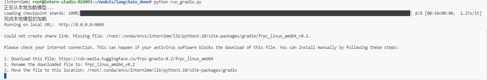

```
1. Download this file: https://cdn-media.huggingface.co/frpc-gradio-0.2/frpc_linux_amd64
2. Rename the downloaded file to: frpc_linux_amd64_v0.2
3. Move the file to this location: /root/.conda/envs/InternLM/lib/python3.10/site-packages/gradio
```

- 下载后重新运行

```
python run_gradio.py
```

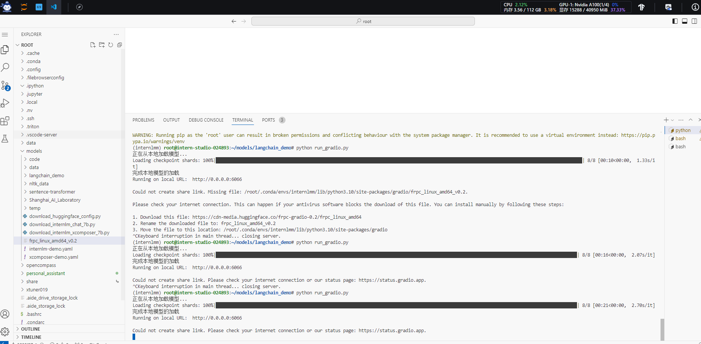

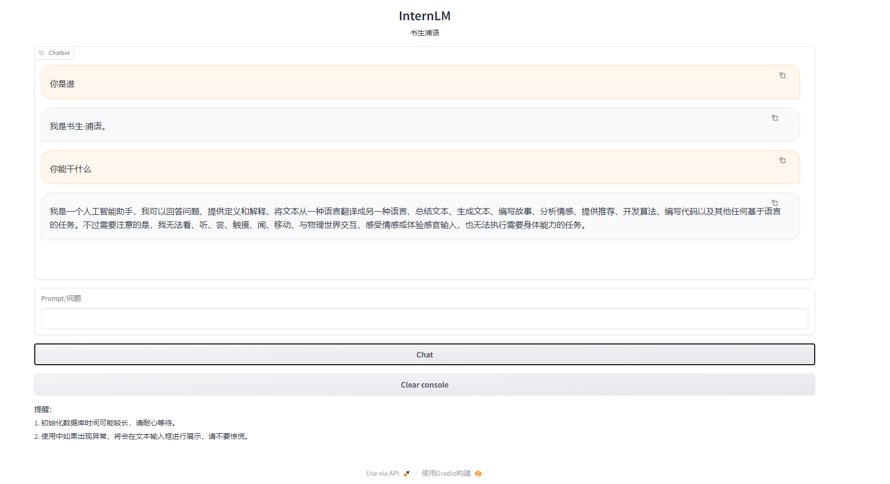

- 选择一个垂直领域，收集该领域的专业资料构建专业知识库，并搭建专业问答助手，并在 [OpenXLab](https://openxlab.org.cn/apps) 上成功部署（截图，并提供应用地址）

## XTuner微调

- **[InternLM](https://huggingface.co/internlm/internlm-7b)** ✅
- [Llama，Llama2](https://huggingface.co/meta-llama)
- [ChatGLM2](https://huggingface.co/THUDM/chatglm2-6b)，[ChatGLM3](https://huggingface.co/THUDM/chatglm3-6b-base)
- [Qwen](https://huggingface.co/Qwen/Qwen-7B)
- [Baichuan](https://huggingface.co/baichuan-inc/Baichuan-7B)，[Baichuan2](https://huggingface.co/baichuan-inc/Baichuan2-7B-Base)
- ......
- [Zephyr](https://huggingface.co/HuggingFaceH4/zephyr-7b-beta) 

- **LoRA** ：**只对玩具中的某些零件进行改动，而不是对整个玩具进行全面改动**。

- ※ 而 **QLoRA** 是 LoRA 的一种改进：如果你手里只有一把生锈的螺丝刀，也能改造你的玩具。

###  环境配置

- 平台：Ubuntu + Anaconda + CUDA/CUDNN + 8GB nvidia显卡

```
# 拉取 0.1.9 的版本源码
mkdir xtuner019 && cd xtuner019
git clone -b v0.1.9 https://gitee.com/Internlm/xtuner
# 从源码安装 XTuner
pip install -e '.[all]'

```

- XTuner 提供多个开箱即用的配置文件，用户可以通过下列命令查看：

```
# 列出所有内置配置
xtuner list-cfg
```

- 假如显示bash: xtuner: command not found的话可以考虑在终端输入 export PATH=$PATH:'/root/.local/bin'

拷贝一个配置文件到当前目录：
`# xtuner copy-cfg ${CONFIG_NAME} ${SAVE_PATH}`

在本案例中即：（注意最后有个英文句号，代表复制到当前路径）

```Bash
cd /root/models/xtuner019
xtuner copy-cfg internlm_chat_7b_qlora_oasst1_e3 .
```

配置文件名的解释：xtuner copy-cfg internlm_chat_7b_qlora_oasst1_e3 .

| 模型名         | internlm_chat_7b     |
| -------------- | -------------------- |
| 使用算法       | qlora                |
| 数据集         | oasst1               |
| 把数据集跑几次 | 跑3次：e3 (epoch 3 ) |

*无 chat比如 `internlm-7b` 代表是基座(base)模型

### 模型下载

```
# 参考Demo实践下载
pip install modelscope
apt install git git-lfs -y
git lfs install
git lfs clone https://modelscope.cn/Shanghai_AI_Laboratory/internlm-chat-7b.git -b v1.0.3
```

### 数据集下载

https://huggingface.co/datasets/timdettmers/openassistant-guanaco/tree/main

- 由于 huggingface 网络问题，咱们已经给大家提前下载好了，复制到正确位置即可。准备在 oasst1 数据集上微调 internlm-7b-chat

```
mkdir /root/models/xtuner019/ft-oasst1
cd /root/models/xtuner019/ft-oasst1
# ...-guanaco 后面有个空格和英文句号啊
cp -r /root/share/temp/datasets/openassistant-guanaco .
```

### 修改配置文件

-  修改其中的模型和数据集为 本地路径
- internlm_chat_7b_qlora_oasst1_e3_copy.py

```
# Model
pretrained_model_name_or_path = './Shanghai_AI_Laboratory/internlm-chat-7b'

# Data
data_path = './xtuner019/ft-oasst1/openassistant-guanaco'
```

**常用超参**

| 参数名              | 解释                                                   |
| ------------------- | ------------------------------------------------------ |
| **data_path**       | 数据路径或 HuggingFace 仓库名                          |
| max_length          | 单条数据最大 Token 数，超过则截断                      |
| pack_to_max_length  | 是否将多条短数据拼接到 max_length，提高 GPU 利用率     |
| accumulative_counts | 梯度累积，每多少次 backward 更新一次参数               |
| evaluation_inputs   | 训练过程中，会根据给定的问题进行推理，便于观测训练状态 |
| evaluation_freq     | Evaluation 的评测间隔 iter 数                          |
| ......              | ......                                                 |

> 如果想把显卡的现存吃满，充分利用显卡资源，可以将 `max_length` 和 `batch_size` 这两个参数调大。

###  开始微调

**训练：**

xtuner train ${CONFIG_NAME_OR_PATH}

**也可以增加 deepspeed 进行训练加速：**

xtuner train ${CONFIG_NAME_OR_PATH} --deepspeed deepspeed_zero2


例如，我们可以利用 QLoRA 算法在 oasst1 数据集上微调 InternLM-7B：

```Bash
# 单卡
## 用刚才改好的config文件训练
xtuner train ./internlm_chat_7b_qlora_oasst1_e3_copy.py

# 多卡
NPROC_PER_NODE=${GPU_NUM} xtuner train ./internlm_chat_7b_qlora_oasst1_e3_copy.py

# 若要开启 deepspeed 加速，增加 --deepspeed deepspeed_zero2 即可
```

> 微调得到的 PTH 模型文件和其他杂七杂八的文件都默认在当前的 `./work_dirs` 中。

### 微调后合并

-  将得到的 PTH 模型转换为 HuggingFace 模型，**即：生成 Adapter 文件夹**

`xtuner convert pth_to_hf ${CONFIG_NAME_OR_PATH} ${PTH_file_dir} ${SAVE_PATH}`

在本示例中，为：

```bash
mkdir hf
export MKL_SERVICE_FORCE_INTEL=1

xtuner convert pth_to_hf ./internlm_chat_7b_qlora_oasst1_e3_copy.py ./work_dirs/internlm_chat_7b_qlora_oasst1_e3_copy/epoch_1.pth ./hf
```

<span style="color: red;">**此时，hf 文件夹即为我们平时所理解的所谓 “LoRA 模型文件”**</span>

> 可以简单理解：LoRA 模型文件 = Adapter


### 部署与测试

- 将 HuggingFace adapter 合并到大语言模型：

```Bash
xtuner convert merge ./internlm-chat-7b ./hf ./merged --max-shard-size 2GB
# xtuner convert merge \
#     ${NAME_OR_PATH_TO_LLM} \
#     ${NAME_OR_PATH_TO_ADAPTER} \
#     ${SAVE_PATH} \
#     --max-shard-size 2GB
```

- 与合并后的模型对话：

```Bash
# 加载 Adapter 模型对话（Float 16）
xtuner chat ./merged --prompt-template internlm_chat

# 4 bit 量化加载
# xtuner chat ./merged --bits 4 --prompt-template internlm_chat
```

- 运行Demo

- 修改 `cli_demo.py` 中的模型路径

```diff
- model_name_or_path = "/root/model/Shanghai_AI_Laboratory/internlm-chat-7b"
+ model_name_or_path = "merged"
```

- 运行 `cli_demo.py` 以目测微调效果

```bash
python ./cli_demo.py
```

**效果：**

**`xtuner chat`** **的启动参数**

| 启动参数              | 干哈滴                                                       |
| --------------------- | ------------------------------------------------------------ |
| **--prompt-template** | 指定对话模板                                                 |
| --system              | 指定SYSTEM文本                                               |
| --system-template     | 指定SYSTEM模板                                               |
| -**-bits**            | LLM位数                                                      |
| --bot-name            | bot名称                                                      |
| --with-plugins        | 指定要使用的插件                                             |
| **--no-streamer**     | 是否启用流式传输                                             |
| **--lagent**          | 是否使用lagent                                               |
| --command-stop-word   | 命令停止词                                                   |
| --answer-stop-word    | 回答停止词                                                   |
| --offload-folder      | 存放模型权重的文件夹（或者已经卸载模型权重的文件夹）         |
| --max-new-tokens      | 生成文本中允许的最大 `token` 数量                            |
| **--temperature**     | 温度值                                                       |
| --top-k               | 保留用于顶k筛选的最高概率词汇标记数                          |
| --top-p               | 如果设置为小于1的浮点数，仅保留概率相加高于 `top_p` 的最小一组最有可能的标记 |
| --seed                | 用于可重现文本生成的随机种子                                 |

## XTuner自定义微调


**整体实训营项目：**

时间周期：即日起致课程结束

即日开始可以在班级群中随机组队完成一个大作业项目，一些可提供的选题如下：

- 人情世故大模型：一个帮助用户撰写新年祝福文案的人情事故大模型
- 中小学数学大模型：一个拥有一定数学解题能力的大模型
- 心理大模型：一个治愈的心理大模型
- 工具调用类项目：结合 Lagent 构建数据集训练 InternLM 模型，支持对 MMYOLO 等工具的调用

其他基于书生·浦语工具链的小项目都在范围内，欢迎大家充分发挥想象力。