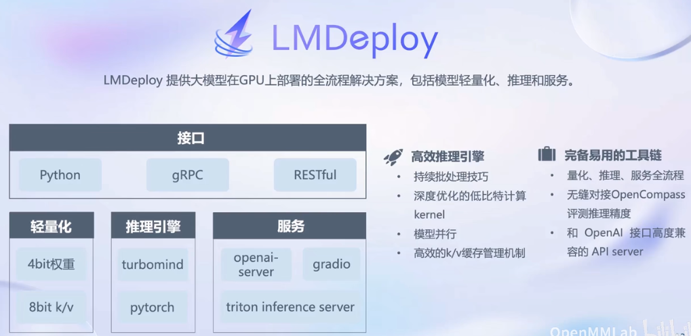

# 书生·浦语大模型全链路开源体系

## 专用大模型--通用大模型
- 大模型：通用人工智能的重要途经（专用大模型--通用大模型--多模态大模型--智能体）
    
- InternLM--书生 万卷（数据）、书生 浦语（模型）
    
- InternLM--轻量级（7B）、中量级（20B）、重量级（123B）

## 从模型到应用

## 书生·浦语大模型全链路开源体系

多模态数据：
- 书生·万卷（总数据量:2TB,文本图像和视频）；Opendatalab开放数据平台

预训练：InternLM-Train
- 并行训练、高可扩展、极致性能优化、兼容主流、开箱即用（支持多种规格语言模型）

微调：支持全参数微调、部分参数微调
- 增量续训：让基座模型学习到一些新知识，训练数据：文章书籍代码
- 有监督微调：让模型学会理解和遵循各种指令，或注入少量领域知识，训练数据：高质量对话，问答数据
- 高效微调框架XTuner：多种微调算法、多种开源生态、自动优化加速、适配多种硬件

评测：OpenCompass
全方位评测，采用六大维度，主要是学科，语言，知识，理解，推理和安全

部署：LMDeploy推理框架
- 大语言模型内存开销巨大，动态Shape以及模型结构相对简单
- 部署方案：模型并行，低比特量化等
- 对外提供不同的接口，提供高效的推理引擎，以及完备的工具链应用：支持多种智能体
针对大模型语言的一些局限性。如最新信息和知识的获取，回复的可靠性，数学计算和工具的使用和交互

智能体：大模型更复杂的应用
- 开源了轻量级智能框架Lagent，灵活支持多种大语言模型，支持多种类型的智能体能力，简单易拓展，支持丰富的工具。
- 多模态智能体工具箱AgentLego。丰富的工具集合，支持多个主流智能体系统等。

相关资料：
第1节课教程视频：https://www.bilibili.com/video/BV1Rc411b7ns
OpenXLab：https://studio.intern-ai.org.cn
学习手册：https://kvudif1helh.feishu.cn/docx/Xx8hdqGwmopi5NxWxNWc76AOnPf

