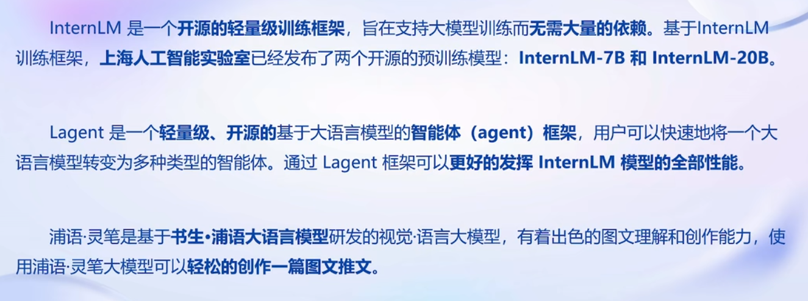
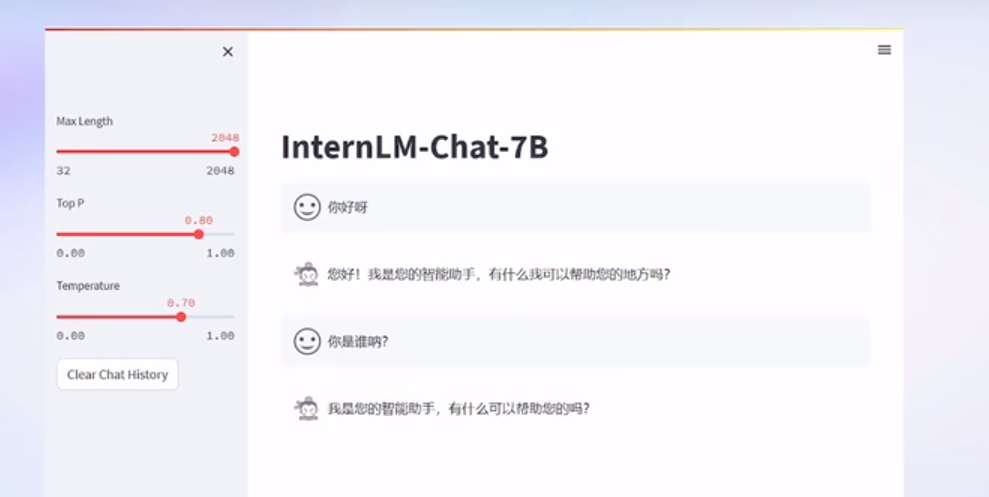
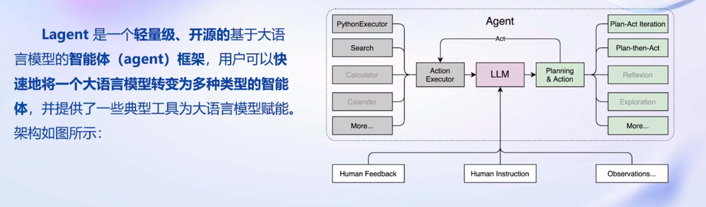
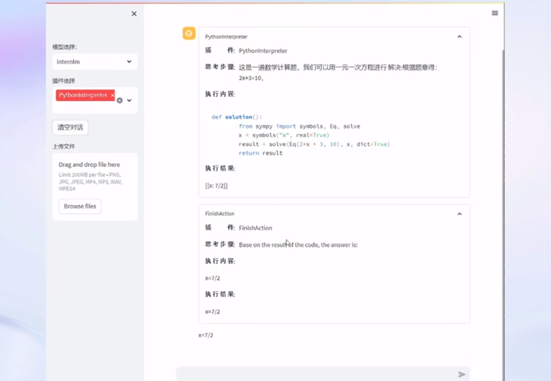
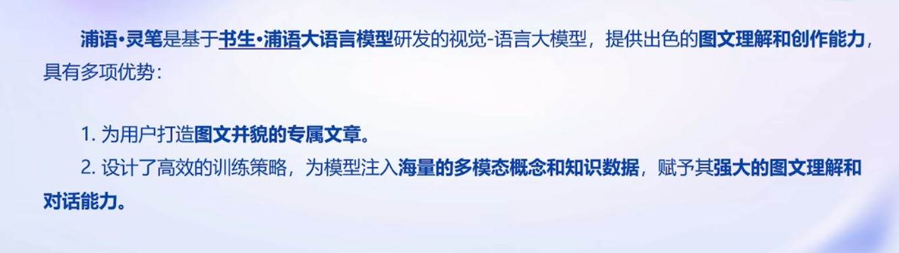
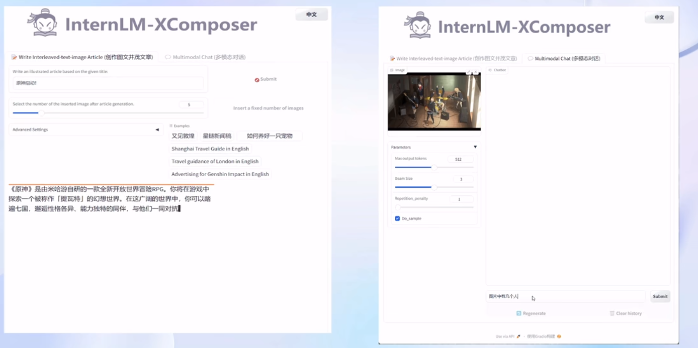
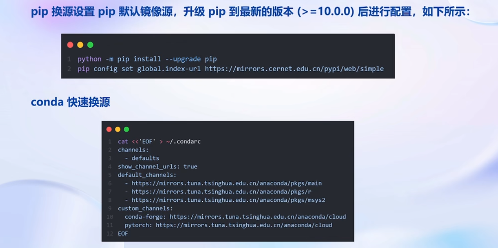
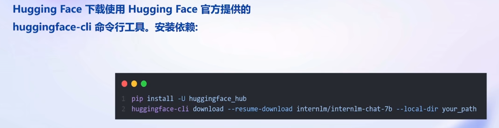
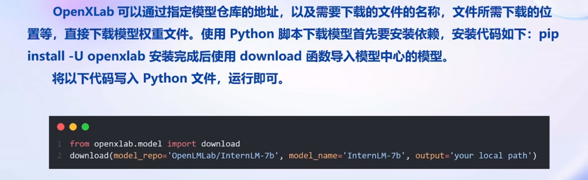
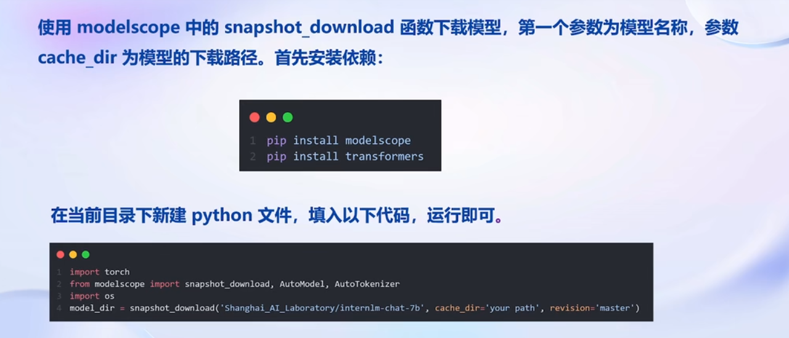

#  Day02 书生·浦语大模型趣味Demo

## 大模型及InternLM模型

### 什么是大模型

- 在人工智能领域中**参数数量巨大、拥有庞大计算能力和参数规模**的模型

- 大模型=大数据+大参数+大性能

### InternLM 模型全链条开源

##  InternLM-CHat-7B  智能对话Demo

- InternLM-CHat-7B  模型介绍

## Lagent智能体调用 Demo

- Lagent介绍

## InternLM-Xcomposer 浦语灵笔Demo

## 通用环境配置

### Pip、Canda 源配置

### 模型下载

方式一、HuggingFace

方式二、OpenXlab

方式三、ModelScpoe

课程资料：

- 课程视频：https://www.bilibili.com/video/BV1Ci4y1z72H
- OpenXLab：https://studio.intern-ai.org.cn
- 学习手册：https://kvudif1helh.feishu.cn/docx/Xx8hdqGwmopi5NxWxNWc76AOnPf

- 基于大模型搭建金融场景智能问答系统：https://github.com/Tongyi-EconML/FinQwen
- 天池LLM大模型：https://tianchi.aliyun.com/competition/entrance/532172
- https://huggingface.co/datasets/arxiv_dataset
- MirrorZ Help 开源镜像: https://help.mirrors.cernet.edu.cn/