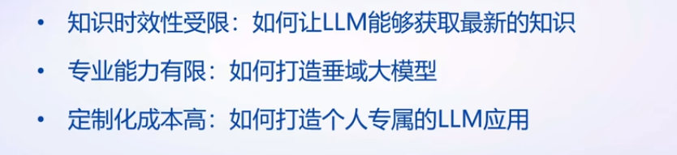
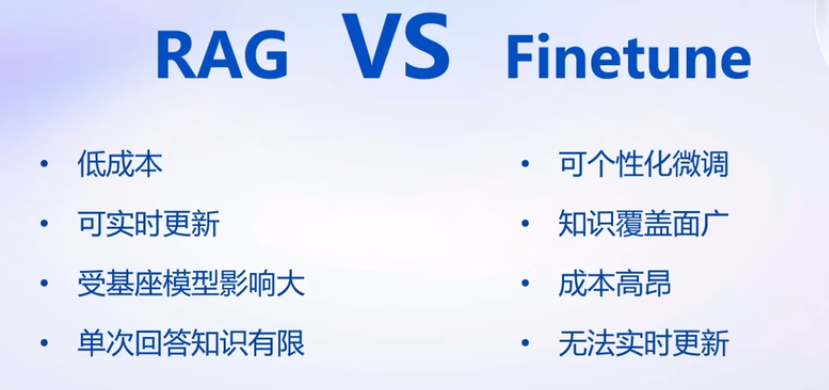
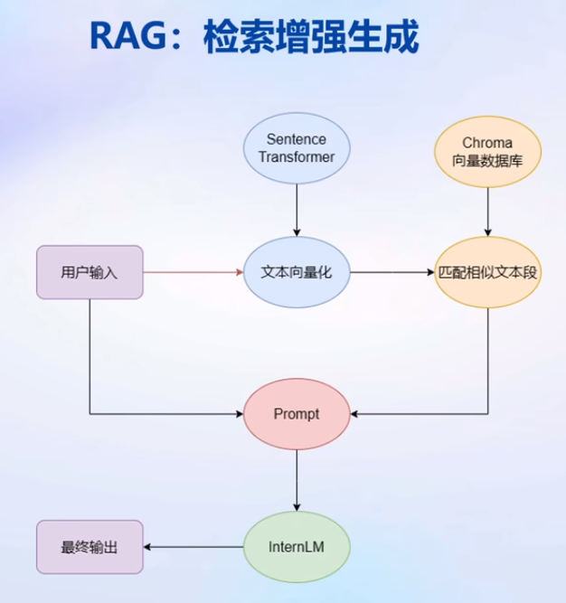
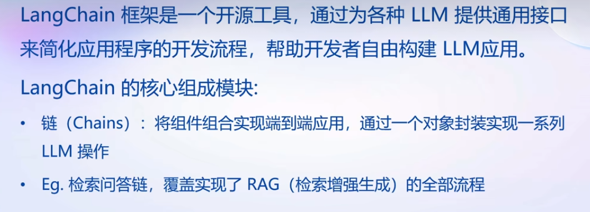
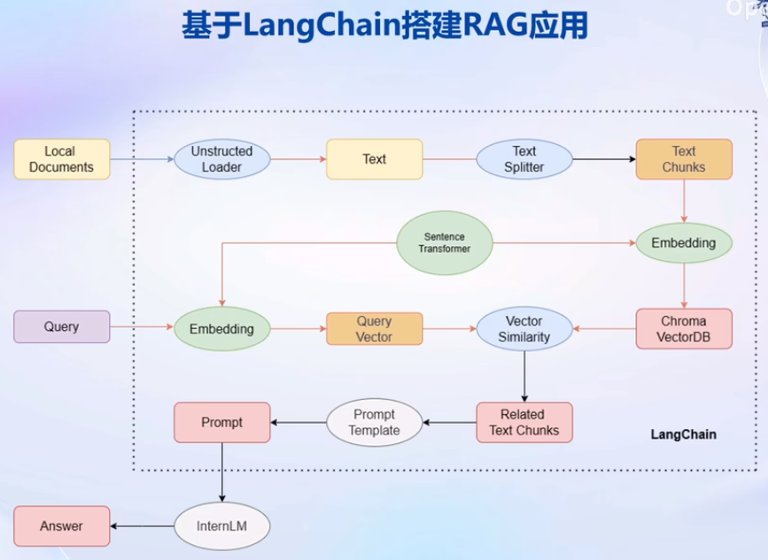
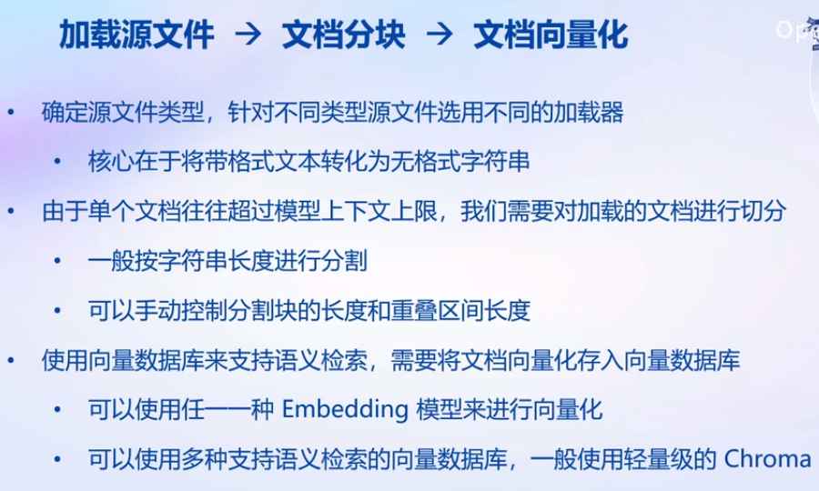
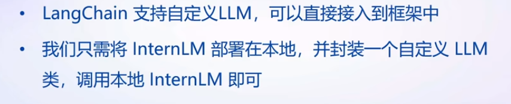
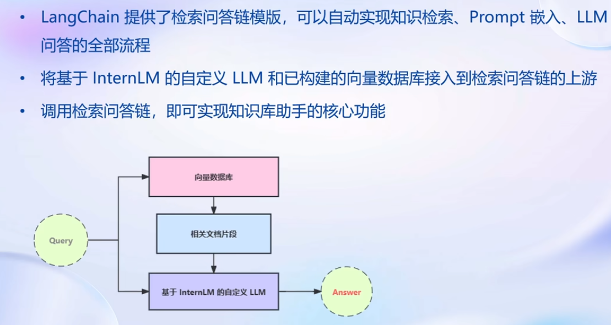
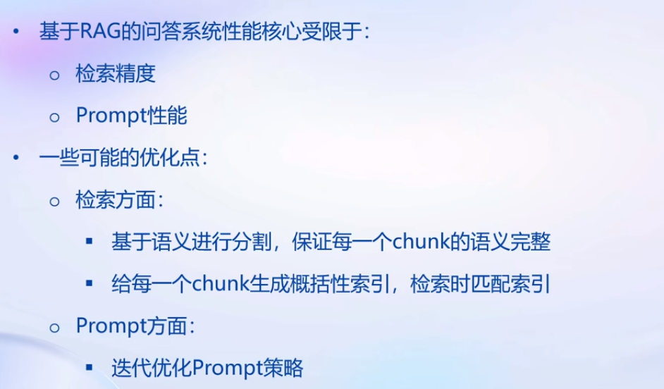
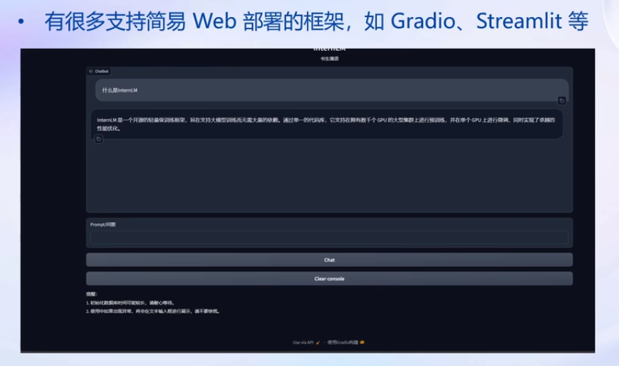

#  Day03 基于 InternLM 和 LangChain 搭建知识库

## 大模型开发范式

### LLM 的局限性

- 知识时效性首先：训练数据集截止时间之前的知识，之后的未知
- 专业能力有限：通用大模型 vs 垂域大模型
- 定制化成本高

### RAG vs Finetune

### RAG 检索增强

## LangChain 简介

- 检索问答链：最基本的链

### 基于LangChain搭建RAG应用

## 构建向量数据库

### 加载源文件-文档分块-文档向量化

## 搭建知识库助手

- 将InternLM接入LangChain

  

- 构建检索问答链

- RAG方案优化建议

## Web Demo 部署

- 支持简易Web部署的框架，如Gradio、Streamlit等

课程资料：

- 课程视频：https://www.bilibili.com/video/BV1Rc411b7ns
- OpenXLab：https://studio.intern-ai.org.cn
- 学习手册：https://kvudif1helh.feishu.cn/docx/Xx8hdqGwmopi5NxWxNWc76AOnPf

- 基于大模型搭建金融场景智能问答系统：https://github.com/Tongyi-EconML/FinQwen
- 天池LLM大模型：https://tianchi.aliyun.com/competition/entrance/532172
- https://huggingface.co/datasets/arxiv_dataset
- MirrorZ Help 开源镜像: https://help.mirrors.cernet.edu.cn/