#  Day04 XTuner 大模型单卡低成本微调实战

- 汪周谦：眼科人工智能系统的临床应用，使用大语言模型与CV模型构建多模态的诊疗体系的研究

## Finetune简介

- 增量训练和指令跟随
- 增量预训练：新知识，垂域领域的常识

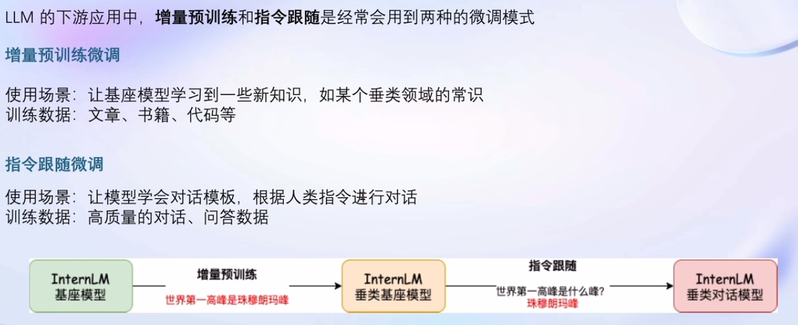

### 指令跟随微调

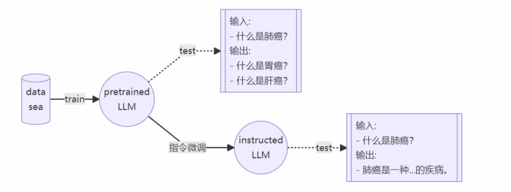

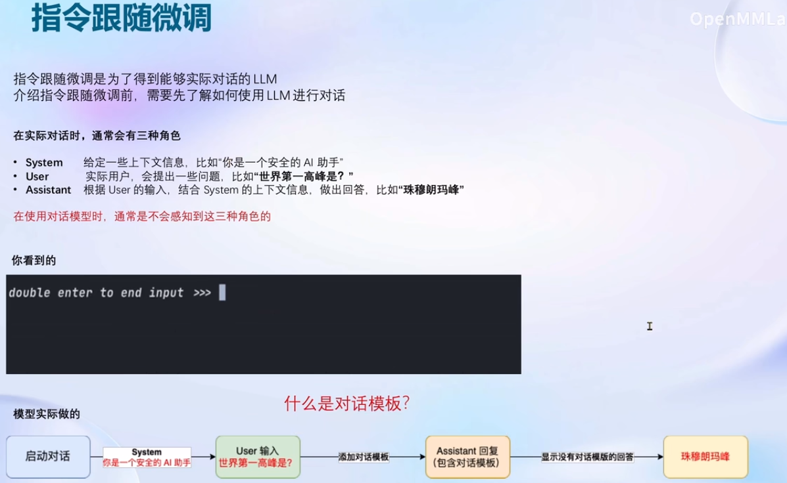

- 对话模板

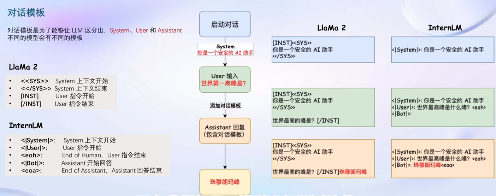

- 指令微调训练

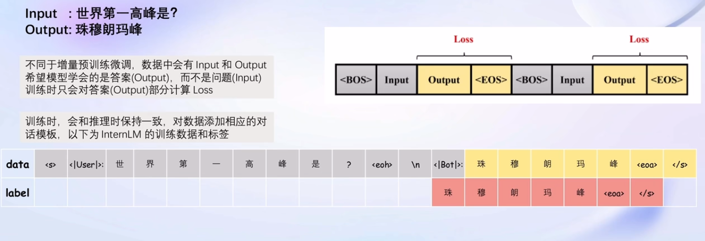

### 增量预训练微调

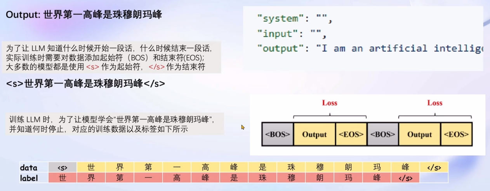

### LoRA & QLoRA

- 在原始模型参数 , 增加旁路分支(组件)

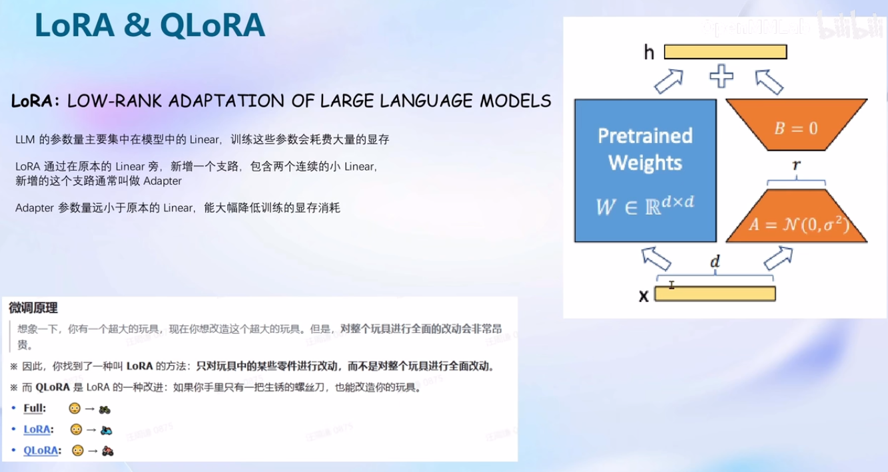

- 微调-LoRA-QLoRA

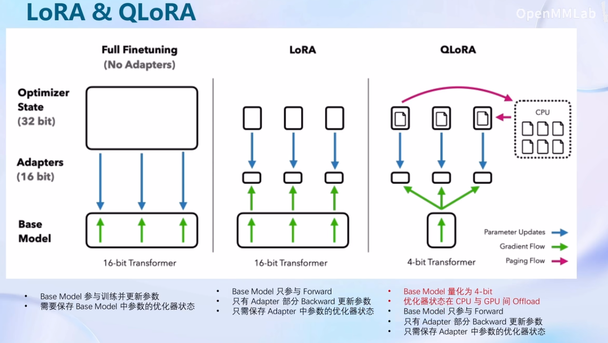

## Xtuner介绍

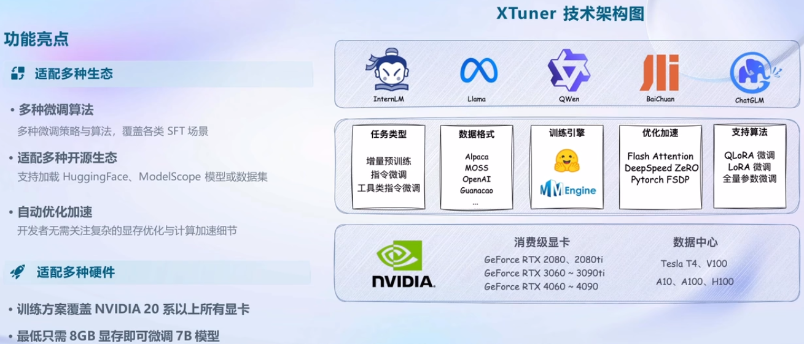

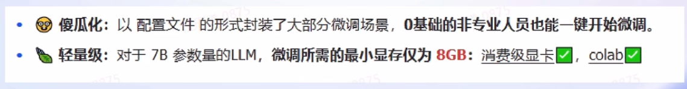

### Xtuner 快速上手

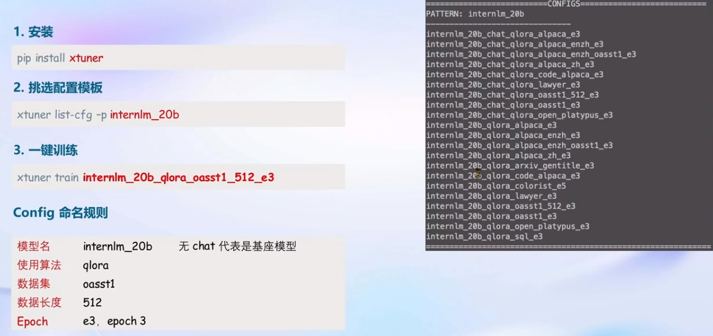

- 自定义微调

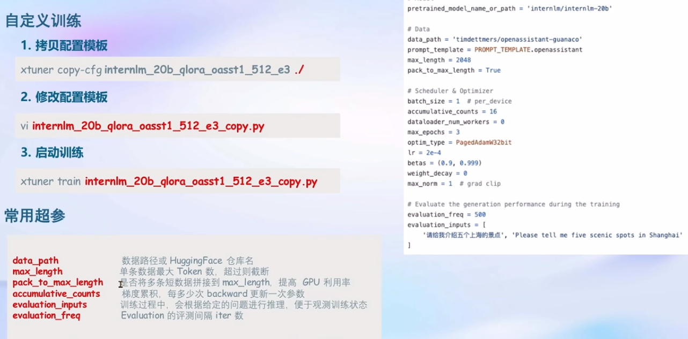

- 对话

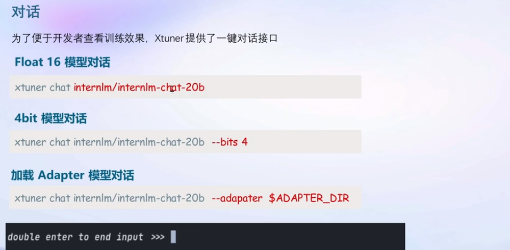

- 更多方式

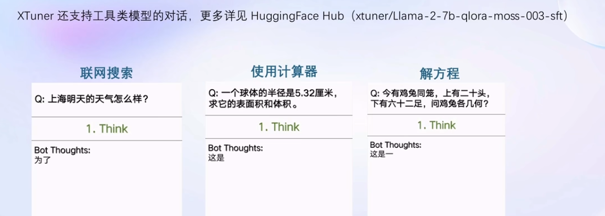

课程资料：

- 课程视频：https://www.bilibili.com/video/BV1Rc411b7ns
- OpenXLab：https://studio.intern-ai.org.cn
- 学习手册：https://kvudif1helh.feishu.cn/docx/Xx8hdqGwmopi5NxWxNWc76AOnPf

- 基于大模型搭建金融场景智能问答系统：https://github.com/Tongyi-EconML/FinQwen
- 天池LLM大模型：https://tianchi.aliyun.com/competition/entrance/532172
- https://huggingface.co/datasets/arxiv_dataset
- MirrorZ Help 开源镜像: https://help.mirrors.cernet.edu.cn/