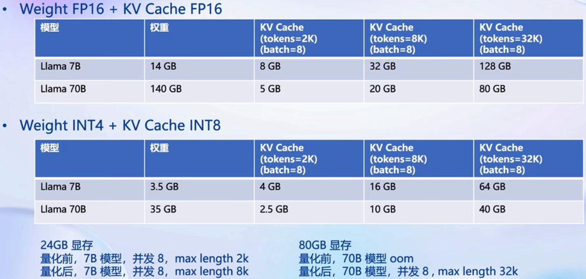

#  Day05 LMDeploy 大模型量化部署实践

## 大模型部署背景

### 模型部署

- 将训练好的模型在特定软硬件环境中启动的过程，使模型能够接收输入并返回预测结果

### 大模型特点

- **内存开销巨大**：庞大参数量，7B模型仅权重就需要14+G内存
- 自回归token 需要缓存attention的k/v
- **动态shape**：请求数不固定，token逐个生成，数量不定
- 相对视觉模型，LLM结构简单，**Transformer结构**，大部分是decoder-only

### 大模型部署挑战

- 设备：存储巨大
- 推理：生成速度
- 服务：吞吐量、时延

### 大模型部署方案

- 技术点：模型并行、低比特量化、Page Attention、Transormer计算和访存优化、ContinuousBatch、、、
- HuggingFace Transformers、专门的推理加速框架

- 云端、移动端

## LMDeploy简介

- LMDeploy是LLM在英伟达设备上部署的全流程解决方案。包括轻量化、推理、服务。
- 项目地址：https://github.com/InternLM/Imdeploy

- 推理性能

### 核心功能-量化

- 为什么做量化：显存降低、存储降低、性能不降

- 为什么做weight only 的量化

- AWQ算法：重要的参数不量化（少部分参数）

### 核心功能-推理引擎TurboMind

- 持续批处理、有状态的推理、高性能CudaKernel、Blocked k/v cache

- 持续批处理

- 有状态的推理

- Blocked k/v cache

### 核心功能-推理服务api server

课程资料：

- 课程视频：https://www.bilibili.com/video/BV1Rc411b7ns
- OpenXLab：https://studio.intern-ai.org.cn
- 学习手册：https://kvudif1helh.feishu.cn/docx/Xx8hdqGwmopi5NxWxNWc76AOnPf

- 基于大模型搭建金融场景智能问答系统：https://github.com/Tongyi-EconML/FinQwen
- 天池LLM大模型：https://tianchi.aliyun.com/competition/entrance/532172
- https://huggingface.co/datasets/arxiv_dataset
- MirrorZ Help 开源镜像: https://help.mirrors.cernet.edu.cn/