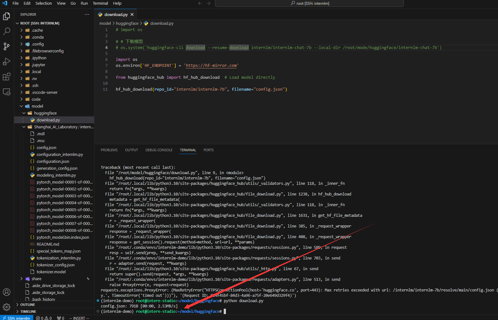

# Day02 作业

- 使用 InternLM-Chat-7B 模型生成 300 字的小故事（需截图）


- 熟悉 hugging face 下载功能，使用 `huggingface_hub` python 包，下载 `InternLM-20B` 的 config.json 文件到本地（需截图下载过程）。


- 修改镜像后下载成功

```
import os 
os.environ['HF_ENDPOINT'] = 'https://hf-mirror.com'

from huggingface_hub import hf_hub_download  # Load model directly 

hf_hub_download(repo_id="internlm/internlm-7b", filename="config.json")
```
