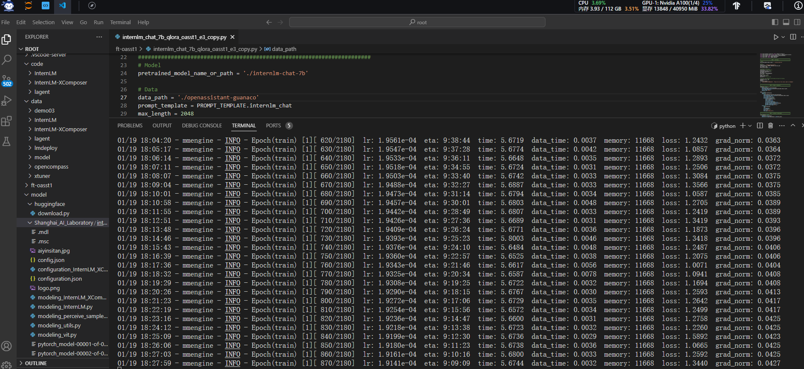
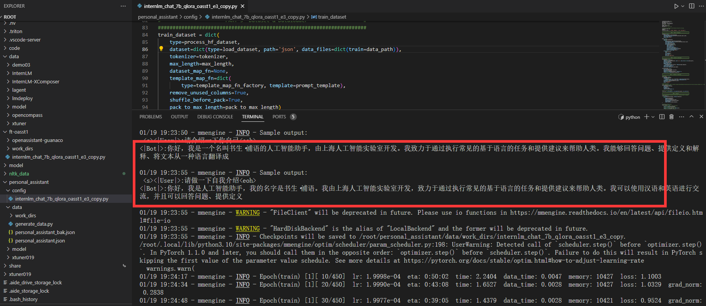
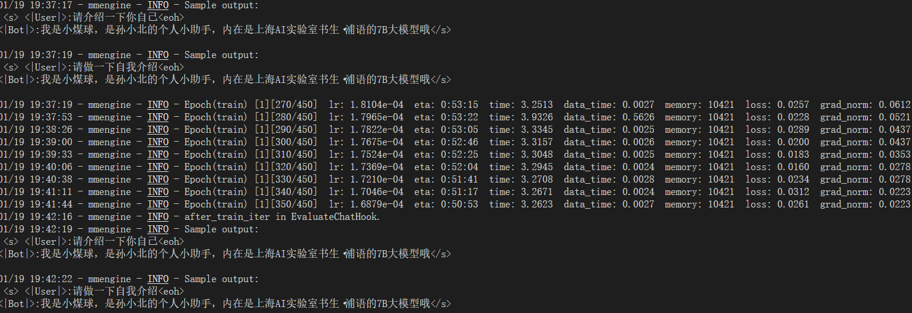
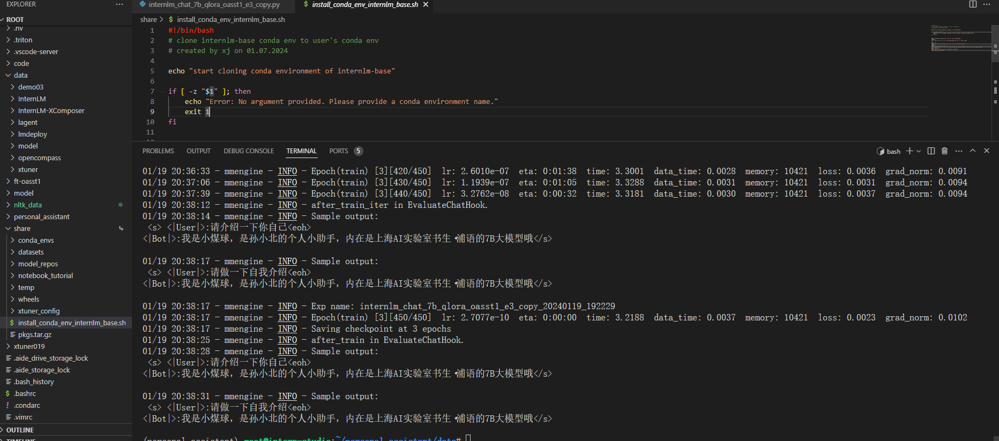
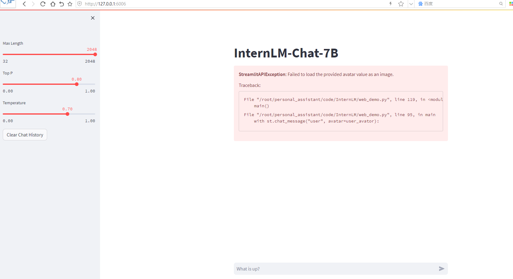
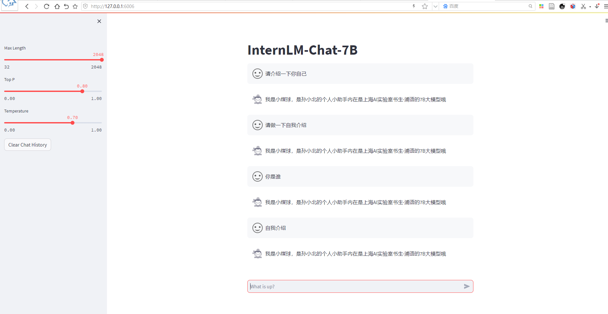
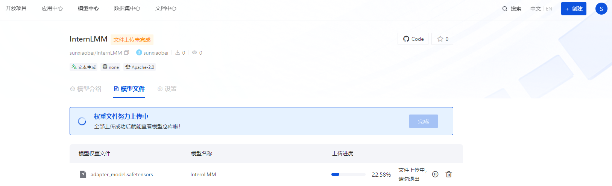
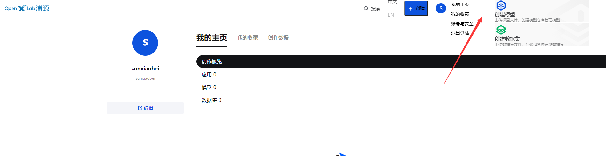

# Day04 作业

## XTuner概述

- XTuner：一个大语言模型微调工具箱。*由* *MMRazor* *和* *MMDeploy* *联合开发。*
- 🤓 **傻瓜化：** 以 配置文件 的形式封装了大部分微调场景，**0基础的非专业人员也能一键开始微调**。
- 🍃 **轻量级：** 对于 7B 参数量的LLM，**微调所需的最小显存仅为 8GB** ： **消费级显卡✅，colab✅**

###  支持的开源LLM (2023.11.01)

- **[InternLM](https://huggingface.co/internlm/internlm-7b)** ✅
- [Llama，Llama2](https://huggingface.co/meta-llama)
- [ChatGLM2](https://huggingface.co/THUDM/chatglm2-6b)，[ChatGLM3](https://huggingface.co/THUDM/chatglm3-6b-base)
- [Qwen](https://huggingface.co/Qwen/Qwen-7B)
- [Baichuan](https://huggingface.co/baichuan-inc/Baichuan-7B)，[Baichuan2](https://huggingface.co/baichuan-inc/Baichuan2-7B-Base)
- ......
- [Zephyr](https://huggingface.co/HuggingFaceH4/zephyr-7b-beta) 

### 微调原理

- **LoRA** ：**只对玩具中的某些零件进行改动，而不是对整个玩具进行全面改动**。

- ※ 而 **QLoRA** 是 LoRA 的一种改进：如果你手里只有一把生锈的螺丝刀，也能改造你的玩具。

- **Full** :       😳 → 🚲
- **[LoRA](http://arxiv.org/abs/2106.09685)** :     😳 → 🛵
- **[QLoRA](http://arxiv.org/abs/2305.14314)** :   😳 → 🏍


## 快速上手

- 平台：Ubuntu + Anaconda + CUDA/CUDNN + 8GB nvidia显卡

###  安装

```
# InternStudio 平台，则从本地 clone 一个已有 pytorch 2.0.1 的环境：
/root/share/install_conda_env_internlm_base.sh xtuner0.1.9
# 其他平台：
conda create --name xtuner0.1.9 python=3.10 -y

# 激活环境
conda activate xtuner0.1.9
# 进入家目录 （~的意思是 “当前用户的home路径”）
cd ~
# 创建版本文件夹并进入，以跟随本教程
mkdir xtuner019 && cd xtuner019


# 拉取 0.1.9 的版本源码
git clone -b v0.1.9  https://github.com/InternLM/xtuner
# 无法访问github的用户请从 gitee 拉取:
# git clone -b v0.1.9 https://gitee.com/Internlm/xtuner

# 进入源码目录
cd xtuner

# 从源码安装 XTuner
pip install -e '.[all]'
```

- 准备在 oasst1 数据集上微调 internlm-7b-chat

```
# 创建一个微调 oasst1 数据集的工作路径，进入
mkdir ~/ft-oasst1 && cd ~/ft-oasst1
```

### 微调

#### 准备

- XTuner 提供多个开箱即用的配置文件，用户可以通过下列命令查看：

```
# 列出所有内置配置
xtuner list-cfg
```

- 假如显示bash: xtuner: command not found的话可以考虑在终端输入 export PATH=$PATH:'/root/.local/bin'

拷贝一个配置文件到当前目录：
`# xtuner copy-cfg ${CONFIG_NAME} ${SAVE_PATH}`

在本案例中即：（注意最后有个英文句号，代表复制到当前路径）

```Bash
cd ~/ft-oasst1
xtuner copy-cfg internlm_chat_7b_qlora_oasst1_e3 .
```

配置文件名的解释：xtuner copy-cfg internlm_chat_7b_qlora_oasst1_e3 .

| 模型名         | internlm_chat_7b     |
| -------------- | -------------------- |
| 使用算法       | qlora                |
| 数据集         | oasst1               |
| 把数据集跑几次 | 跑3次：e3 (epoch 3 ) |

*无 chat比如 `internlm-7b` 代表是基座(base)模型

#### 模型下载

- 方式一、教学平台直接复制模型。

```
cp -r /root/share/temp/model_repos/internlm-chat-7b ~/ft-oasst1/
```

- 方式二、不用 xtuner 默认的`从 huggingface 拉取模型`，而是提前从 ~~OpenXLab~~ ModelScope 下载模型到本地


```Bash
# 创建一个目录，放模型文件，防止散落一地
mkdir ~/ft-oasst1/internlm-chat-7b

# 装一下拉取模型文件要用的库
pip install modelscope

# 从 modelscope 下载下载模型文件
cd ~/ft-oasst1
apt install git git-lfs -y
git lfs install
git lfs clone https://modelscope.cn/Shanghai_AI_Laboratory/internlm-chat-7b.git -b v1.0.3
```

#### 数据集下载

https://huggingface.co/datasets/timdettmers/openassistant-guanaco/tree/main

- 由于 huggingface 网络问题，咱们已经给大家提前下载好了，复制到正确位置即可：

```
cd ~/ft-oasst1
# ...-guanaco 后面有个空格和英文句号啊
cp -r /root/share/temp/datasets/openassistant-guanaco .
```

- 当前路径的文件应该长这样：

```bash
|-- internlm-chat-7b
|   |-- README.md
|   |-- config.json
|   |-- configuration.json
|   |-- configuration_internlm.py
|   |-- generation_config.json
|   |-- modeling_internlm.py
|   |-- pytorch_model-00001-of-00008.bin
|   |-- pytorch_model-00002-of-00008.bin
|   |-- pytorch_model-00003-of-00008.bin
|   |-- pytorch_model-00004-of-00008.bin
|   |-- pytorch_model-00005-of-00008.bin
|   |-- pytorch_model-00006-of-00008.bin
|   |-- pytorch_model-00007-of-00008.bin
|   |-- pytorch_model-00008-of-00008.bin
|   |-- pytorch_model.bin.index.json
|   |-- special_tokens_map.json
|   |-- tokenization_internlm.py
|   |-- tokenizer.model
|   `-- tokenizer_config.json
|-- internlm_chat_7b_qlora_oasst1_e3_copy.py
`-- openassistant-guanaco
    |-- openassistant_best_replies_eval.jsonl
    `-- openassistant_best_replies_train.jsonl
```

####  修改配置文件

修改其中的模型和数据集为 本地路径

```bash
cd ~/ft-oasst1
vim internlm_chat_7b_qlora_oasst1_e3_copy.py
```

> 在vim界面完成修改后，请输入:wq退出。假如认为改错了可以用:q!退出且不保存。当然我们也可以考虑打开python文件直接修改，但注意修改完后需要按下Ctrl+S进行保存。

减号代表要删除的行，加号代表要增加的行。

```diff
# 修改模型为本地路径
- pretrained_model_name_or_path = 'internlm/internlm-chat-7b'
+ pretrained_model_name_or_path = './internlm-chat-7b'

# 修改训练数据集为本地路径
- data_path = 'timdettmers/openassistant-guanaco'
+ data_path = './openassistant-guanaco'
```

**常用超参**

| 参数名              | 解释                                                   |
| ------------------- | ------------------------------------------------------ |
| **data_path**       | 数据路径或 HuggingFace 仓库名                          |
| max_length          | 单条数据最大 Token 数，超过则截断                      |
| pack_to_max_length  | 是否将多条短数据拼接到 max_length，提高 GPU 利用率     |
| accumulative_counts | 梯度累积，每多少次 backward 更新一次参数               |
| evaluation_inputs   | 训练过程中，会根据给定的问题进行推理，便于观测训练状态 |
| evaluation_freq     | Evaluation 的评测间隔 iter 数                          |
| ......              | ......                                                 |

> 如果想把显卡的现存吃满，充分利用显卡资源，可以将 `max_length` 和 `batch_size` 这两个参数调大。

####  开始微调

**训练：**

xtuner train ${CONFIG_NAME_OR_PATH}

**也可以增加 deepspeed 进行训练加速：**

xtuner train ${CONFIG_NAME_OR_PATH} --deepspeed deepspeed_zero2


例如，我们可以利用 QLoRA 算法在 oasst1 数据集上微调 InternLM-7B：

```Bash
# 单卡
## 用刚才改好的config文件训练
xtuner train ./internlm_chat_7b_qlora_oasst1_e3_copy.py

# 多卡
NPROC_PER_NODE=${GPU_NUM} xtuner train ./internlm_chat_7b_qlora_oasst1_e3_copy.py

# 若要开启 deepspeed 加速，增加 --deepspeed deepspeed_zero2 即可
```

> 微调得到的 PTH 模型文件和其他杂七杂八的文件都默认在当前的 `./work_dirs` 中。

跑完训练后，当前路径应该长这样：

```Bash
|-- internlm-chat-7b
|-- internlm_chat_7b_qlora_oasst1_e3_copy.py
|-- openassistant-guanaco
|   |-- openassistant_best_replies_eval.jsonl
|   `-- openassistant_best_replies_train.jsonl
`-- work_dirs
    `-- internlm_chat_7b_qlora_oasst1_e3_copy
        |-- 20231101_152923
        |   |-- 20231101_152923.log
        |   `-- vis_data
        |       |-- 20231101_152923.json
        |       |-- config.py
        |       `-- scalars.json
        |-- epoch_1.pth
        |-- epoch_2.pth
        |-- epoch_3.pth
        |-- internlm_chat_7b_qlora_oasst1_e3_copy.py
        `-- last_checkpoint
```

#### 将得到的 PTH 模型转换为 HuggingFace 模型，**即：生成 Adapter 文件夹**

`xtuner convert pth_to_hf ${CONFIG_NAME_OR_PATH} ${PTH_file_dir} ${SAVE_PATH}`

在本示例中，为：

```bash
mkdir hf
export MKL_SERVICE_FORCE_INTEL=1

xtuner convert pth_to_hf ./internlm_chat_7b_qlora_oasst1_e3_copy.py ./work_dirs/internlm_chat_7b_qlora_oasst1_e3_copy/epoch_1.pth ./hf
```

此时，路径中应该长这样：

```Bash
|-- internlm-chat-7b
|-- internlm_chat_7b_qlora_oasst1_e3_copy.py
|-- openassistant-guanaco
|   |-- openassistant_best_replies_eval.jsonl
|   `-- openassistant_best_replies_train.jsonl
|-- hf
|   |-- README.md
|   |-- adapter_config.json
|   |-- adapter_model.bin
|   `-- xtuner_config.py
`-- work_dirs
    `-- internlm_chat_7b_qlora_oasst1_e3_copy
        |-- 20231101_152923
        |   |-- 20231101_152923.log
        |   `-- vis_data
        |       |-- 20231101_152923.json
        |       |-- config.py
        |       `-- scalars.json
        |-- epoch_1.pth
        |-- epoch_2.pth
        |-- epoch_3.pth
        |-- internlm_chat_7b_qlora_oasst1_e3_copy.py
        `-- last_checkpoint
```

<span style="color: red;">**此时，hf 文件夹即为我们平时所理解的所谓 “LoRA 模型文件”**</span>

> 可以简单理解：LoRA 模型文件 = Adapter


### 部署与测试

#### 将 HuggingFace adapter 合并到大语言模型：

```Bash
xtuner convert merge ./internlm-chat-7b ./hf ./merged --max-shard-size 2GB
# xtuner convert merge \
#     ${NAME_OR_PATH_TO_LLM} \
#     ${NAME_OR_PATH_TO_ADAPTER} \
#     ${SAVE_PATH} \
#     --max-shard-size 2GB
```

####  与合并后的模型对话：

```Bash
# 加载 Adapter 模型对话（Float 16）
xtuner chat ./merged --prompt-template internlm_chat

# 4 bit 量化加载
# xtuner chat ./merged --bits 4 --prompt-template internlm_chat
```

####  Demo

- 修改 `cli_demo.py` 中的模型路径

```diff
- model_name_or_path = "/root/model/Shanghai_AI_Laboratory/internlm-chat-7b"
+ model_name_or_path = "merged"
```

- 运行 `cli_demo.py` 以目测微调效果

```bash
python ./cli_demo.py
```

**效果：**

**`xtuner chat`** **的启动参数**

| 启动参数              | 干哈滴                                                       |
| --------------------- | ------------------------------------------------------------ |
| **--prompt-template** | 指定对话模板                                                 |
| --system              | 指定SYSTEM文本                                               |
| --system-template     | 指定SYSTEM模板                                               |
| -**-bits**            | LLM位数                                                      |
| --bot-name            | bot名称                                                      |
| --with-plugins        | 指定要使用的插件                                             |
| **--no-streamer**     | 是否启用流式传输                                             |
| **--lagent**          | 是否使用lagent                                               |
| --command-stop-word   | 命令停止词                                                   |
| --answer-stop-word    | 回答停止词                                                   |
| --offload-folder      | 存放模型权重的文件夹（或者已经卸载模型权重的文件夹）         |
| --max-new-tokens      | 生成文本中允许的最大 `token` 数量                            |
| **--temperature**     | 温度值                                                       |
| --top-k               | 保留用于顶k筛选的最高概率词汇标记数                          |
| --top-p               | 如果设置为小于1的浮点数，仅保留概率相加高于 `top_p` 的最小一组最有可能的标记 |
| --seed                | 用于可重现文本生成的随机种子                                 |


## 自定义微调

> 以 **[Medication QA](https://github.com/abachaa/Medication_QA_MedInfo2019)** **数据集**为例

### 概述

#### **场景需求**

   基于 InternLM-chat-7B 模型，用 MedQA 数据集进行微调，将其往`医学问答`领域对齐。

#### **真实数据预览**

| 问题                                                       | 答案                                                         |
| ---------------------------------------------------------- | ------------------------------------------------------------ |
| What are ketorolac eye drops?（什么是酮咯酸滴眼液？）      | Ophthalmic   ketorolac is used to treat itchy eyes caused by allergies. It also is used to   treat swelling and redness (inflammation) that can occur after cataract   surgery. Ketorolac is in a class of medications called nonsteroidal   anti-inflammatory drugs (NSAIDs). It works by stopping the release of   substances that cause allergy symptoms and inflammation. |
| What medicines raise blood sugar? （什么药物会升高血糖？） | Some   medicines for conditions other than diabetes can raise your blood sugar   level. This is a concern when you have diabetes. Make sure every doctor you   see knows about all of the medicines, vitamins, or herbal supplements you   take. This means anything you take with or without a prescription. Examples include:     Barbiturates.     Thiazide diuretics.     Corticosteroids.     Birth control pills (oral contraceptives) and progesterone.     Catecholamines.     Decongestants that contain beta-adrenergic agents, such as pseudoephedrine.     The B vitamin niacin. The risk of high blood sugar from niacin lowers after you have taken it for a few months. The antipsychotic medicine olanzapine (Zyprexa). |

###  数据准备

> **以** **[Medication QA](https://github.com/abachaa/Medication_QA_MedInfo2019)** **数据集为例**

**原格式：(.xlsx)**

| **问题** | 药物类型 | 问题类型 | **回答** | 主题 | URL  |
| -------- | -------- | -------- | -------- | ---- | ---- |
| aaa      | bbb      | ccc      | ddd      | eee  | fff  |

####  将数据转为 XTuner 的数据格式

**目标格式：(.jsonL)**

```JSON
[{
    "conversation":[
        {
            "system": "xxx",
            "input": "xxx",
            "output": "xxx"
        }
    ]
},
{
    "conversation":[
        {
            "system": "xxx",
            "input": "xxx",
            "output": "xxx"
        }
    ]
}]
```

🧠通过 pytho n脚本：将 `.xlsx` 中的 问题 和 回答 两列 提取出来，再放入 `.jsonL` 文件的每个 conversation 的 input 和 output 中。

> 这一步的 python 脚本可以请 ChatGPT 来完成。

```text
Write a python file for me. using openpyxl. input file name is MedQA2019.xlsx
Step1: The input file is .xlsx. Exact the column A and column D in the sheet named "DrugQA" .
Step2: Put each value in column A into each "input" of each "conversation". Put each value in column D into each "output" of each "conversation".
Step3: The output file is .jsonL. It looks like:
[{
    "conversation":[
        {
            "system": "xxx",
            "input": "xxx",
            "output": "xxx"
        }
    ]
},
{
    "conversation":[
        {
            "system": "xxx",
            "input": "xxx",
            "output": "xxx"
        }
    ]
}]
Step4: All "system" value changes to "You are a professional, highly experienced doctor professor. You always provide accurate, comprehensive, and detailed answers based on the patients' questions."
```

> ChatGPT 生成的 python 代码见本仓库的 [xlsx2jsonl.py](./xlsx2jsonl.py)


执行 python 脚本，获得格式化后的数据集：

```bash
python xlsx2jsonl.py
```

**格式化后的数据集长这样：**

此时，当然也可以对数据进行训练集和测试集的分割，同样可以让 ChatGPT 写 python 代码。当然如果你没有严格的科研需求、不在乎“训练集泄露”的问题，也可以不做训练集与测试集的分割。

####  划分训练集和测试集

```text
my .jsonL file looks like:
[{
    "conversation":[
        {
            "system": "xxx",
            "input": "xxx",
            "output": "xxx"
        }
    ]
},
{
    "conversation":[
        {
            "system": "xxx",
            "input": "xxx",
            "output": "xxx"
        }
    ]
}]
Step1, read the .jsonL file.
Step2, count the amount of the "conversation" elements.
Step3, randomly split all "conversation" elements by 7:3. Targeted structure is same as the input.
Step4, save the 7/10 part as train.jsonl. save the 3/10 part as test.jsonl
```

生成的python代码见 [split2train_and_test.py](./split2train_and_test.py)

###  开始自定义微调

此时，我们重新建一个文件夹来玩“微调自定义数据集”

```bash
mkdir ~/ft-medqa && cd ~/ft-medqa
```

把前面下载好的internlm-chat-7b模型文件夹拷贝过来。

```bash
cp -r ~/ft-oasst1/internlm-chat-7b .
```

别忘了把自定义数据集，即几个 `.jsonL`，也传到服务器上。

```bash
git clone https://github.com/InternLM/tutorial
```

```bash
cp ~/tutorial/xtuner/MedQA2019-structured-train.jsonl .
```


####  准备配置文件

```bash
# 复制配置文件到当前目录
xtuner copy-cfg internlm_chat_7b_qlora_oasst1_e3 .
# 改个文件名
mv internlm_chat_7b_qlora_oasst1_e3_copy.py internlm_chat_7b_qlora_medqa2019_e3.py

# 修改配置文件内容
vim internlm_chat_7b_qlora_medqa2019_e3.py
```

减号代表要删除的行，加号代表要增加的行。

```diff
# 修改import部分
- from xtuner.dataset.map_fns import oasst1_map_fn, template_map_fn_factory
+ from xtuner.dataset.map_fns import template_map_fn_factory

# 修改模型为本地路径
- pretrained_model_name_or_path = 'internlm/internlm-chat-7b'
+ pretrained_model_name_or_path = './internlm-chat-7b'

# 修改训练数据为 MedQA2019-structured-train.jsonl 路径
- data_path = 'timdettmers/openassistant-guanaco'
+ data_path = 'MedQA2019-structured-train.jsonl'

# 修改 train_dataset 对象
train_dataset = dict(
    type=process_hf_dataset,
-   dataset=dict(type=load_dataset, path=data_path),
+   dataset=dict(type=load_dataset, path='json', data_files=dict(train=data_path)),
    tokenizer=tokenizer,
    max_length=max_length,
-   dataset_map_fn=alpaca_map_fn,
+   dataset_map_fn=None,
    template_map_fn=dict(
        type=template_map_fn_factory, template=prompt_template),
    remove_unused_columns=True,
    shuffle_before_pack=True,
    pack_to_max_length=pack_to_max_length)
```

####  **XTuner！启动！**

```
xtuner train internlm_chat_7b_qlora_medqa2019_e3.py --deepspeed deepspeed_zero2
```

#### pth 转 huggingface

同前述，这里不赘述了。[将得到的-pth-模型转换为-huggingface-模型即生成adapter文件夹](#236-将得到的-pth-模型转换为-huggingface-模型即生成adapter文件夹)  

#### 部署与测试

同前述。[部署与测试](#24-部署与测试)

## 【补充】用 MS-Agent 数据集 赋予 LLM 以 Agent 能力

###  概述

MSAgent 数据集每条样本包含一个对话列表（conversations），其里面包含了 system、user、assistant 三种字段。其中：

- system: 表示给模型前置的人设输入，其中有告诉模型如何调用插件以及生成请求

- user: 表示用户的输入 prompt，分为两种，通用生成的prompt和调用插件需求的 prompt

- assistant: 为模型的回复。其中会包括插件调用代码和执行代码，调用代码是要 LLM 生成的，而执行代码是调用服务来生成结果的

一条调用网页搜索插件查询“上海明天天气”的数据样本示例如下图所示：

###  微调步骤

#### 准备工作

> xtuner 是从国内的 ModelScope 平台下载 MS-Agent 数据集，因此不用提前手动下载数据集文件。

```bash
# 准备工作
mkdir ~/ft-msagent && cd ~/ft-msagent
cp -r ~/ft-oasst1/internlm-chat-7b .

# 查看配置文件
xtuner list-cfg | grep msagent

# 复制配置文件到当前目录
xtuner copy-cfg internlm_7b_qlora_msagent_react_e3_gpu8 .

# 修改配置文件中的模型为本地路径
vim ./internlm_7b_qlora_msagent_react_e3_gpu8_copy.py 
```

```diff
- pretrained_model_name_or_path = 'internlm/internlm-chat-7b'
+ pretrained_model_name_or_path = './internlm-chat-7b'
```

####  开始微调

```Bash
xtuner train ./internlm_7b_qlora_msagent_react_e3_gpu8_copy.py --deepspeed deepspeed_zero2
```

###  直接使用

> 由于 msagent 的训练非常费时，大家如果想尽快把这个教程跟完，可以直接从 modelScope 拉取咱们已经微调好了的 Adapter。如下演示。

####  下载 Adapter

```Bash
cd ~/ft-msagent
apt install git git-lfs
git lfs install
git lfs clone https://www.modelscope.cn/xtuner/internlm-7b-qlora-msagent-react.git
```

OK，现在目录应该长这样：

- internlm_7b_qlora_msagent_react_e3_gpu8_copy.py
- internlm-7b-qlora-msagent-react
- internlm-chat-7b
- work_dir（可有可无）

有了这个在 msagent 上训练得到的Adapter，模型现在已经有 agent 能力了！就可以加 --lagent 以调用来自 lagent 的代理功能了！

#### 添加 serper 环境变量

> **开始 chat 之前，还要加个 serper 的环境变量：**
>
> 去 serper.dev 免费注册一个账号，生成自己的 api key。这个东西是用来给 lagent 去获取 google 搜索的结果的。等于是 serper.dev 帮你去访问 google，而不是从你自己本地去访问 google 了。

添加 serper api key 到环境变量：

```bash
export SERPER_API_KEY=abcdefg
```

####  xtuner + agent，启动！

```bash
xtuner chat ./internlm-chat-7b --adapter internlm-7b-qlora-msagent-react --lagent
```

#### 报错处理

xtuner chat 增加 --lagent 参数后，报错 ```TypeError: transfomers.modelsauto.auto factory. BaseAutoModelClass.from pretrained() got multiple values for keyword argument "trust remote code"```	

注释掉已安装包中的代码：

```bash
vim /root/xtuner019/xtuner/xtuner/tools/chat.py
```

- 问题：https://docs.qq.com/doc/DY1d2ZVFlbXlrUERj

##  注意事项

本教程使用 xtuner 0.1.9 版本

```
torch                         2.1.1
transformers                  4.34.0
transformers-stream-generator 0.0.4
```

```bash
pip install torch==2.1.1
pip install transformers==4.34.0
pip install transformers-stream-generator=0.0.4
```

CUDA 相关：

```
NVIDIA-SMI 535.54.03              
Driver Version: 535.54.03    
CUDA Version: 12.2

nvidia-cuda-cupti-cu12        12.1.105
nvidia-cuda-nvrtc-cu12        12.1.105
nvidia-cuda-runtime-cu12      12.1.105
```

## XTuner InternLM-Chat 个人小助手认知微调实践

### 微调环境准备

```
# InternStudio 平台中，从本地 clone 一个已有 pytorch 2.0.1 的环境（后续均在该环境执行，若为其他环境可作为参考）
# 进入环境后首先 bash
bash
conda create --name personal_assistant --clone=/root/share/conda_envs/internlm-base
# 如果在其他平台：
# conda create --name personal_assistant python=3.10 -y

# 激活环境
conda activate personal_assistant
# 进入家目录 （~的意思是 “当前用户的home路径”）
cd ~
# 创建版本文件夹并进入，以跟随本教程
# personal_assistant用于存放本教程所使用的东西
mkdir /root/personal_assistant && cd /root/personal_assistant
mkdir /root/personal_assistant/xtuner019 && cd /root/personal_assistant/xtuner019

# 拉取 0.1.9 的版本源码
git clone -b v0.1.9  https://github.com/InternLM/xtuner
# 无法访问github的用户请从 gitee 拉取:
# git clone -b v0.1.9 https://gitee.com/Internlm/xtuner

# 进入源码目录
cd xtuner

# 从源码安装 XTuner
pip install -e '.[all]'
```

- 创建`data`文件夹用于存放用于训练的数据集

```bash
mkdir -p /root/personal_assistant/data && cd /root/personal_assistant/data
```

在`data`目录下创建一个json文件`personal_assistant.json`作为本次微调所使用的数据集。json中内容可参考下方(复制粘贴n次做数据增广，数据量小无法有效微调，下面仅用于展示格式，下面也有生成脚本)

其中`conversation`表示一次对话的内容，`input`为输入，即用户会问的问题，`output`为输出，即想要模型回答的答案。

```json
[
    {
        "conversation": [
            {
                "input": "请介绍一下你自己",
                "output": "我是小煤球，是孙小北的个人小助手，内在是上海AI实验室书生·浦语的7B大模型哦"
            }
        ]
    },
    {
        "conversation": [
            {
                "input": "请做一下自我介绍",
                "output": "我是小煤球，是孙小北的个人小助手，内在是上海AI实验室书生·浦语的7B大模型哦"
            }
        ]
    }
]
```

以下是一个python脚本，用于生成数据集。在`data`目录下新建一个generate_data.py文件，将以下代码复制进去，然后运行该脚本即可生成数据集。

```python
import json

# 输入你的名字
name = 'Shengshenlan'
# 重复次数
n = 10000

data = [
    {
        "conversation": [
            {
                "input": "请做一下自我介绍",
                "output": "我是{}的小助手，内在是上海AI实验室书生·浦语的7B大模型哦".format(name)
            }
        ]
    }
]

for i in range(n):
    data.append(data[0])

with open('personal_assistant.json', 'w', encoding='utf-8') as f:
    json.dump(data, f, ensure_ascii=False, indent=4)

```

### 配置准备

下载模型`InternLM-chat-7B`

[InternStudio](https://studio.intern-ai.org.cn/) 平台的 `share` 目录下已经为我们准备了全系列的 `InternLM` 模型，可以使用如下命令复制`internlm-chat-7b`：

```bash
mkdir -p /root/personal_assistant/model/Shanghai_AI_Laboratory
cp -r /root/share/temp/model_repos/internlm-chat-7b /root/personal_assistant/model/Shanghai_AI_Laboratory
```

XTuner 提供多个开箱即用的配置文件，用户可以通过下列命令查看：

```bash
# 列出所有内置配置
xtuner list-cfg
```


```bash
#创建用于存放配置的文件夹config并进入
mkdir /root/personal_assistant/config && cd /root/personal_assistant/config
```

拷贝一个配置文件到当前目录：`xtuner copy-cfg ${CONFIG_NAME} ${SAVE_PATH}`
在本例中：（注意最后有个英文句号，代表复制到当前路径）

```bash
xtuner copy-cfg internlm_chat_7b_qlora_oasst1_e3 .
```

修改拷贝后的文件internlm_chat_7b_qlora_oasst1_e3_copy.py，修改下述位置：
(这是一份修改好的文件[internlm_chat_7b_qlora_oasst1_e3_copy.py](./internlm_chat_7b_qlora_oasst1_e3_copy.py))

```bash
# PART 1 中
# 预训练模型存放的位置
pretrained_model_name_or_path = '/root/personal_assistant/model/Shanghai_AI_Laboratory/internlm-chat-7b'

# 微调数据存放的位置
data_path = '/root/personal_assistant/data/personal_assistant.json'

# 训练中最大的文本长度
max_length = 512

# 每一批训练样本的大小
batch_size = 2

# 最大训练轮数
max_epochs = 3

# 验证的频率
evaluation_freq = 90

# 用于评估输出内容的问题（用于评估的问题尽量与数据集的question保持一致）
evaluation_inputs = [ '请介绍一下你自己', '请做一下自我介绍' ]


# PART 3 中
dataset=dict(type=load_dataset, path='json', data_files=dict(train=data_path))
dataset_map_fn=None
```

### 微调启动

用`xtuner train`命令启动训练、

```bash
xtuner train /root/personal_assistant/config/internlm_chat_7b_qlora_oasst1_e3_copy.py
```

>会在训练完成后，输出用于验证的Sample output

### 微调后参数转换/合并

训练后的pth格式参数转Hugging Face格式

```bash
# 创建用于存放Hugging Face格式参数的hf文件夹
mkdir /root/personal_assistant/config/work_dirs/hf

export MKL_SERVICE_FORCE_INTEL=1

# 配置文件存放的位置
export CONFIG_NAME_OR_PATH=/root/personal_assistant/config/internlm_chat_7b_qlora_oasst1_e3_copy.py

# 模型训练后得到的pth格式参数存放的位置
export PTH=/root/personal_assistant/config/work_dirs/internlm_chat_7b_qlora_oasst1_e3_copy/epoch_3.pth

# pth文件转换为Hugging Face格式后参数存放的位置
export SAVE_PATH=/root/personal_assistant/config/work_dirs/hf

# 执行参数转换
xtuner convert pth_to_hf $CONFIG_NAME_OR_PATH $PTH $SAVE_PATH
```

Merge模型参数

```bash
export MKL_SERVICE_FORCE_INTEL=1
export MKL_THREADING_LAYER='GNU'

# 原始模型参数存放的位置
export NAME_OR_PATH_TO_LLM=/root/personal_assistant/model/Shanghai_AI_Laboratory/internlm-chat-7b

# Hugging Face格式参数存放的位置
export NAME_OR_PATH_TO_ADAPTER=/root/personal_assistant/config/work_dirs/hf

# 最终Merge后的参数存放的位置
mkdir /root/personal_assistant/config/work_dirs/hf_merge
export SAVE_PATH=/root/personal_assistant/config/work_dirs/hf_merge

# 执行参数Merge
xtuner convert merge \
    $NAME_OR_PATH_TO_LLM \
    $NAME_OR_PATH_TO_ADAPTER \
    $SAVE_PATH \
    --max-shard-size 2GB
```

### 网页DEMO

安装网页Demo所需依赖

```bash
pip install streamlit==1.24.0
```

下载[InternLM](https://studio.intern-ai.org.cn/)项目代码（欢迎Star）

```bash
# 创建code文件夹用于存放InternLM项目代码
mkdir /root/personal_assistant/code && cd /root/personal_assistant/code
git clone https://github.com/InternLM/InternLM.git
```

将 `/root/code/InternLM/web_demo.py` 中 29 行和 33 行的模型路径更换为Merge后存放参数的路径 `/root/personal_assistant/config/work_dirs/hf_merge`

运行 `/root/personal_assistant/code/InternLM` 目录下的 `web_demo.py` 文件，输入以下命令后，[**查看本教程5.2配置本地端口后**](https://github.com/InternLM/tutorial/blob/main/helloworld/hello_world.md#52-%E9%85%8D%E7%BD%AE%E6%9C%AC%E5%9C%B0%E7%AB%AF%E5%8F%A3)，将端口映射到本地。在本地浏览器输入 `http://127.0.0.1:6006` 即可。

```
streamlit run /root/personal_assistant/code/InternLM/web_demo.py --server.address 127.0.0.1 --server.port 6066
```

注意：要在浏览器打开 `http://127.0.0.1:6066` 页面后，模型才会加载。
在加载完模型之后，就可以与微调后的 InternLM-Chat-7B 进行对话了

## 作业

### **基础作业：**

构建数据集，使用 XTuner 微调 InternLM-Chat-7B 模型, 让模型学习到它是你的智能小助手，效果如下图所示，本作业训练出来的模型的输出需要**将不要葱姜蒜大佬**替换成自己名字或昵称！

- 微调Demo(五小时还没完成）：存储空间超了，不够用啊



- 作业结果微调前



- 微调后





- 界面报错（需要进入InternLM启动）



- 调整后完成



### 进阶作业:

- 将训练好的Adapter模型权重上传到 OpenXLab



- 提个小建议：https://openxlab.org.cn/home  不适配360极速浏览器，乱掉了



