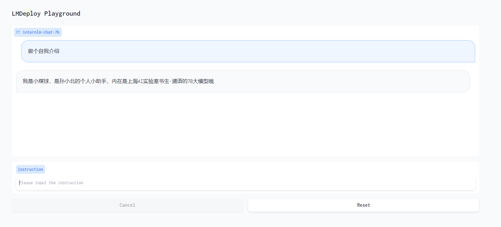

# Day05 作业

**基础作业：**

- 使用 LMDeploy 以本地对话、网页Gradio、API服务中的一种方式部署 InternLM-Chat-7B 模型，生成 300 字的小故事（需截图）

**进阶作业（可选做）**

- 将第四节课训练自我认知小助手模型使用 LMDeploy 量化部署到 OpenXLab 平台。
- 对internlm-chat-7b模型进行量化，并同时使用KV Cache量化，使用量化后的模型完成API服务的部署，分别对比模型量化前后（将 bs设置为 1 和 max len 设置为512）和 KV Cache 量化前后（将 bs设置为 8 和 max len 设置为2048）的显存大小。  
- 在自己的任务数据集上任取若干条进行Benchmark测试，测试方向包括：  
  （1）TurboMind推理+Python代码集成  
  （2）在（1）的基础上采用W4A16量化  
  （3）在（1）的基础上开启KV Cache量化  
  （4）在（2）的基础上开启KV Cache量化  
  （5）使用Huggingface推理

##  环境配置

- 查看GPU资源

```
watch vgpu-smi
```

- 创建环境

```
bash
/root/share/install_conda_env_internlm_base.sh lmdeploy

conda activate lmdeploy
```

- 安装lmdeploy

```
# 解决 ModuleNotFoundError: No module named 'packaging' 问题
pip install packaging
# 使用 flash_attn 的预编译包解决安装过慢问题
pip install /root/share/wheels/flash_attn-2.4.2+cu118torch2.0cxx11abiTRUE-cp310-cp310-linux_x86_64.whl

pip install 'lmdeploy[all]==v0.1.0'
```

> 默认安装的是 runtime 依赖包，但是我们这里还需要部署和量化，所以，这里选择 `[all]`

## 服务部署

- 模型推理/服务。主要提供模型本身的推理，一般来说可以和具体业务解耦，专注模型推理本身性能的优化。可以以模块、API等多种方式提供。
- Client。可以理解为前端，与用户交互的地方。
- API Server。一般作为前端的后端，提供与产品和服务相关的数据和功能支持。

### 模型转换

- 使用 TurboMind 推理模型需要先将模型转化为 TurboMind 的格式，目前支持在线转换和离线转换两种形式。在线转换可以直接加载 Huggingface 模型，离线转换需需要先保存模型再加载。
- TurboMind 是一款关于 LLM 推理的高效推理引擎，基于英伟达的 [FasterTransformer](https://github.com/NVIDIA/FasterTransformer) 研发而成。它的主要功能包括：LLaMa 结构模型的支持，persistent batch 推理模式和可扩展的 KV 缓存管理器。

#### 在线转换

lmdeploy 支持直接读取 Huggingface 模型权重，目前共支持三种类型：

- 在 huggingface.co 上面通过 lmdeploy 量化的模型，如 [llama2-70b-4bit](https://huggingface.co/lmdeploy/llama2-chat-70b-4bit), [internlm-chat-20b-4bit](https://huggingface.co/internlm/internlm-chat-20b-4bit)
- huggingface.co 上面其他 LM 模型，如 Qwen/Qwen-7B-Chat

示例如下：

```bash
# 需要能访问 Huggingface 的网络环境
lmdeploy chat turbomind internlm/internlm-chat-20b-4bit --model-name internlm-chat-20b
lmdeploy chat turbomind Qwen/Qwen-7B-Chat --model-name qwen-7b
```

上面两行命令分别展示了如何直接加载 Huggingface 的模型，第一条命令是加载使用 lmdeploy 量化的版本，第二条命令是加载其他 LLM 模型。

我们也可以直接启动本地的 Huggingface 模型，如下所示。

```bash
lmdeploy chat turbomind /share/temp/model_repos/internlm-chat-7b/  --model-name internlm-chat-7b
```

以上命令都会启动一个本地对话界面，通过 Bash 可以与 LLM 进行对话。

#### 离线转换

离线转换需要在启动服务之前，将模型转为 lmdeploy TurboMind  的格式，如下所示。

```bash
# 转换模型（FastTransformer格式） TurboMind
lmdeploy convert internlm-chat-7b /path/to/internlm-chat-7b
```

这里我们使用官方提供的模型文件，就在用户根目录执行，如下所示。

```bash
lmdeploy convert internlm-chat-7b  /root/share/temp/model_repos/internlm-chat-7b/
```

执行完成后将会在当前目录生成一个 `workspace` 的文件夹。这里面包含的就是 TurboMind 和 Triton “模型推理”需要到的文件。

### TurboMind 推理+命令行本地对话

模型转换完成后，我们就具备了使用模型推理的条件，接下来就可以进行真正的模型推理环节。

我们先尝试本地对话（`Bash Local Chat`），下面用（Local Chat 表示）在这里其实是跳过 API Server 直接调用 TurboMind。简单来说，就是命令行代码直接执行 TurboMind。所以说，实际和前面的架构图是有区别的。

这里支持多种方式运行，比如Turbomind、PyTorch、DeepSpeed。但 PyTorch 和 DeepSpeed 调用的其实都是 Huggingface 的 Transformers 包，PyTorch表示原生的 Transformer 包，DeepSpeed 表示使用了 DeepSpeed 作为推理框架。Pytorch/DeepSpeed 目前功能都比较弱，不具备生产能力，不推荐使用。

执行命令如下。

```bash
# Turbomind + Bash Local Chat
lmdeploy chat turbomind ./workspace
```

启动后就可以和它进行对话了

输入后两次回车，退出时输入`exit` 回车两次即可。此时，Server 就是本地跑起来的模型（TurboMind），命令行可以看作是前端。

### TurboMind推理+API服务

在上面的部分我们尝试了直接用命令行启动 Client，接下来我们尝试如何运用 lmdepoy 进行服务化。

”模型推理/服务“目前提供了 Turbomind 和 TritonServer 两种服务化方式。此时，Server 是 TurboMind 或 TritonServer，API Server 可以提供对外的 API 服务。我们推荐使用 TurboMind，TritonServer 使用方式详见《附录1》。

首先，通过下面命令启动服务。


```bash
# ApiServer+Turbomind   api_server => AsyncEngine => TurboMind
lmdeploy serve api_server ./workspace \
	--server_name 0.0.0.0 \
	--server_port 23333 \
	--instance_num 64 \
	--tp 1
```

上面的参数中 `server_name` 和 `server_port` 分别表示服务地址和端口，`tp` 参数我们之前已经提到过了，表示 Tensor 并行。还剩下一个 `instance_num` 参数，表示实例数，可以理解成 Batch 的大小。

然后，我们可以新开一个窗口，执行下面的 Client 命令。如果使用官方机器，可以打开 vscode 的 Terminal，执行下面的命令。

```bash
# ChatApiClient+ApiServer（注意是http协议，需要加http）
lmdeploy serve api_client http://localhost:23333
```

当然，刚刚我们启动的是 API Server，自然也有相应的接口。可以直接打开 `http://{host}:23333` 查看，如下图所示。

注意，这一步由于 Server 在远程服务器上，所以本地需要做一下 ssh 转发才能直接访问（与第一部分操作一样），命令如下：

ssh -CNg -L 23333:127.0.0.1:23333 root@ssh.intern-ai.org.cn -p <你的ssh端口号>

而执行本命令需要添加本机公钥，公钥添加后等待几分钟即可生效。ssh 端口号就是下面图片里的 33087。

这里一共提供了 4 个 HTTP 的接口，任何语言都可以对其进行调用，我们以 `v1/chat/completions` 接口为例，简单试一下。

接口请求参数如下：

```json
{
  "model": "internlm-chat-7b",
  "messages": "写一首春天的诗",
  "temperature": 0.7,
  "top_p": 1,
  "n": 1,
  "max_tokens": 512,
  "stop": false,
  "stream": false,
  "presence_penalty": 0,
  "frequency_penalty": 0,
  "user": "string",
  "repetition_penalty": 1,
  "renew_session": false,
  "ignore_eos": false
}
```

### 网页演示

这一部分主要是将 Gradio 作为前端 Demo 演示。在上一节的基础上，我们不执行后面的 `api_client` 或 `triton_client`，而是执行 `gradio`。

> 由于 Gradio 需要本地访问展示界面，因此也需要通过 ssh 将数据转发到本地。命令如下：
>
> ssh -CNg -L 6006:127.0.0.1:6006 root@ssh.intern-ai.org.cn -p <你的 ssh 端口号>

####  TurboMind 服务作为后端

API Server 的启动和上一节一样，这里直接启动作为前端的 Gradio。

```bash
# Gradio+ApiServer。必须先开启 Server，此时 Gradio 为 Client
lmdeploy serve gradio http://0.0.0.0:23333 \
	--server_name 0.0.0.0 \
	--server_port 6006 \
	--restful_api True
```

#### TurboMind 推理作为后端

当然，Gradio 也可以直接和 TurboMind 连接，如下所示。

```bash
# Gradio+Turbomind(local)
lmdeploy serve gradio ./workspace
```

可以直接启动 Gradio，此时没有 API Server，TurboMind 直接与 Gradio 通信。

### TurboMind 推理 + Python 代码集成

前面介绍的都是通过 API 或某种前端与”模型推理/服务“进行交互，lmdeploy 还支持 Python 直接与 TurboMind 进行交互，如下所示。

```python
from lmdeploy import turbomind as tm

# load model
model_path = "/root/share/temp/model_repos/internlm-chat-7b/"
tm_model = tm.TurboMind.from_pretrained(model_path, model_name='internlm-chat-20b')
generator = tm_model.create_instance()

# process query
query = "你好啊兄嘚"
prompt = tm_model.model.get_prompt(query)
input_ids = tm_model.tokenizer.encode(prompt)

# inference
for outputs in generator.stream_infer(
        session_id=0,
        input_ids=[input_ids]):
    res, tokens = outputs[0]

response = tm_model.tokenizer.decode(res.tolist())
print(response)
```

在上面的代码中，我们首先加载模型，然后构造输入，最后执行推理。

加载模型可以显式指定模型路径，也可以直接指定 Huggingface 的 repo_id，还可以使用上面生成过的 `workspace`。这里的 `tm.TurboMind` 其实是对 C++ TurboMind 的封装。

构造输入这里主要是把用户的 query 构造成 InternLLM 支持的输入格式，比如上面的例子中， `query` 是“你好啊兄嘚”，构造好的 Prompt 如下所示。

```python
"""
<|System|>:You are an AI assistant whose name is InternLM (书生·浦语).
- InternLM (书生·浦语) is a conversational language model that is developed by Shanghai AI Laboratory (上海人工智能实验室). It is designed to be helpful, honest, and harmless.
- InternLM (书生·浦语) can understand and communicate fluently in the language chosen by the user such as English and 中文.

<|User|>:你好啊兄嘚
<|Bot|>:
"""
```

Prompt 其实就是增加了 `<|System|>` 消息和 `<|User|>` 消息（即用户的 `query`），以及一个 `<|Bot|>` 的标记，表示接下来该模型输出响应了。最终输出的响应内容如下所示。

```python
"你好啊，有什么我可以帮助你的吗？"
```


## 作业

### 基础作业

- 本地会话


- API服务（不知为啥咋突然飙英语了，多了个空格）


- 去掉空格正常了


- 网页Gradio


### 进阶作业

- 自我认知小助手模型使用 LMDeploy 量化部署

```
lmdeploy convert internlm-chat-7b  /root/personal_assistant/config/work_dirs/hf_merge/

lmdeploy serve gradio ./workspace
```

