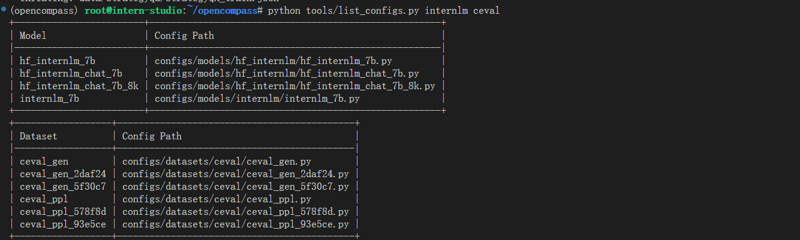
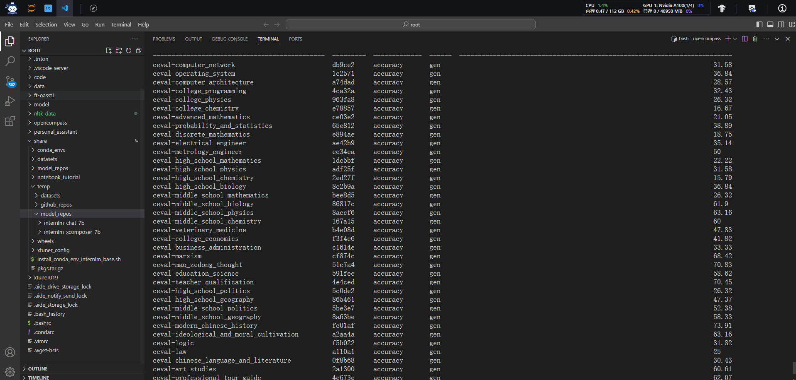
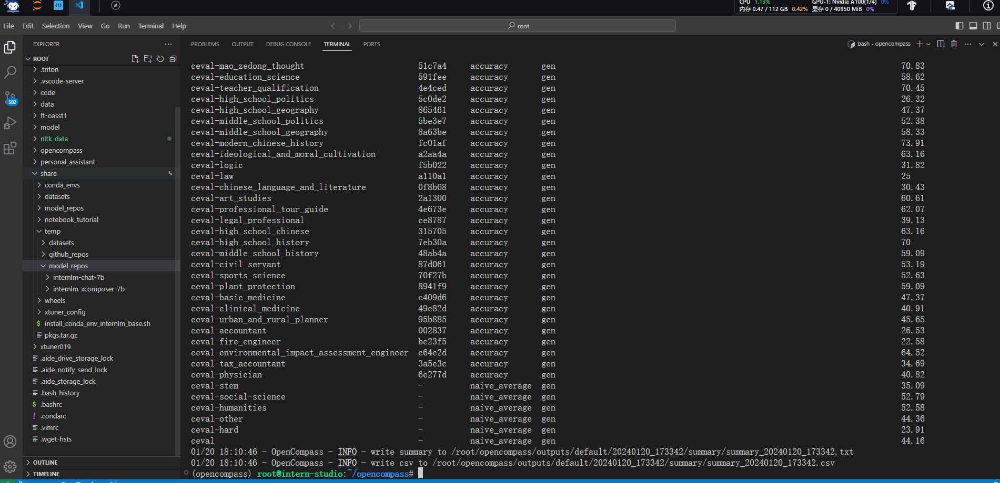

#  Day06  OpenCompass 评测作业

## 环境配置

```
conda create --name opencompass --clone=/root/share/conda_envs/internlm-base
source activate opencompass
git clone https://github.com/open-compass/opencompass
cd opencompass
pip install -e .
```

有部分第三方功能,如代码能力基准测试 Humaneval 以及 Llama格式的模型评测,可能需要额外步骤才能正常运行，如需评测，详细步骤请参考[安装指南](https://opencompass.readthedocs.io/zh_CN/latest/get_started/installation.html)。

### 数据准备

```bash
# 解压评测数据集到 data/ 处
cp /share/temp/datasets/OpenCompassData-core-20231110.zip /root/opencompass/
unzip OpenCompassData-core-20231110.zip

# 将会在opencompass下看到data文件夹
```

### 查看支持的数据集和模型 

```bash
# 列出所有跟 internlm 及 ceval 相关的配置
python tools/list_configs.py internlm ceval
```

将会看到



```text
+--------------------------+--------------------------------------------------------+
| Model                    | Config Path                                            |
|--------------------------+--------------------------------------------------------|
| hf_internlm_20b          | configs/models/hf_internlm/hf_internlm_20b.py          |
| hf_internlm_7b           | configs/models/hf_internlm/hf_internlm_7b.py           |
| hf_internlm_chat_20b     | configs/models/hf_internlm/hf_internlm_chat_20b.py     |
| hf_internlm_chat_7b      | configs/models/hf_internlm/hf_internlm_chat_7b.py      |
| hf_internlm_chat_7b_8k   | configs/models/hf_internlm/hf_internlm_chat_7b_8k.py   |
| hf_internlm_chat_7b_v1_1 | configs/models/hf_internlm/hf_internlm_chat_7b_v1_1.py |
| internlm_7b              | configs/models/internlm/internlm_7b.py                 |
| ms_internlm_chat_7b_8k   | configs/models/ms_internlm/ms_internlm_chat_7b_8k.py   |
+--------------------------+--------------------------------------------------------+
+----------------------------+------------------------------------------------------+
| Dataset                    | Config Path                                          |
|----------------------------+------------------------------------------------------|
| ceval_clean_ppl            | configs/datasets/ceval/ceval_clean_ppl.py            |
| ceval_gen                  | configs/datasets/ceval/ceval_gen.py                  |
| ceval_gen_2daf24           | configs/datasets/ceval/ceval_gen_2daf24.py           |
| ceval_gen_5f30c7           | configs/datasets/ceval/ceval_gen_5f30c7.py           |
| ceval_ppl                  | configs/datasets/ceval/ceval_ppl.py                  |
| ceval_ppl_578f8d           | configs/datasets/ceval/ceval_ppl_578f8d.py           |
| ceval_ppl_93e5ce           | configs/datasets/ceval/ceval_ppl_93e5ce.py           |
| ceval_zero_shot_gen_bd40ef | configs/datasets/ceval/ceval_zero_shot_gen_bd40ef.py |
+----------------------------+------------------------------------------------------+
```


### 启动评测

确保按照上述步骤正确安装 OpenCompass 并准备好数据集后，可以通过以下命令评测 InternLM-Chat-7B 模型在 C-Eval 数据集上的性能。由于 OpenCompass 默认并行启动评估过程，我们可以在第一次运行时以 `--debug` 模式启动评估，并检查是否存在问题。在 `--debug` 模式下，任务将按顺序执行，并实时打印输出。

```bash
python run.py --datasets ceval_gen --hf-path /share/temp/model_repos/internlm-chat-7b/ --tokenizer-path /share/temp/model_repos/internlm-chat-7b/ --tokenizer-kwargs padding_side='left' truncation='left' trust_remote_code=True --model-kwargs trust_remote_code=True device_map='auto' --max-seq-len 2048 --max-out-len 16 --batch-size 4 --num-gpus 1 --debug
```

命令解析

```bash
--datasets ceval_gen \
--hf-path /share/temp/model_repos/internlm-chat-7b/ \  # HuggingFace 模型路径
--tokenizer-path /share/temp/model_repos/internlm-chat-7b/ \  # HuggingFace tokenizer 路径（如果与模型路径相同，可以省略）
--tokenizer-kwargs padding_side='left' truncation='left' trust_remote_code=True \  # 构建 tokenizer 的参数
--model-kwargs device_map='auto' trust_remote_code=True \  # 构建模型的参数
--max-seq-len 2048 \  # 模型可以接受的最大序列长度
--max-out-len 16 \  # 生成的最大 token 数
--batch-size 4  \  # 批量大小
--num-gpus 1  # 运行模型所需的 GPU 数量
--debug
```

如果一切正常，您应该看到屏幕上显示 “Starting inference process”：

```bash
[2024-01-12 18:23:55,076] [opencompass.openicl.icl_inferencer.icl_gen_inferencer] [INFO] Starting inference process...
```

评测完成后，将会看到：

```
dataset                                         version    metric         mode      opencompass.models.huggingface.HuggingFace_model_repos_internlm-chat-7b
----------------------------------------------  ---------  -------------  ------  -------------------------------------------------------------------------
ceval-computer_network                          db9ce2     accuracy       gen                                                                         31.58
ceval-operating_system                          1c2571     accuracy       gen                                                                         36.84
```

有关 `run.py` 支持的所有与 HuggingFace 相关的参数，请阅读 [评测任务发起](https://opencompass.readthedocs.io/zh-cn/latest/user_guides/experimentation.html#id2)


除了通过命令行配置实验外，OpenCompass 还允许用户在配置文件中编写实验的完整配置，并通过 `run.py` 直接运行它。配置文件是以 Python 格式组织的，并且必须包括 `datasets` 和 `models` 字段。

示例测试配置在 [configs/eval_demo.py](https://github.com/open-compass/opencompass/blob/main/configs/eval_demo.py) 中。此配置通过 [继承机制](../user_guides/config.md#继承机制) 引入所需的数据集和模型配置，并以所需格式组合 `datasets` 和 `models` 字段。

```python
from mmengine.config import read_base

with read_base():
    from .datasets.siqa.siqa_gen import siqa_datasets
    from .datasets.winograd.winograd_ppl import winograd_datasets
    from .models.opt.hf_opt_125m import opt125m
    from .models.opt.hf_opt_350m import opt350m

datasets = [*siqa_datasets, *winograd_datasets]
models = [opt125m, opt350m]
```

运行任务时，我们只需将配置文件的路径传递给 `run.py`：

```bash
python run.py configs/eval_demo.py
```


OpenCompass 提供了一系列预定义的模型配置，位于 `configs/models` 下。以下是与 [opt-350m](https://github.com/open-compass/opencompass/blob/main/configs/models/opt/hf_opt_350m.py)（`configs/models/opt/hf_opt_350m.py`）相关的配置片段：

```python
# 使用 `HuggingFaceCausalLM` 评估由 HuggingFace 的 `AutoModelForCausalLM` 支持的模型
from opencompass.models import HuggingFaceCausalLM

# OPT-350M
opt350m = dict(
       type=HuggingFaceCausalLM,
       # `HuggingFaceCausalLM` 的初始化参数
       path='facebook/opt-350m',
       tokenizer_path='facebook/opt-350m',
       tokenizer_kwargs=dict(
           padding_side='left',
           truncation_side='left',
           proxies=None,
           trust_remote_code=True),
       model_kwargs=dict(device_map='auto'),
       # 下面是所有模型的共同参数，不特定于 HuggingFaceCausalLM
       abbr='opt350m',               # 结果显示的模型缩写
       max_seq_len=2048,             # 整个序列的最大长度
       max_out_len=100,              # 生成的最大 token 数
       batch_size=64,                # 批量大小
       run_cfg=dict(num_gpus=1),     # 该模型所需的 GPU 数量
    )
```

使用配置时，我们可以通过命令行参数 `--models` 指定相关文件，或使用继承机制将模型配置导入到配置文件中的 `models` 列表中。


与模型类似，数据集的配置文件也提供在 `configs/datasets` 下。用户可以在命令行中使用 `--datasets`，或通过继承在配置文件中导入相关配置

下面是来自 `configs/eval_demo.py` 的与数据集相关的配置片段：

```python
from mmengine.config import read_base  # 使用 mmengine.read_base() 读取基本配置

with read_base():
    # 直接从预设的数据集配置中读取所需的数据集配置
    from .datasets.winograd.winograd_ppl import winograd_datasets  # 读取 Winograd 配置，基于 PPL（困惑度）进行评估
    from .datasets.siqa.siqa_gen import siqa_datasets  # 读取 SIQA 配置，基于生成进行评估

datasets = [*siqa_datasets, *winograd_datasets]       # 最终的配置需要包含所需的评估数据集列表 'datasets'
```

数据集配置通常有两种类型：'ppl' 和 'gen'，分别指示使用的评估方法。其中 `ppl` 表示辨别性评估，`gen` 表示生成性评估。

此外，[configs/datasets/collections](https://github.com/open-compass/opencompass/blob/main/configs/datasets/collections) 收录了各种数据集集合，方便进行综合评估。OpenCompass 通常使用 [`base_medium.py`](https://github.com/open-compass/opencompass/blob/main/configs/datasets/collections/base_medium.py) 进行全面的模型测试。要复制结果，只需导入该文件，例如：

```bash
python run.py --models hf_llama_7b --datasets base_medium
```

OpenCompass 通常假定运行环境网络是可用的。如果您遇到网络问题或希望在离线环境中运行 OpenCompass，请参阅 [FAQ - 网络 - Q1](https://opencompass.readthedocs.io/zh-cn/latest/get_started/faq.html) 寻求解决方案。

### 可视化评估结果

评估完成后，评估结果表格将打印如下：

```text
dataset    version    metric    mode      opt350m    opt125m
---------  ---------  --------  ------  ---------  ---------
siqa       e78df3     accuracy  gen         21.55      12.44
winograd   b6c7ed     accuracy  ppl         51.23      49.82
```

所有运行输出将定向到 `outputs/demo/` 目录，结构如下：

```text
outputs/default/
├── 20200220_120000
├── 20230220_183030     # 每个实验一个文件夹
│   ├── configs         # 用于记录的已转储的配置文件。如果在同一个实验文件夹中重新运行了不同的实验，可能会保留多个配置
│   ├── logs            # 推理和评估阶段的日志文件
│   │   ├── eval
│   │   └── infer
│   ├── predictions   # 每个任务的推理结果
│   ├── results       # 每个任务的评估结果
│   └── summary       # 单个实验的汇总评估结果
├── ...
```

打印评测结果的过程可被进一步定制化，用于输出一些数据集的平均分 (例如 MMLU, C-Eval 等)。

### 作业

- 使用 OpenCompass 评测 InternLM2-Chat-7B 模型在 C-Eval 数据集上的性能






课程资料：

- 课程视频：https://www.bilibili.com/video/BV1Rc411b7ns
- OpenXLab：https://studio.intern-ai.org.cn
- 学习手册：https://kvudif1helh.feishu.cn/docx/Xx8hdqGwmopi5NxWxNWc76AOnPf


- 基于大模型搭建金融场景智能问答系统：https://github.com/Tongyi-EconML/FinQwen
- 天池LLM大模型：https://tianchi.aliyun.com/competition/entrance/532172
- https://huggingface.co/datasets/arxiv_dataset
- MirrorZ Help 开源镜像: https://help.mirrors.cernet.edu.cn/