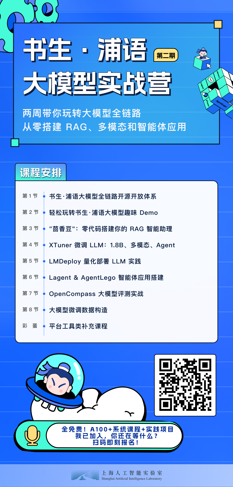

#  书生·浦语大模型实战营系列学习

## 大模型

## 课程资料

上海人工智能研究院-书生浦语 第二期  3.26-4.26

https://s-085841-internlmcamp-t2-fission.openxlab.space/dist/index.html

学员手册

https://aicarrier.feishu.cn/wiki/Vv4swUFMni5DiMkcasUczUp9nid

学员登记

https://aicarrier.feishu.cn/wiki/TqjawZsoqiiRXEkRpcScmKAAn8d?table=tblNCUy9PeGmgd9I&view=vewQagjCL1

由上海人工智能实验室青年科学家陈恺老师为我们带来《书生·浦语大模型全链路开源体系》的课程

视频地址：https://www.bilibili.com/video/BV1Vx421X72D/

作业笔记提交地址：https://aicarrier.feishu.cn/wiki/TqjawZsoqiiRXEkRpcScmKAAn8d?chunked=false&table=tblNCUy9PeGmgd9I&view=vew8ThBWt9

作业：课程及 InternLM2 技术报告笔记

InternLM2 技术报告链接：https://arxiv.org/pdf/2403.17297.pdf

玩转书生·浦语【智能对话】、【智能体解应用题】、【多模态理解及图文创作】等趣味 Demo

视频晚上 21:20 上传。

课程文档：https://github.com/InternLM/Tutorial/blob/camp2/helloworld/hello_world.md

课程视频：https://www.bilibili.com/video/BV1AH4y1H78d/

课程作业：

初始只有 8G 显存，如需要调节 GPU 到 24 GB，请先完成第一节课的笔记后联系我临时（第三节课前）在表中调整 GPU Quota

### 课程资料

- 课程视频：https://www.bilibili.com/video/BV1Rc411b7ns
- OpenXLab：https://studio.intern-ai.org.cn
- 学习手册：https://kvudif1helh.feishu.cn/docx/Xx8hdqGwmopi5NxWxNWc76AOnPf

- 基于大模型搭建金融场景智能问答系统：https://github.com/Tongyi-EconML/FinQwen
- 天池LLM大模型：https://tianchi.aliyun.com/competition/entrance/532172
- https://huggingface.co/datasets/arxiv_dataset
- MirrorZ Help 开源镜像: https://help.mirrors.cernet.edu.cn/