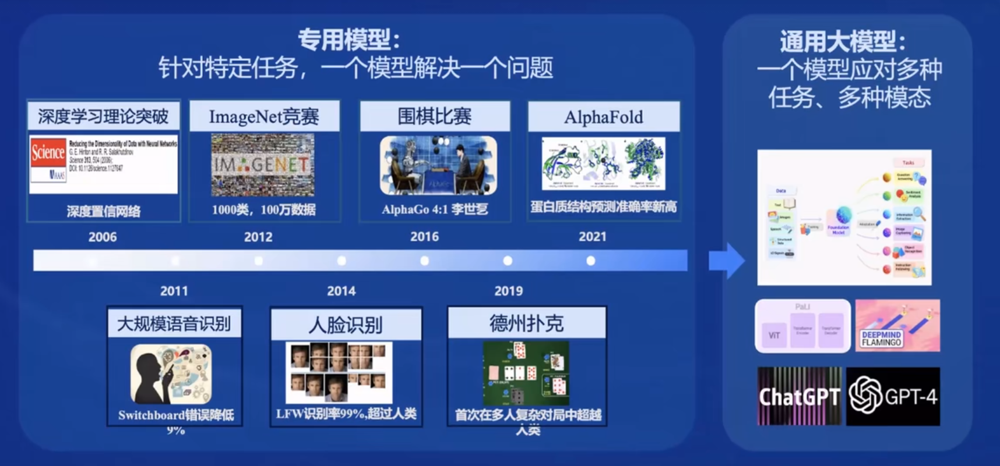

#  书生·浦语大模型实战营Day01

## 大模型

- 通用人工智能的重要途经

- 专用大模型--通用大模型
- 大模型：通用人工智能的重要途经（专用大模型--通用大模型--多模态大模型--智能体）

## InternLM发展历程

- InternLM--书生 万卷（数据）、书生 浦语（模型）
- InternLM--轻量级（7B）、中量级（20B）、重量级（123B）

- InternLM2：7B和20B两种规模模型，InternLM2-Base、InternLM2和InternLM2-Chat三个版本

### InternLM2

- 回归语言建模的本质

- InternLM2在超长上下文、综合性能、对话和创作体验、工具调用能力以及数理能力和数据分析功能等方面都有显著优势。

- InternLM2-Chat-20B在重点评测上甚至可以达到比肩ChatGPT（GPT3.5）的水平。

### 从模型到应用过程和选型

- 模型到应用的典型流程：业务场景是否复杂--算力是否足够--是否交互（智能体）--评测--部署

## 书生·浦语大模型全链路开源体系

### 数据（书生·万卷）

- 书生·浦语大模型的数据集名为"书生·万卷"，是一个包含1.6万亿token的多语种高质量数据集，涵盖多种模态和任务。包含文本数据（50 亿个文档，数据量超 1TB），图像-文本数据集（超 2200 万个文件，数据量超 140GB），视频数据（超 1000 个文件，数据量超 900GB）
- 书生·万卷（总数据量:2TB,文本图像和视频）；Opendatalab开放数据平台

### 预训练（InternLM-Train）

- InternLM-Train是一个基于Transformer架构的预训练模型，它具有1040亿参数，通过在书生·万卷数据集上进行训练，使模型具备了强大的语言理解和生成能力。它支持从 8 卡到千卡训练，千卡训练效率达 92%；无缝接入 HuggingFace 等技术生态，支持各类轻量化技术。

### 微调（XTuner微调框架）

- XTuner可以根据不同的任务需求，对大模型进行微调，使其在特定领域或任务上表现更加优秀。
- 支持多种任务类型，如增量预训练，指令微调，工具类指令微调
- 支持全量参数、LoRA、QLoRA 等低成本微调，覆盖各类 SFT 场景
- 支持多种大语言模型的微调，如 InternLM, Llama, QWen, BaiChuan, ChatGLM，适配多种开源生态，支持加载 HuggingFace、ModelScope 模型或数据集
- 支持自动优化加速，如 Flash Attention, DeepSpeed ZeRO, Pytorch FSDP，使得开发者无需关注复杂的现存优化与计算加速细节
- 支持多种硬件，覆盖 NVIDIA 20 系以上所有显卡，最低只需 8GB 现存即可微调 7B 模型
- 支持多种数据格式，如 Alpaca, MOSS, OpenAI, Guanacao 等等。

### 部署（LMDeploy部署框架）

- LMDeploy提供大模型在 GPU 上部署的全流程解决方案，包括模型轻量化、推理和服务。可以将大模型快速部署到各种计算平台上，实现模型的实时推理和应用。

- 接口支持：Python, GRPC, RESTful 
- 量化支持：4bit 、8bit 
- 推理引擎：turbomind, pytorch 
- 服务：openai-server, gradio, triton inference server

### 评测（OpenCompass评测框架）

- 包含80 套评测集，40 万道题目。全方位评测，采用六大维度，主要是学科，语言，知识，理解，推理和安全。

- 学科：初中考试、中国高考、大学考试、语言能力考试、职业资格考试
- 语言：字词释义、成语习语、语义相似、指代消解、翻译
- 知识：知识问答、多语种知识问答
- 理解：阅读理解、内容分析、内容总结
- 推理：因果推理、常识推理、代码推理、数学推理
- 安全：偏见、有害性、公平性、隐私性、真实性、合法性

### 应用（Lagent和AgentLego）

- 开源了轻量级智能框架Lagent，灵活支持多种大语言模型，支持多种类型的智能体能力。
- Lagent多模态智能体工具箱和AgentLego多模态智能体工具箱。
- 帮助开发者构建和训练多模态智能体，实现图文混合创作、多模态对话等应用场景。

## InternLM2 技术报告阅读

LLM开发的主要阶段：预训练、监督微调和人类反馈强化学习。论文还在研读。

### 预训练数据

- 文本数据

- 代码数据
- 长文本数据

### 预训练设置

- tokenization

- 预训练超参数

### 预训练阶段

- 4k上下文训练

- 长上下文训练

- 特定能力增强训练

## 小结

- 由于之前事情多没有太多精力分配到实战营，第一期只是简单跟学了一下。并没有深入学习LLM和InternLM相关技术。希望这次能够借此机会学习相关技术，将大模型推广到在自己的研究领域，学以致用。