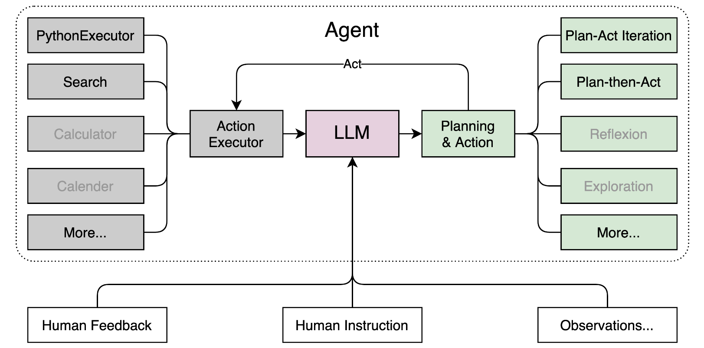
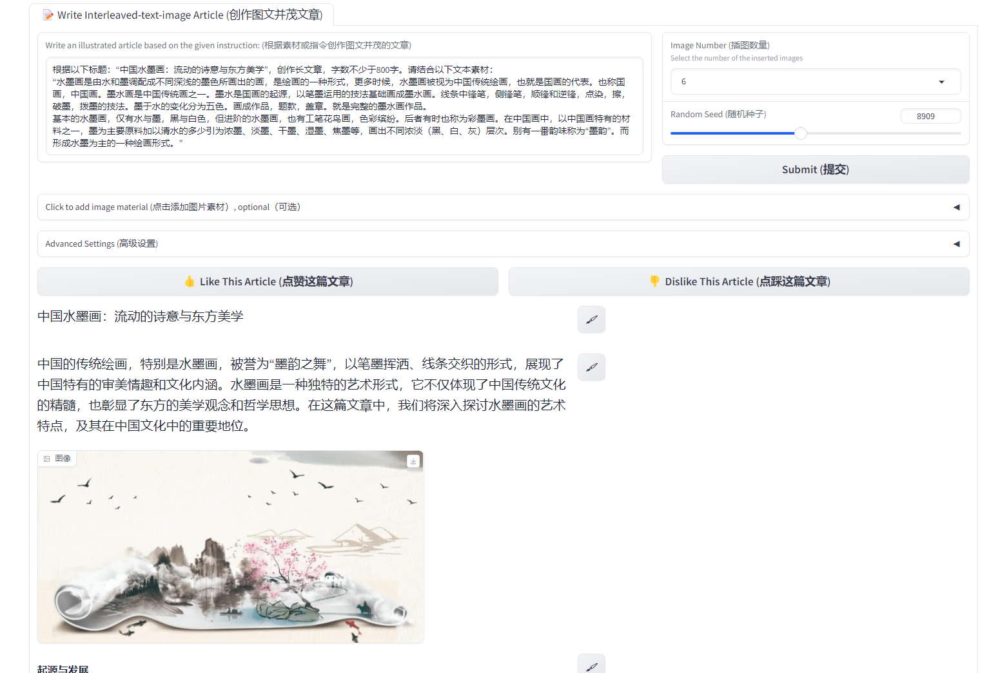

#  书生·浦语大模型实战营Day02

- 轻松玩转书生·浦语大模型趣味Demo

## 实战部署InternLM2-Chat-1.8B

- 创建 InternStudio开发机，通过ModelScope下载基础模型，完成Demo部署和交互
- 10%A100  Cuda11.7  进入开发机

### 环境配置

```
# Python==3.10
conda create -n internlm_demo python==3.10 -y
# 安装环境 pytorch==2.0.1  cuda=11.7
conda activate internlm_demo
conda install pytorch==2.0.1 torchvision==0.15.2 torchaudio==2.0.2 pytorch-cuda=11.7 -c pytorch -c nvidia

# 安装依赖包
pip install huggingface-hub==0.17.3
pip install transformers==4.34 
pip install psutil==5.9.8
pip install accelerate==0.24.1
pip install streamlit==1.32.2 
pip install matplotlib==3.8.3 
pip install modelscope==1.9.5
pip install sentencepiece==0.1.99

pip list
```


### 下载模型

- 创建目录和文件

```
mkdir -p /root/demo
touch /root/demo/cli_demo.py
touch /root/demo/download_mini.py
cd /root/demo
```

- 下载 `InternLM2-Chat-1.8B` 模型 代码 download_mini.py

```
import os
from modelscope.hub.snapshot_download import snapshot_download

# 创建保存模型目录
os.system("mkdir /root/models")

# save_dir是模型保存到本地的目录
save_dir="/root/models"

snapshot_download("Shanghai_AI_Laboratory/internlm2-chat-1_8b", 
                  cache_dir=save_dir, 
                  revision='v1.1.0')
```

- 执行

```
conda activate internlm_demo
python /root/demo/download_mini.py
```


### 运行Demo

- Demo 代码

```
import torch
from transformers import AutoTokenizer, AutoModelForCausalLM


model_name_or_path = "/root/models/Shanghai_AI_Laboratory/internlm2-chat-1_8b"

tokenizer = AutoTokenizer.from_pretrained(model_name_or_path, trust_remote_code=True, device_map='cuda:0')
model = AutoModelForCausalLM.from_pretrained(model_name_or_path, trust_remote_code=True, torch_dtype=torch.bfloat16, device_map='cuda:0')
model = model.eval()

system_prompt = """You are an AI assistant whose name is InternLM (书生·浦语).
- InternLM (书生·浦语) is a conversational language model that is developed by Shanghai AI Laboratory (上海人工智能实验室). It is designed to be helpful, honest, and harmless.
- InternLM (书生·浦语) can understand and communicate fluently in the language chosen by the user such as English and 中文.
"""

messages = [(system_prompt, '')]

print("=============Welcome to InternLM chatbot, type 'exit' to exit.=============")

while True:
    input_text = input("\nUser  >>> ")
    input_text = input_text.replace(' ', '')
    if input_text == "exit":
        break

    length = 0
    for response, _ in model.stream_chat(tokenizer, input_text, messages):
        if response is not None:
            print(response[length:], flush=True, end="")
            length = len(response)
```

- 运行

```
conda activate demo
python /root/demo/cli_demo.py
```


- 测试 ：请创作一个 300 字的小故事


- 请创作一个 300 字关于春天的小故事


- 请创作一个 300 字关于夏天的小故事


- 请创作一个 300 字关于秋天的小故事


- 请创作一个 300 字关于冬天的小故事


## 实战部署八戒-Chat-1.8B

- 通过OpenXLab部署xiyou系列八戒模型，完成Web Demo部署和交互

### 环境配置

- 同上

```
conda activate internlm_demo

# 获取代码
cd /root/
git clone https://gitee.com/InternLM/Tutorial -b camp2
# git clone https://github.com/InternLM/Tutorial -b camp2
cd /root/Tutorial
```

### 下载八戒Demo

```
touch /root/demo/bajie_download.py
```

- 下载代码

```
import os
#模型下载
from modelscope.hub.snapshot_download import snapshot_download

# 创建保存模型目录
os.system("mkdir -p /root/models")

# save_dir是模型保存到本地的目录
save_dir="/root/models"

snapshot_download('JimmyMa99/BaJie-Chat-mini',  cache_dir=save_dir)

```

- 执行

```
python /root/demo/bajie_download.py
```

### 运行Demo

- Intern Studio 运行

```
streamlit run /root/demo/bajie_chat.py --server.address 127.0.0.1 --server.port 6006
```

- 本地PowerShell映射

```
# 从本地使用 ssh 连接 studio 端口
# 将下方端口号 40323  替换成自己的端口号
ssh -CNg -L 6006:127.0.0.1:6006 root@ssh.intern-ai.org.cn -p 40323
```


- 打开 [http://127.0.0.1:6006](http://127.0.0.1:6006) 


- 一直在输出


## 实战进阶 运行 Lagent 智能体

- 算力升级，以InternLM2-Chat-7B 为基础，运行开源框架 Lagent的智能体Demo
- Lagent 是一个轻量级、开源的基于大语言模型的智能体（agent）框架，支持用户快速地将一个大语言模型转变为多种类型的智能体，并提供了一些典型工具为大语言模型赋能。它的整个框架图如下:



Lagent 的特性总结如下：

- 流式输出：提供 stream_chat 接口作流式输出，本地就能演示酷炫的流式 Demo。
- 接口统一，设计全面升级，提升拓展性，包括：  
  - Model : 不论是 OpenAI API, Transformers 还是推理加速框架 LMDeploy 一网打尽，模型切换可以游刃有余；         
  - Action: 简单的继承和装饰，即可打造自己个人的工具集，不论 InternLM 还是 GPT 均可适配；        
  - Agent：与 Model 的输入接口保持一致，模型到智能体的蜕变只需一步，便捷各种 agent 的探索实现；  

### 环境配置

- 环境升级：30% A100,  关闭开发机升级后，配置环境

```
conda activate internlm_demo

cd /root/demo

```

- 源码安装lagent

```
git clone https://gitee.com/internlm/lagent.git
# git clone https://github.com/internlm/lagent.git
cd /root/demo/lagent
git checkout 581d9fb8987a5d9b72bb9ebd37a95efd47d479ac
pip install -e . # 源码安装
```

### Lagent运行InternLM2-Chat-7B

- 下载

```
# 软连接方式
ln -s /root/share/new_models/Shanghai_AI_Laboratory/internlm2-chat-7b /root/models/internlm2-chat-7b
```

- 自己下载: 

```

```

- 配置lagent

```
vim /root/demo/lagent/examples/internlm2_agent_web_demo_hf.py

# 修改第71行左右，模型路径
model_path = st.sidebar.text_input('模型路径：', value='/root/models/internlm2-chat-7b')

```

### 运行Demo

-  大约5分钟完成模型加载

```
streamlit run /root/demo/lagent/examples/internlm2_agent_web_demo_hf.py --server.address 127.0.0.1 --server.port 6006
```

- 本地PowerShell运行

```
# 从本地使用 ssh 连接 studio 端口
# 将下方端口号 40323  替换成自己的端口号
ssh -CNg -L 6006:127.0.0.1:6006 root@ssh.intern-ai.org.cn -p 40323
```

- 完成Demo

```
你是谁
请解方程 2*X=1360 之中 X 的结果
```


## 实战进阶 灵笔InternLM-XComposer2

- 浅尝多模态大模型，图文生成

### 浦语·灵笔

- `浦语·灵笔2` 是基于 `书生·浦语2` 大语言模型研发的突破性的图文多模态大模型，具有非凡的图文写作和图像理解能力，在多种应用场景表现出色，总结起来其具有：
  - 自由指令输入的图文写作能力： `浦语·灵笔2` 可以理解自由形式的图文指令输入，包括大纲、文章细节要求、参考图片等，为用户打造图文并貌的专属文章。生成的文章文采斐然，图文相得益彰，提供沉浸式的阅读体验。
  - 准确的图文问题解答能力：`浦语·灵笔2` 具有海量图文知识，可以准确的回复各种图文问答难题，在识别、感知、细节描述、视觉推理等能力上表现惊人。
  - 杰出的综合能力： `浦语·灵笔2-7B` 基于 `书生·浦语2-7B` 模型，在13项多模态评测中大幅领先同量级多模态模型，在其中6项评测中超过 `GPT-4V` 和 `Gemini Pro`。

### 环境配置

- 升级环境：50%A100，升级后运行

- 环境配置

```
conda activate internlm_demo

# 补充环境包
pip install timm==0.4.12 sentencepiece==0.1.99 markdown2==2.4.10 xlsxwriter==3.1.2 gradio==4.13.0 modelscope==1.9.5
```

- 下载代码仓 

```
cd /root/demo
git clone https://gitee.com/internlm/InternLM-XComposer.git
# git clone https://github.com/internlm/InternLM-XComposer.git
cd /root/demo/InternLM-XComposer
git checkout f31220eddca2cf6246ee2ddf8e375a40457ff626
```

- 创建软连接，或自己下载

```
ln -s /root/share/new_models/Shanghai_AI_Laboratory/internlm-xcomposer2-7b /root/models/internlm-xcomposer2-7b
ln -s /root/share/new_models/Shanghai_AI_Laboratory/internlm-xcomposer2-vl-7b /root/models/internlm-xcomposer2-vl-7b
```

### 运行Demo

- 启动 `InternLM-XComposer`：

```
cd /root/demo/InternLM-XComposer
python /root/demo/InternLM-XComposer/examples/gradio_demo_composition.py  \
--code_path /root/models/internlm-xcomposer2-7b \
--private \
--num_gpus 1 \
--port 6006
```

- 显存不足，记得升级50%A100


- 升级后, 不使用映射访问样式丢失


```
python examples/gradio_demo_composition.py  \
--code_path /root/models/internlm-xcomposer2-7b \
--private \
--num_gpus 1 \
--port 6006
```

- 本地PowerShell运行

```
# 从本地使用 ssh 连接 studio 端口
# 将下方端口号 40323  替换成自己的端口号
ssh -CNg -L 6006:127.0.0.1:6006 root@ssh.intern-ai.org.cn -p 40323
```

- 完成Demo  打开 [http://127.0.0.1:6006](http://127.0.0.1:6006) 


### 图文创作





### 图片理解

- 关闭并重新启动一个新的 `terminal`，继续输入指令，启动 `InternLM-XComposer2-vl`：

```bash
conda activate internlm_demo

cd /root/demo/InternLM-XComposer

python /root/demo/InternLM-XComposer/examples/gradio_demo_chat.py  \
--code_path /root/models/internlm-xcomposer2-vl-7b \
--private \
--num_gpus 1 \
--port 6006
```

打开 [http://127.0.0.1:6006](http://127.0.0.1:6006) (上传图片后) 键入内容示例如下：请分析一下图中内容


## 常用命令

```
# 查看GPU
studio-smi

# PowerShell  映射
# 从本地使用 ssh 连接 studio 端口
# 将下方端口号 40323  替换成自己的端口号
ssh -CNg -L 6006:127.0.0.1:6006 root@ssh.intern-ai.org.cn -p 40323


# Pip镜像
pip install -i https://mirrors.cernet.edu.cn/pypi/web/simple some-package
python -m pip install --upgrade pip
pip config set global.index-url   https://mirrors.cernet.edu.cn/pypi/web/simple
python -m pip install -i https://mirrors.cernet.edu.cn/pypi/web/simple --upgrade pip

# 清理软连接
unlink link_name
cd /root/demo/
unlink internlm2-chat-7b
```

## 模型下载

- 除了上述软连接方式，适用于学习。当在自己的环境下配置时，可采用以下方式下载模型

### Hugging Face

- 官方提供的 `huggingface-cli` 命令行工具

```
pip install -U huggingface_hub
```

- 下载代码

```
import os
# 下载模型
os.system('huggingface-cli download --resume-download internlm/internlm2-chat-7b --local-dir your_path')
```

+ resume-download：断点续下
+ local-dir：本地存储路径。其中 linux 环境下需要填写绝对路径.

- 下载单个文件

```
import os 
from huggingface_hub import hf_hub_download  # Load model directly 

hf_hub_download(repo_id="internlm/internlm2-7b", filename="config.json")
```

### ModelScope

- 使用 `modelscope` 中的 `snapshot_download` 函数下载模型

```
pip install modelscope==1.9.5
pip install transformers==4.35.2
```

- 下载代码

```
import torch
from modelscope import snapshot_download, AutoModel, AutoTokenizer
import os
model_dir = snapshot_download('Shanghai_AI_Laboratory/internlm2-chat-7b', cache_dir='your path', revision='master')
```

- 第一个参数为模型名称

- `cache_dir` 最好为绝对路径。

### OpenXLab

- `OpenXLab` 可以通过指定模型仓库的地址，以及需要下载的文件的名称，文件所需下载的位置等，直接下载模型权重文件，使用 `download` 函数导入模型中心的模型。

- 下载代码

```
import torch
import os
from transformers import AutoModelForCausalLM, AutoTokenizer, AutoModel
base_path = './local_files'
os.system('apt install git')
os.system('apt install git-lfs')
os.system(f'git clone https://code.openxlab.org.cn/Usr_name/repo_name.git {base_path}')
os.system(f'cd {base_path} && git lfs pull')
```


## 作业

**基础作业 (结营必做)**

- 使用 `InternLM2-Chat-1.8B` 模型生成 300 字的小故事（需截图）


**进阶作业 (优秀学员必做)**

- 熟悉 `huggingface` 下载功能，使用 `huggingface_hub` python 包，下载 `InternLM2-Chat-7B` 的 `config.json` 文件到本地（需截图下载过程）

```
import os 
os.environ['HF_ENDPOINT'] = 'https://hf-mirror.com'

from huggingface_hub import hf_hub_download  # Load model directly 

hf_hub_download(repo_id="internlm/InternLM2-Chat-7B", filename="config.json")
```


- 完成 `Lagent` 工具调用 `数据分析` Demo 部署（需截图）


- 完成 `浦语·灵笔2` 的 `图文创作` 及 `视觉问答` 部署（需截图）


