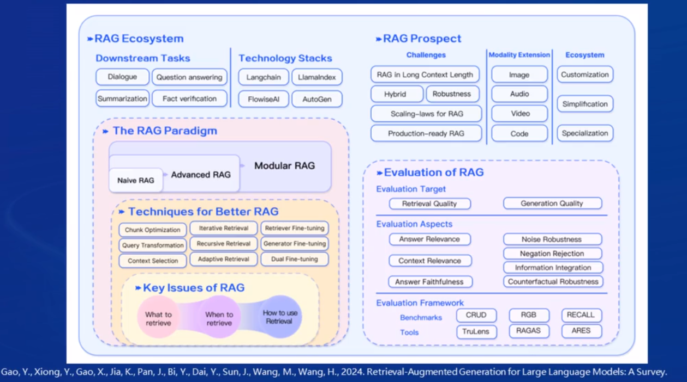
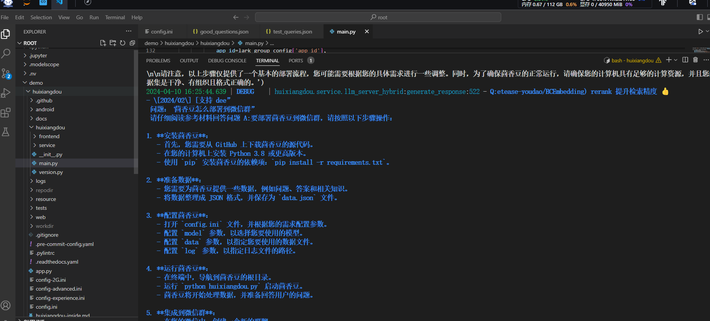

#  书生·浦语大模型实战营Day03

- 茴香豆：搭建你的 RAG 智能助理

## RAG技术

### RAG技术概览

- 结合了检索和生成的技术，利用外部知识
- 大模型外部记忆


- RAG（Retrieval Augmented Generation）技术，通过检索与用户输入相关的信息片段，并结合***外部知识库***来生成更准确、更丰富的回答。解决 LLMs 在处理知识密集型任务时可能遇到的挑战, 如幻觉、知识过时和缺乏透明、可追溯的推理过程等。提供更准确的回答、降低推理成本、实现外部记忆。
- RAG 能够让基础模型实现非参数知识更新，无需训练就可以掌握新领域的知识。
- 案例：茴香豆

### RAG工作原理


### 向量数据库

- 相似性检索：余弦相似性、点积
- 


### RAG流程示例

- 


### RAG发展进程


### RAG常见优化方法

- 嵌入优化
- 索引优化
- 查询优化
- 上下文管理
- 迭代检索、递归检索、自适应检索
- 大模型微调


### RAG vs 微调

- RAG ：外部知识库，时效性，动态更新
- 微调：需要大量标注数据，小数据过拟合，针对特定任务训练


### LLM模型优化方法比较

- 提示工程：
- RAG：高外部知识
- 微调：资源


### 评价框架和基准测试


### 小结




## 茴香豆

### 茴香豆简介

- 基于LLMs的领域知识助手
- RAG技术，专业领域知识+LLMs


### 茴香豆构建

- 前端：微信群、飞书群
- 本地知识库：md、word、pdf、ppt
- LLM后端：InternLM、千问、ChatGPT、
- 核心：茴香豆，打通工作流（预处理、分析、回答）


- 流程


- 应答模块：多来源{本地库、检索、知识图谱}


## 茴香豆部署

- 创建环境和开发机：Cuda-11.7  30%A100

### 配置环境

```
# 创建环境
# studio-conda -o internlm-base -t InternLM2_Huixiangdou
# conda activate InternLM2_Huixiangdou
conda env list
conda activate internlm_demo
```

### 下载文件

- HuggingFace太慢：
- 使用服务器已有

```
# 创建模型文件夹
cd /root && mkdir models

# 复制BCE模型
ln -s /root/share/new_models/maidalun1020/bce-embedding-base_v1 /root/models/bce-embedding-base_v1
ln -s /root/share/new_models/maidalun1020/bce-reranker-base_v1 /root/models/bce-reranker-base_v1

# 复制大模型参数（下面的模型，根据作业进度和任务进行**选择一个**就行）
ln -s /root/share/new_models/Shanghai_AI_Laboratory/internlm2-chat-7b /root/models/internlm2-chat-7b
```

### 下载安装茴香豆

- 依赖包安装

```
# 安装 python 依赖
source activate internlm_demo

# pip install -r requirements.txt

pip install protobuf==4.25.3 accelerate==0.28.0 aiohttp==3.9.3 auto-gptq==0.7.1 bcembedding==0.1.3 beautifulsoup4==4.8.2 einops==0.7.0 faiss-gpu==1.7.2 langchain==0.1.14 loguru==0.7.2 lxml_html_clean==0.1.0 openai==1.16.1 openpyxl==3.1.2 pandas==2.2.1 pydantic==2.6.4 pymupdf==1.24.1 python-docx==1.1.0 pytoml==0.1.21 readability-lxml==0.8.1 redis==5.0.3 requests==2.31.0 scikit-learn==1.4.1.post1 sentence_transformers==2.2.2 textract==1.6.5 tiktoken==0.6.0 transformers==4.39.3 transformers_stream_generator==0.0.5 unstructured==0.11.2

## 因为 Intern Studio 不支持对系统文件的永久修改，在 Intern Studio 安装部署的同学不建议安装 Word 依赖，后续的操作和作业不会涉及 Word 解析。
## 想要自己尝试解析 Word 文件的同学，uncomment 掉下面这行，安装解析 .doc .docx 必需的依赖
# apt update && apt -y install python-dev python libxml2-dev libxslt1-dev antiword unrtf poppler-utils pstotext tesseract-ocr flac ffmpeg lame libmad0 libsox-fmt-mp3 sox libjpeg-dev swig libpulse-dev
```

- 下载源码

```
cd /root/demo
# 下载 repo
git clone https://github.com/internlm/huixiangdou && cd huixiangdou
git checkout 447c6f7e68a1657fce1c4f7c740ea1700bde0440

```

### 使用茴香豆搭建 RAG 助手

- 修改配置文件。用已下载模型的路径替换 `/root/demo/huixiangdou/config.ini` 文件中的默认模型，需要修改 3 处模型地址

```
# 修改用于向量数据库和词嵌入的模型
sed -i '6s#.*#embedding_model_path = "/root/models/bce-embedding-base_v1"#' /root/demo/huixiangdou/config.ini
# 检索的重排序模型
sed -i '7s#.*#reranker_model_path = "/root/models/bce-reranker-base_v1"#' /root/demo/huixiangdou/config.ini
# 选用的大模型
sed -i '29s#.*#local_llm_path = "/root/models/internlm2-chat-7b"#' /root/demo/huixiangdou/config.ini

```

### 创建知识库

- 使用 **InternLM** 的 **Huixiangdou** 文档作为新增知识数据检索来源，在不重新训练的情况下，打造一个 **Huixiangdou** 技术问答助手。
- 下载茴香豆预料

```
cd /root/demo/huixiangdou && mkdir repodir

git clone https://github.com/internlm/huixiangdou --depth=1 repodir/huixiangdou
```

- 提取知识库特征，创建向量数据库。数据库向量化的过程应用到了 **LangChain** 的相关模块，默认嵌入和重排序模型调用的网易 **BCE 双语模型**，如果没有在 `config.ini` 文件中指定本地模型路径，茴香豆将自动从 **HuggingFace**  拉取默认模型。

- 除了语料知识的向量数据库，茴香豆建立接受和拒答两个向量数据库，用来在检索的过程中更加精确的判断提问的相关性，这两个数据库的来源分别是：

  - 接受问题列表，希望茴香豆助手回答的示例问题
    - 存储在 `huixiangdou/resource/good_questions.json` 中
  - 拒绝问题列表，希望茴香豆助手拒答的示例问题
    - 存储在 `huixiangdou/resource/bad_questions.json` 中
    - 其中多为技术无关的主题或闲聊
    - 如："nihui 是谁", "具体在哪些位置进行修改？", "你是谁？", "1+1"

  运行下面的命令，增加茴香豆相关的问题到接受问题示例中：

```
cd /root/demo/huixiangdou
mv resource/good_questions.json resource/good_questions_bk.json

echo '[
    "mmpose中怎么调用mmyolo接口",
    "mmpose实现姿态估计后怎么实现行为识别",
    "mmpose执行提取关键点命令不是分为两步吗，一步是目标检测，另一步是关键点提取，我现在目标检测这部分的代码是demo/topdown_demo_with_mmdet.py demo/mmdetection_cfg/faster_rcnn_r50_fpn_coco.py checkpoints/faster_rcnn_r50_fpn_1x_coco_20200130-047c8118.pth   现在我想把这个mmdet的checkpoints换位yolo的，那么应该怎么操作",
    "在mmdetection中，如何同时加载两个数据集，两个dataloader",
    "如何将mmdetection2.28.2的retinanet配置文件改为单尺度的呢？",
    "1.MMPose_Tutorial.ipynb、inferencer_demo.py、image_demo.py、bottomup_demo.py、body3d_pose_lifter_demo.py这几个文件和topdown_demo_with_mmdet.py的区别是什么，\n2.我如果要使用mmdet是不是就只能使用topdown_demo_with_mmdet.py文件，",
    "mmpose 测试 map 一直是 0 怎么办？",
    "如何使用mmpose检测人体关键点？",
    "我使用的数据集是labelme标注的，我想知道mmpose的数据集都是什么样式的，全都是单目标的数据集标注，还是里边也有多目标然后进行标注",
    "如何生成openmmpose的c++推理脚本",
    "mmpose",
    "mmpose的目标检测阶段调用的模型，一定要是demo文件夹下的文件吗，有没有其他路径下的文件",
    "mmpose可以实现行为识别吗，如果要实现的话应该怎么做",
    "我在mmyolo的v0.6.0 (15/8/2023)更新日志里看到了他新增了支持基于 MMPose 的 YOLOX-Pose，我现在是不是只需要在mmpose/project/yolox-Pose内做出一些设置就可以，换掉demo/mmdetection_cfg/faster_rcnn_r50_fpn_coco.py 改用mmyolo来进行目标检测了",
    "mac m1从源码安装的mmpose是x86_64的",
    "想请教一下mmpose有没有提供可以读取外接摄像头，做3d姿态并达到实时的项目呀？",
    "huixiangdou 是什么？",
    "使用科研仪器需要注意什么？",
    "huixiangdou 是什么？",
    "茴香豆 是什么？",
    "茴香豆 能部署到微信吗？",
    "茴香豆 怎么应用到飞书",
    "茴香豆 能部署到微信群吗？",
    "茴香豆 怎么应用到飞书群",
    "huixiangdou 能部署到微信吗？",
    "huixiangdou 怎么应用到飞书",
    "huixiangdou 能部署到微信群吗？",
    "huixiangdou 怎么应用到飞书群",
    "huixiangdou",
    "茴香豆",
    "茴香豆 有哪些应用场景",
    "huixiangdou 有什么用",
    "huixiangdou 的优势有哪些？",
    "茴香豆 已经应用的场景",
    "huixiangdou 已经应用的场景",
    "huixiangdou 怎么安装",
    "茴香豆 怎么安装",
    "茴香豆 最新版本是什么",
    "茴香豆 支持哪些大模型",
    "茴香豆 支持哪些通讯软件",
    "config.ini 文件怎么配置",
    "remote_llm_model 可以填哪些模型?"
]' > /root/demo/huixiangdou/resource/good_questions.json

```

- 再创建一个测试用的问询列表，用来测试拒答流程是否起效：

```
cd /root/demo/huixiangdou

echo '[
"huixiangdou 是什么？",
"你好，介绍下自己"
]' > ./test_queries.json

```

- 在确定好语料来源后，运行下面的命令，创建 RAG 检索过程中使用的向量数据库：

```
# 创建向量数据库存储目录
cd /root/demo/huixiangdou && mkdir workdir 

# 分别向量化知识语料、接受问题和拒绝问题中后保存到 workdir
python3 -m huixiangdou.service.feature_store --sample ./test_queries.json
```

向量数据库的创建需要等待一小段时间，过程约占用 1.6G 显存。

完成后，**Huixiangdou** 相关的新增知识就以向量数据库的形式存储在 `workdir` 文件夹下。

检索过程中，茴香豆会将输入问题与两个列表中的问题在向量空间进行相似性比较，判断该问题是否应该回答，避免群聊过程中的问答泛滥。确定的回答的问题会利用基础模型提取关键词，在知识库中检索 `top K` 相似的 `chunk`，综合问题和检索到的 `chunk` 生成答案。


### 运行茴香豆

- 来测试一下效果

```
# 填入问题
sed -i '74s/.*/    queries = ["huixiangdou 是什么？", "茴香豆怎么部署到微信群", "今天天气怎么样？"]/' /root/demo/huixiangdou/huixiangdou/main.py

# 运行茴香豆
cd /root/demo/huixiangdou/
python3 -m huixiangdou.main --standalone
```

- RAG 技术的优势就是非参数化的模型调优，这里使用的仍然是基础模型 `InternLM2-Chat-7B`， 没有任何额外数据的训练。
- 面对同样的问题，**茴香豆技术助理**能够根据我们提供的数据库生成准确的答案：




## 茴香豆进阶


茴香豆并非单纯的 RAG 功能实现，而是一个专门针对群聊优化的知识助手，下面介绍一些茴香豆的进阶用法。

### 加入网络搜索

茴香豆除了可以从本地向量数据库中检索内容进行回答，也可以加入网络的搜索结果，生成回答。 

开启网络搜索功能需要用到 **Serper** 提供的 API：

- 登录 [Serper](https://serper.dev/) ，注册：


- 进入 [Serper API](https://serper.dev/api-key) 界面，复制自己的 API-key

- 替换 `/huixiangdou/config.ini` 中的 ***${YOUR-API-KEY}*** 为自己的API-key：

```
[web_search]
# check https://serper.dev/api-key to get a free API key
x_api_key = "${YOUR-API-KEY}"
domain_partial_order = ["openai.com", "pytorch.org", "readthedocs.io", "nvidia.com", "stackoverflow.com", "juejin.cn", "zhuanlan.zhihu.com", "www.cnblogs.com"]
save_dir = "logs/web_search_result"
```

- 其中 `domain_partial_order` 可以设置网络搜索的范围。

### 使用远程模型

茴香豆除了可以使用本地大模型，还可以轻松的调用云端模型 API。

目前，茴香豆已经支持 `Kimi`，`GPT-4`，`Deepseek` 和 `GLM` 等常见大模型API。

想要使用远端大模型，首先修改 `/huixiangdou/config.ini` 文件中

```
enable_local = 0 # 关闭本地模型
enable_remote = 1 # 启用云端模型
```

接着，如下图所示，修改 `remote_` 相关配置，填写 API key、模型类型等参数。

| 远端模型配置选项                    | GPT          | Kimi               | Deepseek        | ChatGLM | xi-api       | alles-apin |
| ----------------------------------- | ------------ | ------------------ | --------------- | ------- | ------------ | ---------- |
| `remote_type`                       | gpt          | kimi               | deepseek        | zhipuai | xi-api       | alles-apin |
| `remote_llm_max_text_length` 最大值 | 192000       | 128000             | 16000           | 128000  | 192000       | -          |
| `remote_llm_model`                  | "gpt-4-0613" | "moonshot-v1-128k" | "deepseek-chat" | "glm-4" | "gpt-4-0613" | -          |


启用远程模型可以大大降低GPU显存需求，根据测试，采用远程模型的茴香豆应用，最小只需要2G内存即可。

需要注意的是，这里启用的远程模型，只用在问答分析和问题生成，依然需要本地嵌入、重排序模型进行特征提取。

也可以尝试同时开启 local 和 remote 模型，茴香豆将采用混合模型的方案，详见 [技术报告](https://arxiv.org/abs/2401.08772)，效果更好。

### 利用Gradio搭建网页Demo

- 用 **Gradio** 搭建一个自己的网页对话 Demo。
- 首先，安装 **Gradio** 依赖组件：

```bash
pip install gradio==4.25.0 redis==5.0.3 flask==3.0.2 lark_oapi==1.2.4
```

- 运行脚本，启动茴香豆对话 Demo 服务：

```bash
conda activate internlm_demo
cd /root/demo/huixiangdou
python3 -m tests.test_query_gradio 

```

此时服务器端接口已开启。如果在本地服务器使用，直接在浏览器中输入 [127.0.0.1:7860](http://127.0.0.1:7860/) ，即可进入茴香豆对话 Demo 界面。

- 需要设置端口映射，转发端口到本地浏览器：

```
ssh -CNg -L 7860:127.0.0.1:7860 root@ssh.intern-ai.org.cn -p 40323
```

如果需要更换检索的知识领域，只需要用新的语料知识重复步骤 [2.2 创建知识库](#22-创建知识库) 提取特征到新的向量数据库，更改 `huixiangdou/config.ini` 文件中 `work_dir = "新向量数据库路径"`；

或者运行： 

```
python3 -m tests.test_query_gradi --work_dir <新向量数据库路径>
```

无需重新训练或微调模型，就可以轻松的让基础模型学会新领域知识，搭建一个新的问答助手。

- 测试：huixiangdou是什么？

```

```


### 配置文件解析

茴香豆的配置文件位于代码主目录下，采用 `Toml` 形式，有着丰富的功能，下面将解析配置文件中重要的常用参数。

```
[feature_store]
...
reject_throttle = 0.22742061846268935
...
embedding_model_path = "/root/models/bce-embedding-base_v1"
reranker_model_path = "/root/models/bce-reranker-base_v1"
...
work_dir = "workdir"
```

`reject_throttle`: 拒答阈值，0-1，数值越大，回答的问题相关性越高。拒答分数在检索过程中通过与示例问题的相似性检索得出，高质量的问题得分高，无关、低质量的问题得分低。只有得分数大于拒答阈值的才会被视为相关问题，用于回答的生成。当闲聊或无关问题较多的环境可以适当调高。
`embedding_model_path` 和 `reranker_model_path`: 嵌入和重排用到的模型路径。不设置本地模型路径情况下，默认自动通过 ***Huggingface*** 下载。开始自动下载前，需要使用下列命令登录 ***Huggingface*** 账户获取权限：

```bash
huggingface-cli login
```

`work_dir`: 向量数据库路径。茴香豆安装后，可以通过切换向量数据库路径，来回答不同知识领域的问答。

```
[llm.server]
...
local_llm_path = "/root/models/internlm2-chat-1_8b"
local_llm_max_text_length = 3000
...
```

`local_llm_path`: 本地模型文件夹路径或模型名称。现支持 **书生·浦语** 和 **通义千问** 模型类型，调用 `transformers` 的 `AutoModels` 模块，除了模型路径，输入 ***Huggingface*** 上的模型名称，如*"internlm/internlm2-chat-7b"*、*"qwen/qwen-7b-chat-int8"*、*"internlm/internlm2-chat-20b"*，也可自动拉取模型文件。
`local_llm_max_text_length`: 模型可接受最大文本长度。

远端模型支持参考上一小节。


```
[worker]
# enable search enhancement or not
enable_sg_search = 0
save_path = "logs/work.txt"
...
```

`[worker]`: 增强搜索功能，配合 `[sg_search]` 使用。增强搜索利用知识领域的源文件建立图数据库，当模型判断问题为无关问题或回答失败时，增强搜索功能将利用 LLM 提取的关键词在该图数据库中搜索，并尝试用搜索到的内容重新生成答案。在 `config.ini` 中查看 `[sg_search]` 具体配置示例。

```
[worker.time]
start = "00:00:00"
end = "23:59:59"
has_weekday = 1
```

`[worker.time]`: 可以设置茴香豆每天的工作时间，通过 `start` 和 `end` 设定应答的起始和结束时间。
`has_weekday`: `= 1` 的时候，周末不应答😂（豆哥拒绝 996）。 

```
[frontend]
...
```

`[fronted]`:  前端交互设置。[茴香豆代码仓库](https://github.com/InternLM/HuixiangDou/tree/main/docs) 查看具体教程。


### 文件结构

通过了解主要文件的位置和作用，可以更好的理解茴香豆的工作原理。

```bash
.
├── LICENSE
├── README.md
├── README_zh.md
├── android
├── app.py
├── config-2G.ini
├── config-advanced.ini
├── config-experience.ini
├── config.ini # 配置文件
├── docs # 教学文档
├── huixiangdou # 存放茴香豆主要代码，重点学习
├── huixiangdou-inside.md
├── logs
├── repodir # 默认存放个人数据库原始文件，用户建立
├── requirements-lark-group.txt
├── requirements.txt
├── resource
├── setup.py
├── tests # 单元测试
├── web # 存放茴香豆 Web 版代码
└── web.log
└── workdir # 默认存放茴香豆本地向量数据库，用户建立
```


```bash
./huixiangdou
├── __init__.py
├── frontend # 存放茴香豆前端与用户端和通讯软件交互代码
│   ├── __init__.py
│   ├── lark.py
│   └── lark_group.py
├── main.py # 运行主贷
├── service # 存放茴香豆后端工作流代码
│   ├── __init__.py
│   ├── config.py #
│   ├── feature_store.py # 数据嵌入、特征提取代码
│   ├── file_operation.py
│   ├── helper.py
│   ├── llm_client.py
│   ├── llm_server_hybrid.py # 混合模型代码
│   ├── retriever.py # 检索模块代码
│   ├── sg_search.py # 增强搜索，图检索代码
│   ├── web_search.py # 网页搜索代码
│   └── worker.py # 主流程代码
└── version.py
```

茴香豆工作流中用到的 **Prompt** 位于 `huixiangdou/service/worker.py` 中。可以根据业务需求尝试调整 **Prompt**，打造你独有的茴香豆知识助手。

```python
...
        # Switch languages according to the scenario.
        if self.language == 'zh':
            self.TOPIC_TEMPLATE = '告诉我这句话的主题，直接说主题不要解释：“{}”'
            self.SCORING_QUESTION_TEMPLTE = '“{}”\n请仔细阅读以上内容，判断句子是否是个有主题的疑问句，结果用 0～10 表示。直接提供得分不要解释。\n判断标准：有主语谓语宾语并且是疑问句得 10 分；缺少主谓宾扣分；陈述句直接得 0 分；不是疑问句直接得 0 分。直接提供得分不要解释。'  # noqa E501
            self.SCORING_RELAVANCE_TEMPLATE = '问题：“{}”\n材料：“{}”\n请仔细阅读以上内容，判断问题和材料的关联度，用0～10表示。判断标准：非常相关得 10 分；完全没关联得 0 分。直接提供得分不要解释。\n'  # noqa E501
            self.KEYWORDS_TEMPLATE = '谷歌搜索是一个通用搜索引擎，可用于访问互联网、查询百科知识、了解时事新闻等。搜索参数类型 string， 内容是短语或关键字，以空格分隔。\n你现在是{}交流群里的技术助手，用户问“{}”，你打算通过谷歌搜索查询相关资料，请提供用于搜索的关键字或短语，不要解释直接给出关键字或短语。'  # noqa E501
            self.SECURITY_TEMAPLTE = '判断以下句子是否涉及政治、辱骂、色情、恐暴、宗教、网络暴力、种族歧视等违禁内容，结果用 0～10 表示，不要解释直接给出得分。判断标准：涉其中任一问题直接得 10 分；完全不涉及得 0 分。直接给得分不要解释：“{}”'  # noqa E501
            self.PERPLESITY_TEMPLATE = '“question:{} answer:{}”\n阅读以上对话，answer 是否在表达自己不知道，回答越全面得分越少，用0～10表示，不要解释直接给出得分。\n判断标准：准确回答问题得 0 分；答案详尽得 1 分；知道部分答案但有不确定信息得 8 分；知道小部分答案但推荐求助其他人得 9 分；不知道任何答案直接推荐求助别人得 10 分。直接打分不要解释。'  # noqa E501
            self.SUMMARIZE_TEMPLATE = '{} \n 仔细阅读以上内容，总结得简短有力点'  # noqa E501
            # self.GENERATE_TEMPLATE = '材料：“{}”\n 问题：“{}” \n 请仔细阅读参考材料回答问题，材料可能和问题无关。如果材料和问题无关，尝试用你自己的理解来回答问题。如果无法确定答案，直接回答不知道。'  # noqa E501
            self.GENERATE_TEMPLATE = '材料：“{}”\n 问题：“{}” \n 请仔细阅读参考材料回答问题。'  # noqa E501
...
```

## 作业

### 基础作业

- 完成下面两个作业

#### 1. 在[茴香豆 Web 版](https://openxlab.org.cn/apps/detail/tpoisonooo/huixiangdou-web)中创建自己领域的知识问答助手

- 参考视频[零编程玩转大模型，学习茴香豆部署群聊助手](https://www.bilibili.com/video/BV1S2421N7mn)

```
# 小望云：xiaowangyun/xiaowangyun
```

- 完成不少于 400 字的笔记 + 线上茴香豆助手对话截图(不少于5轮)
- 上传文档：AI架构师手册


- AI落地的约束条件


- 构建一个商用AI


- 除了算法模型之外的关键能力


- 传统工程师转型 AI架构师的挑战


- AI架构师手册
- AI 算法是对数据的重新组织吗
- AI 算法的确是对数据的重新组织。在文中，董维奇表示：“不管是 ACM-ICPC 比赛、实验室里的算法还是应用在工业界的算法，其本质是对数据的一种重组。” 这种重组的目的是通过对数据的重新组织和抽象，构建出机器学习模型，以解决实际问题。因此，AI 算法可以被看作是对数据的重新组织。
- 什么是建模的灵活性
- 建模的灵活性指的是AI平台能够快速适应不同场景和需求的建模能力。一个灵活的平台应该具备丰富的表达能力，能够基于简单的描述语言构建大量的算法模型。这样可以满足不同业务的需求，根据实际情况快速调整和优化模型，提高效率和准确性。建模的灵活性是AI平台建设的核心问题之一。


- 怎样进行技术模型选择


- 怎样进行技术模型选择
- “怎样进行技术模型选择”是指在实际应用中，选择合适的AI算法和模型来实现特定的业务目标。以下是几个步骤： 1. **理解业务需求**：首先，需要明确具体的业务需求和问题。这包括确定AI要解决的具体任务（分类、回归、聚类等）以及业务的关键点和痛点。 2. **研究现有算法**：接下来，需要研究现有的AI算法和技术，包括深度学习、机器学习和其他相关的算法。了解各种算法的特点、优缺点以及在类似场景中的应用情况。 3. **特征工程**：对数据进行特征提取和预处理，以便算法能够更好地学习和理解数据。这可能涉及到数据清洗、降维、归一化等操作。 4. **模型选择**：基于业务需求和研究结果，选择最适合的AI模型。这可能涉及到选择或设计特定的神经网络架构、选择合适的损失函数、优化器等。 5. **实验和评估**：使用数据集对所选模型进行实验和评估。这包括在训练集和测试集上进行训练和验证，以确保模型的准确性和泛化能力。 6. **调优和改进**：根据实验结果对模型进行调优和改进。这可能涉及到调整模型参数、修改网络结构、改进特征工程等。 7. **部署和监控**：最后，将训练好的模型部署到生产环境中，并监控其性能和效果。这可能涉及到模型的优化、压缩、部署等。 总的来说，进行技术模型选择需要深入理解业务需求、具备扎实的AI算法知识、良好的实验和评估能力，并能够持续改进和优化模型。

- 什么是重塑行业的关键
- 重塑行业的关键是高阶AI 人才。在文章中，提到“高阶AI 人才—重塑行业的关键”。高阶AI 人才是指那些既懂AI 技术，又了解行业业务，并能将AI 技术应用到实际业务中的复合型人才。他们能够理解企业需求，填补技术和场景之间的鸿沟，将新的技术和原有业务问题的落地解决方案充分结合起来，推动产业智能化发展。这种人才是推动行业发展、实现技术革命和产业变革的关键。


- 企业该如何引入 AI架构师
- 企业引入AI架构师，应采取以下措施： 1. **明确业务需求**：企业应先审视自身业务需求，了解哪些业务环节或场景可以通过AI技术来提升效率、降低成本或优化用户体验。 2. **寻找合适人才**：根据业务需求，企业应寻找具有AI算法、模型开发经验，同时具备良好业务理解和工程架构能力的AI架构师。 3. **内部培养**：如果企业内部有具备AI算法开发基础的技术人员，可以提供相关培训和实践机会，帮助他们向AI架构师方向转型。 4. **外部招聘**：如果企业内部没有合适的人选，则需要在外部招聘具有AI架构师背景的人才。 5. **评估AI架构师价值**：企业需理解AI架构师对于业务发展的重要性，评估其引入AI架构师后的预期收益，以此决定是否引入。 6. **设置合理目标**：企业应根据自身业务情况，设置合理预期目标，明确AI架构师的主要职责和目标，以便于后续管理和评估。 7. **建立良好沟通机制**：AI架构师需要与业务团队密切合作，共同解决问题。因此，企业应建立有效的沟通机制，确保信息畅通。 8. **持续学习和迭代**：AI技术发展迅速，AI架构师应持续学习最新的AI技术和业务趋势，不断优化和迭代AI解决方案。 9. **考虑成本效益**：企业引入AI架构师时应综合考虑引入成本、项目风险、预期收益等因素，确保成本效益。 10. **建立绩效考核机制**：为了激励AI架构师发挥其价值，企业应建立相应的绩效考核机制，评估其工作成果。 通过以上措施，企业可以引入合适的AI架构师，并充分发挥其在AI应用落地中的作用。
- 怎样才能发现 AI的美
- \1. 不要只关注 AI 技术的原理和效果，而要尝试亲自动手，例如尝试使用一些 AI 算法和模型，感受 AI 的实际效果。 2. 对 AI 技术有深入的了解和掌握，能够熟练使用 AI 工具和框架，例如尝试使用飞桨、TensorFlow 等 AI 框架进行开发。 3. 多学习 AI 的实际应用案例，了解 AI 技术在不同领域的应用情况，例如搜索、推荐、图像识别等。 4. 参加 AI 技术相关的培训和课程，例如参加百度的 AICA 首席 AI 架构师培养计划，通过系统的学习和实践，深入了解 AI 技术。 5. 与 AI 领域的专业人士交流和互动，了解他们的经验和见解，从中获取启发和灵感。 6. 在实际项目中尝试应用 AI 技术，例如在自己的工作中尝试引入 AI 技术，解决实际业务问题。 7. 持续学习和跟踪 AI 技术的最新进展，关注 AI 领域的最新研究和应用成果。


- （可选）参考 [代码](https://github.com/InternLM/HuixiangDou/tree/main/web) 在自己的服务器部署茴香豆 Web 版


#### 2.在 `InternLM Studio` 上部署茴香豆技术助手

- 根据教程文档搭建 `茴香豆技术助手`，针对问题"茴香豆怎么部署到微信群？"进行提问

- 完成不少于 400 字的笔记 + 截图
- huixiangdou是什么


- 茴香豆怎么部署到微信群


### 进阶作业 

- 请先学完后续的课程内容再来做此处的进阶作业

#### A.【应用方向】 结合自己擅长的领域知识（游戏、法律、电子等）、专业背景，搭建个人工作助手或者垂直领域问答助手，参考茴香豆官方文档，部署到下列任一平台。

  - 飞书、微信
  - 可以使用 茴香豆 Web 版 或 InternLM Studio 云端服务器部署
  - 涵盖部署全过程的作业报告和个人助手问答截图

#### B.【算法方向】尝试修改 `good_questions.json`、调试 prompt 或应用其他 NLP 技术，如其他 chunk 方法，提高个人工作助手的表现。

  - 完成不少于 400 字的笔记 ，记录自己的尝试和调试思路，涵盖全过程和改进效果截图

### 大作业项目选题

#### A.【工程方向】 参与贡献茴香豆前端，将茴香豆助手部署到下列平台

  - Github issue、Discord、钉钉、X

#### B.【应用方向】 茴香豆RAG-Agent

  - 应用茴香豆建立一个 ROS2 的机器人Agent

#### C.【算法方向】 茴香豆多模态

  - 参与茴香豆多模态的工作


## 课程资料

- 课程视频：https://www.bilibili.com/video/BV1Rc411b7ns
- OpenXLab：https://studio.intern-ai.org.cn
- 学习手册：https://kvudif1helh.feishu.cn/docx/Xx8hdqGwmopi5NxWxNWc76AOnPf

