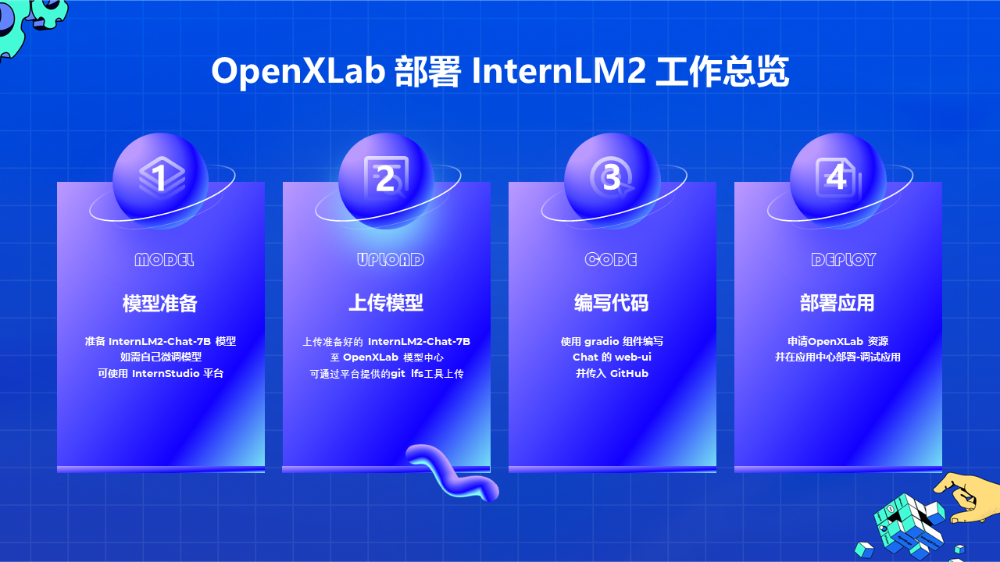
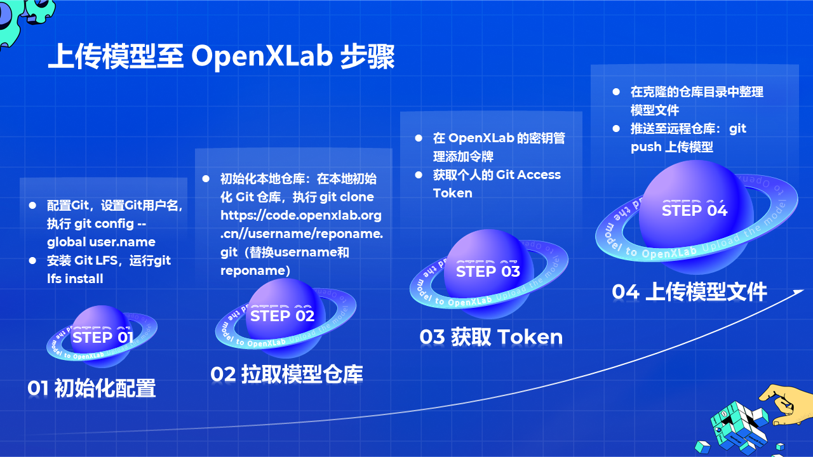
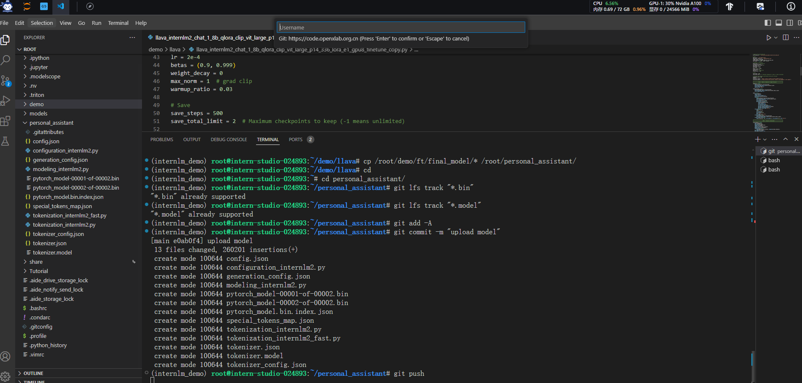
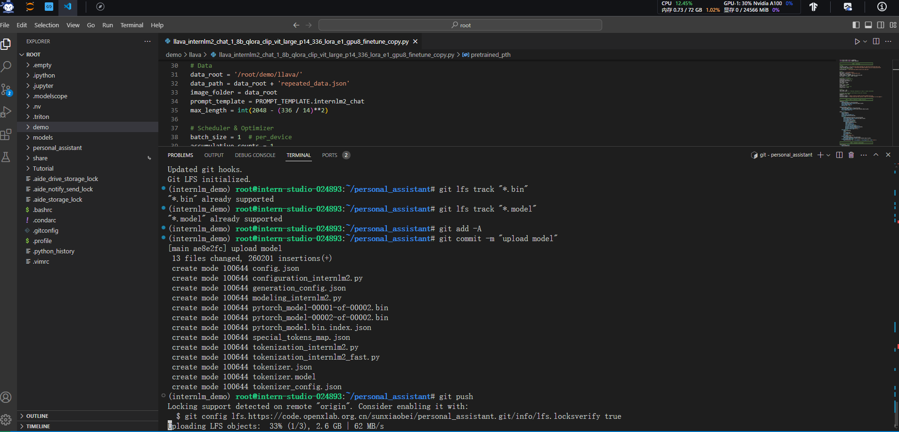

#  书生·浦语大模型实战营Day04OpenXLab 部署

- 如何在 OpenXLab 部署一个 InternLM2-7B chat 的应用。

## OpenXLab·浦源平台介绍

[OpenXLab](https://openxlab.org.cn/home) 浦源平台以开源为核心，旨在构建开源开放的人工智能生态，促进学术成果的开放共享。OpenXLab面向 AI 研究员和开发者提供 AI 领域的一站式服务平台，包含数据集中心、模型中心和应用中心，致力于推动人工智能对产学研各领域全面赋能，为构建人工智能开放生态，推动人工智能科研与技术突破、交叉创新和产业落地提供全方位的平台支撑。

## 部署 InternLM2



* InternLM2 GitHub文档：https://github.com/InternLM/InternLM

* Gradio官方说明文档：https://www.gradio.app/docs/interface

* OpenXLab平台地址：https://openxlab.org.cn/home

### 模型准备

准备InternLM2-Chat-7B的预训练模型。InternLM2-Chat-7B的模型权重链接如下：

| Model             | OpenXLab                                                     | Hugging Face                                                 | ModelScope                                                   |
| :---------------- | :----------------------------------------------------------- | :----------------------------------------------------------- | :----------------------------------------------------------- |
| InternLM2-Chat-7B | [OpenLMLab/internlm2-chat-7b](https://openxlab.org.cn/models/detail/OpenLMLab/internlm2-chat-7b) | [internlm/internlm2-chat-7b](https://huggingface.co/internlm/internlm2-chat-7b) | [Shanghai_AI_Laboratory/internlm2-chat-7b](https://modelscope.cn/models/Shanghai_AI_Laboratory/internlm2-chat-7b) |

1. 如有自己微调的模型，跳过该步骤，用自己训练好的模型即可。

2. 如需获取 InternLM2其他模型，可查看 GitHub 的 [Model Zoo 文档](https://github.com/InternLM/InternLM/blob/main/README_zh-CN.md#model-zoo)

### 上传模型

> 若 OpenXLab 模型中心已托管你所需要的模型，可跳过模型上传的步骤



#### 初始化 Git 配置

安装Git的命令取决于您使用的操作系统。以下是在不同操作系统上安装 Git 的常见方法：

**Windows:** 

1. 访问Git官方网站下载页面：[Git - Downloads](https://git-scm.com/downloads)
2. 点击“Windows”下载Git安装程序。
3. 运行下载的安装程序并按照向导指示完成安装。

```shell
# use git install lfs
git lfs install
```

**Linux:** 

安装 git 和 git lfs，命令如下

```shell
# install git
# sudo apt-get update
# sudo apt-get install git

# install git lfs
sudo apt-get update
sudo apt-get install git-lfs

# use git install lfs
git lfs install
```

设置您的 Git 用户名，OpenXLab 使用你在平台的用户名作为 Git的用户名，具体获取路径，可登录 OpenXLab 后，点击个人头像下的 【账号与安全】查看个人的用户名

配置 Git Username，用于作为 Git 提交的身份标识。

```shell
git config --global user.name "sunxiaobei"
```

> 需要将 Username 替换成你在 OpenXLab 平台上的用户名

配置 Git Email

```shell
git config --global user.email "1371815174@qq.com"
```

#### 获取 Git Access Token

在 OpenXLab 的密钥管理添加 Git 令牌

进入密钥管理页面，点击添加令牌，输入一个令牌名称和选择可写的权限


添加完令牌后，记得复制生成的 Access Token，如下图所示，在后续上传模型文件，执行git push 命令时会需要填入 Username 和 Access Token 信息

#### 拉取模型仓库

首先需要在 OpenXLab 先创建一个模型空仓库，填写模型仓库的基本信息，包括仓库名称、任务类型、访问权限等。

创建完成空的模型仓库后，找到该仓库的 git 地址并拉取该空仓库至本地，空仓库的地址在模型文件的下载按钮下。

```
cd /root/
git clone https://code.openxlab.org.cn/sunxiaobei/personal_assistant.git
# git clone git@code.openxlab.org.cn:sunxiaobei/personal_assistant.git
cd personal_assistant
git lfs install
```

#### 上传模型文件

在克隆的仓库目录中整理模型文件，即将你的模型文件放入至clone的目录中，并执行git push命令将模型推送至远程仓库

```
cp /root/demo/ft/final_model/* /root/personal_assistant/
```

在执行 `git push` 之前，如果您的仓库中包含大型文件，并且您希望使用 Git LFS 来管理这些文件，您需要先标记这些文件以便 Git LFS 能够识别它们。这通常是通过使用 `git lfs track` 命令来标记。以下是使用 `git lfs track` 命令的基本步骤：

**LFS管理大文件**：使用 `git lfs track` 命令来标记你希望通过 Git LFS 管理的大文件。例如，您想要通过LFS管理所有的 `.bin`和` .model`的模型文件，可以使用以下命令：

```shell
git lfs track "*.bin"
git lfs track "*.model"
```


标记LFS管理的文件后，提交更新的信息，执行 git push 上传模型，命令如下所示：

```shell
cd personal_assistant
git add -A
git commit -m "upload model"
git push
```

> 命令行解释
>
> 1. `cd internlm2-chat-7b`：切换到名为`internlm2-chat-7b`的目录。
> 2. `git add -A`：添加所有新文件、修改过的文件和删除的文件到暂存区。
> 3. `git commit -m "upload model"`：创建一个新的提交，附带提交信息"upload model"。
> 4. `git push`：将本地的提交推送到远程仓库。



在执行 git push 时会弹出身份验证的弹窗，填入 Username 和 Access Token 信息，如图所示

**其他身份验证方式**

平台也提供SSH密钥方式身份验证，本小节不再赘述，如想了解 SSH 密钥身份验证可参考：https://openxlab.org.cn/docs/models/%E4%B8%8A%E4%BC%A0%E6%A8%A1%E5%9E%8B.html#%E4%B8%8A%E4%BC%A0%E6%A8%A1%E5%9E%8B%E6%96%87%E4%BB%B6

```
# 生成密钥文件
ssh-keygen -t rsa -C "1371815174@qq.com"

# 公钥信息 复制到配置
ssh-rsa AAAAB3  ******************


git clone git@code.openxlab.org.cn:sunxiaobei/personal_assistant.git
```



### 编写代码

本小节为编写 chat 的 web-ui 代码，主要包括项目结构初始化、应用环境配置和 gradio 应用代码的编写


## 课程资料

- 课程视频：https://www.bilibili.com/video/BV1Rc411b7ns
- OpenXLab：https://studio.intern-ai.org.cn
- 学习手册：https://kvudif1helh.feishu.cn/docx/Xx8hdqGwmopi5NxWxNWc76AOnPf

